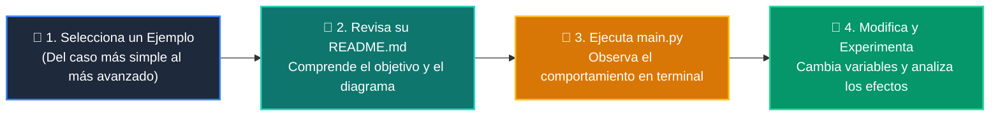

# 💻 Catálogo de Ejemplos Prácticos: Clase 02: Desarrollo del Backend: APIs RESTful con FastAPI

> **Ubicación:** `curso/clase-02-backend-fastapi/ejemplos`  
> **Filosofía:** *Aprender programando mediante casos de uso aislados, legibles y comentados.*

---

## 🗺️ Flujo de Estudio Recomendado



---

## 📑 Ejemplos Disponibles en esta Clase

| Directorio | Caso de Uso Demostrado | Script Principal |
| :--- | :--- | :---: |
| [`ejemplo_01_app_minima/`](ejemplo_01_app_minima/) | 01 App Minima | [`main.py`](ejemplo_01_app_minima/main.py) |
| [`ejemplo_02_endpoints_crud/`](ejemplo_02_endpoints_crud/) | 02 Endpoints Crud | [`main.py`](ejemplo_02_endpoints_crud/main.py) |
| [`ejemplo_03_manejo_http_exceptions/`](ejemplo_03_manejo_http_exceptions/) | 03 Manejo Http Exceptions | [`main.py`](ejemplo_03_manejo_http_exceptions/main.py) |
| [`ejemplo_04_inyeccion_depends/`](ejemplo_04_inyeccion_depends/) | 04 Inyeccion Depends | [`main.py`](ejemplo_04_inyeccion_depends/main.py) |


---

## 🚀 Cómo Ejecutar Cualquier Ejemplo
Abre tu terminal en la raíz del repositorio y ejecuta:
```bash
python 01-fundamentos-python/clase-02-backend-fastapi/ejemplos/<nombre_del_ejemplo>/main.py
```
