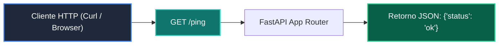

# 📖 01 App Minima

> **Clase:** Clase 02: Desarrollo del Backend: APIs RESTful con FastAPI  
> **Script:** [`main.py`](main.py)  

API Mínima con FastAPI.

---

## 🗺️ Flujo de Ejecución del Ejemplo



---

## 💻 Ejecución desde Terminal

```bash
python 04-proyecto-final/clase-02-backend-fastapi/ejemplos/ejemplo_01_app_minima/main.py
```
