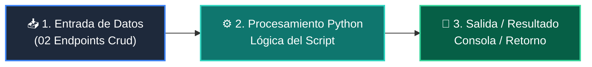

# 📖 02 Endpoints Crud

> **Clase:** Clase 02: Desarrollo del Backend: APIs RESTful con FastAPI  
> **Script:** [`main.py`](main.py)  

Endpoints GET y POST con DTO.

---

## 🗺️ Flujo de Ejecución del Ejemplo



---

## 💻 Ejecución desde Terminal

```bash
python 04-proyecto-final/clase-02-backend-fastapi/ejemplos/ejemplo_02_endpoints_crud/main.py
```
