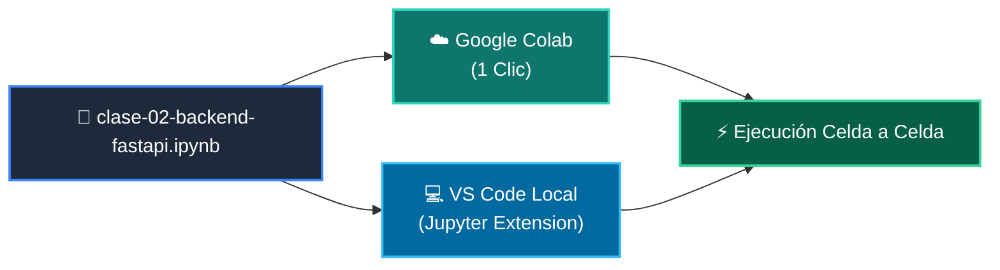

# 📓 Cuaderno Interactivo: Clase 02: Desarrollo del Backend: APIs RESTful con FastAPI

> **Curso:** 04-proyecto-final  
> **Archivo:** [`clase-02-backend-fastapi.ipynb`](clase-02-backend-fastapi.ipynb)  

---

## 🗺️ Formato de Trabajo Interactivo

---

## 🚀 Opciones de Uso
*   **En la Nube:** Haz clic en el botón superior **Open in Colab** para ejecutar sin instalar nada.
*   **En Local:** Abre [`clase-02-backend-fastapi.ipynb`](clase-02-backend-fastapi.ipynb) directamente en Visual Studio Code.
