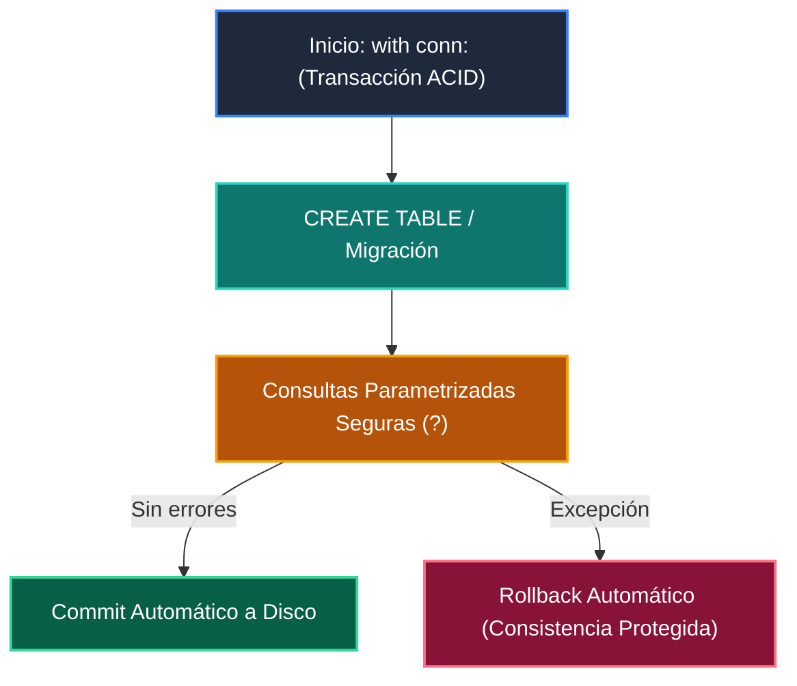

# 📘 Clase 03: Persistencia de Datos: Modelado SQL y Transacciones ACID

> **Curso:** Curso 4: Taller Práctico & Proyecto Final Integrador (CLASE 03)  
> **Nivel:** Nivel 4 - Integrador &bull; **Metáfora:** *«La Base de Datos como una Bóveda Acorazada para la Información»*  

---

## 🗺️ Diagrama de Arquitectura y Flujo de la Clase

---

## 📑 Recursos Disponibles en esta Clase

*   📄 [`clase-03-persistencia-sql-transacciones.pdf`](clase-03-persistencia-sql-transacciones.pdf): Manual técnico oficial en PDF (9 páginas).
*   📖 [`book.md`](book.md): Libro de estudio digital con teoría profunda y diagramas Mermaid.
*   📁 [`notebook/`](notebook/): Cuaderno interactivo Jupyter ejecutable en local y en Google Colab.
*   📁 [`ejemplos/`](ejemplos/): Carpetas de código funcional con casos prácticos comentados.
*   📁 [`ejercicios/`](ejercicios/): Reto práctico para afianzar conceptos.
