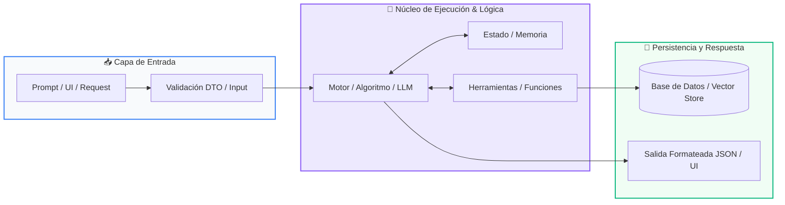

# 📚 Clase 03: Persistencia de Datos: Modelado SQL y Transacciones ACID

> **Programa:** Curso 4: Taller Práctico & Proyecto Final Integrador  
> **Nivel:** Nivel 4 - Integrador  
> **Metáfora Central:** *«La Base de Datos como una Bóveda Acorazada para la Información»*  
> **Documento Oficial PDF:** [clase-03-persistencia-sql-transacciones.pdf](clase-03-persistencia-sql-transacciones.pdf)  
> **Instructor:** **William Rodríguez (Wisrovi)** (AI Solutions Architect & Principal Software Engineer)  

---

## 👤 Perfil del Autor y Mentor

### **William Rodríguez (Wisrovi)**
*AI Solutions Architect & Principal Software Engineer &bull; Badajoz, España*

Ingeniero y arquitecto de software especializado en Inteligencia Artificial Generativa, sistemas multi-agente, Visión por Computador e infraestructuras MLOps de alta disponibilidad. Creador y mantenedor de la suite de software libre wisrovi SUITE en PyPI con más de 26 bibliotecas enfocadas en orquestación de pipelines, caching distribuido y optimización de bases de datos.

*   🐙 **GitHub:** [github.com/wisrovi](https://github.com/wisrovi)
*   💼 **LinkedIn:** [www.linkedin.com/in/wisrovi-rodriguez/](https://www.linkedin.com/in/wisrovi-rodriguez/)
*   🐳 **DockerHub:** [hub.docker.com/u/wisrovi](https://hub.docker.com/u/wisrovi)
*   🌐 **Website:** [wisrovi.dev](https://wisrovi.dev)
*   📦 **PyPI:** [pypi.org/user/wisrovi/](https://pypi.org/user/wisrovi/)

---

### 🚲 La Regla de la Bicicleta

> *"Nadie aprende a montar en bicicleta viendo tutoriales. El verdadero dominio de la programación surge cuando abres tu editor, escribes código con tus propias manos, resuelves errores y construyes proyectos reales."*

---

## 📑 Tabla de Contenidos de la Sesión

1. [💡 Fundamentación Teórica y Modelo Mental](#1--fundamentación-teórica-y-modelo-mental)
2. [🗺️ Arquitectura y Diagrama de Flujo](#2-️-arquitectura-y-diagrama-de-flujo)
3. [💻 Implementación en Python 3.10+](#3--implementación-en-python-310)
4. [🛡️ Buenas Prácticas y Trampas Frecuentes](#4-️-buenas-prácticas-y-trampas-frecuentes)
5. [🏋️ Desafío de Práctica](#5-️-desafío-de-práctica)
6. [📚 Bibliografía y Enlaces Canónicos](#6--bibliografía-y-enlaces-canónicos)

---

## 1. 💡 Fundamentación Teórica y Modelo Mental

La persistencia de datos garantiza que la información de los usuarios permanezca intacta tras apagar o reiniciar el servidor.

> [!NOTE]
> **🌟 Metáfora Didáctica:** Una transacción ACID es como una transferencia bancaria: o se descuenta de una cuenta y se acredita en la otra, o se cancela todo.

### Principios Fundamentales

Inyección SQL: La vulnerabilidad #1 de bases de datos. Ocurre al concatenar strings en consultas.

Consultas parametrizadas: Separan el código SQL de los datos proporcionados por el usuario.

> [!IMPORTANT]
> **⚡ Regla de Oro en Python:** NUNCA concatenes variables en consultas SQL; usa siempre placeholders (?, %s o :val).

---

## 2. 🗺️ Arquitectura y Diagrama de Flujo

Ciclo de vida de una transacción con Commit / Rollback automático.



### Desglose Paso a Paso del Flujo

| Fase | Acción del Intérprete | Estado en Memoria |
| :--- | :--- | :--- |
| **1. Inicialización** | Apertura de conexión y bloque transaccional (with conn:). | `Transacción iniciada en BD.` |
| **2. Evaluación** | Ejecución de sentencias DML (INSERT, UPDATE, DELETE). | `Cambios en buffer transaccional.` |
| **3. Transformación** | ¿Ocurrió algún error? Sí -> Rollback / No -> Commit. | `Persistencia en disco confirmada.` |
| **4. Retorno / Salida** | Cierre seguro de la conexión. | `Pool liberado.` |

> [!TIP]
> **🔍 Visualización Mental:** El context manager 'with sqlite3.connect' ejecuta commit automáticamente si no hay excepciones.

---

## 3. 💻 Implementación en Python 3.10+

```python
# CLASE 03 - Código de Demostración
import sqlite3

class RepositorioUsuarios:
    def __init__(self, db_path: str = "app.db"):
        self.db_path = db_path
        self._crear_tabla()

    def _crear_tabla(self):
        with sqlite3.connect(self.db_path) as conn:
            conn.execute("""
                CREATE TABLE IF NOT EXISTS usuarios (
                    id INTEGER PRIMARY KEY AUTOINCREMENT,
                    nombre TEXT NOT NULL,
                    email TEXT UNIQUE NOT NULL
                )
            """)

    def insertar(self, nombre: str, email: str) -> int:
        with sqlite3.connect(self.db_path) as conn:
            cursor = conn.cursor()
            cursor.execute("INSERT INTO usuarios (nombre, email) VALUES (?, ?)", (nombre, email))
            return cursor.lastrowid

repo = RepositorioUsuarios(":memory:")
uid = repo.insertar("Wisrovi Developer", "wisrovi@dev.com")
print(f"Usuario insertado con ID: {uid}")
```

*Uso de consultas parametrizadas con '?' para evitar SQL Injection y context manager seguro.*

---

## 4. 🛡️ Buenas Prácticas y Trampas Frecuentes

> [!WARNING]
> **⚠️ Gotcha Frecuente (Trampa de Principiante):** Formatear strings con f-strings en SQL permite a atacantes ejecutar comandos destructivos (ej. ' OR 1=1; DROP TABLE...).

*   **❌ Antipatrón:**
    ```python
cursor.execute(f'SELECT * FROM users WHERE email = '{email}'')  # ❌ Vulnerable a SQL Injection
    ```

*   **✅ Patrón Correcto:**
    ```python
cursor.execute('SELECT * FROM users WHERE email = ?', (email,))    # ✅ 100% Seguro
    ```

> [!TIP]
> **💡 Consejo Profesional:** Usa SQLAlchemy o SQLModel para proyectos de gran escala con mapeo objeto-relacional.

---

## 5. 🏋️ Desafío de Práctica

> **Desafío:** Crea una tabla 'pedidos' vinculada por clave foránea (FOREIGN KEY) a la tabla de usuarios.

Para ejecutar la verificación automática con pytest:
```bash
pytest ejercicios/
```

---

## 6. 📚 Bibliografía y Enlaces Canónicos

| Fuente / Recurso | Descripción | Enlace |
| :--- | :--- | :--- |
| **Documentación Oficial de Python** | Especificación y biblioteca estándar | [docs.python.org/3/](https://docs.python.org/3/) |
| **PEP 8 — Style Guide for Python** | Estándar oficial de formateo y estilo | [peps.python.org/pep-0008/](https://peps.python.org/pep-0008/) |
| **Real Python Tutorials** | Patrones de ingeniería y desarrollo | [realpython.com](https://realpython.com/) |
| **Suite Open Source wisrovi** | Librerías de alto rendimiento | [github.com/wisrovi](https://github.com/wisrovi) |
