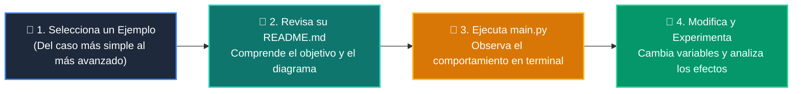

# 💻 Catálogo de Ejemplos Prácticos: Clase 03: Persistencia de Datos: Modelado SQL y Transacciones ACID

> **Ubicación:** `curso/clase-03-persistencia-sql-transacciones/ejemplos`  
> **Filosofía:** *Aprender programando mediante casos de uso aislados, legibles y comentados.*

---

## 🗺️ Flujo de Estudio Recomendado



---

## 📑 Ejemplos Disponibles en esta Clase

| Directorio | Caso de Uso Demostrado | Script Principal |
| :--- | :--- | :---: |
| [`ejemplo_01_ddl_sqlite/`](ejemplo_01_ddl_sqlite/) | 01 Ddl Sqlite | [`main.py`](ejemplo_01_ddl_sqlite/main.py) |
| [`ejemplo_02_consultas_parametrizadas/`](ejemplo_02_consultas_parametrizadas/) | 02 Consultas Parametrizadas | [`main.py`](ejemplo_02_consultas_parametrizadas/main.py) |
| [`ejemplo_03_transacciones_acid/`](ejemplo_03_transacciones_acid/) | 03 Transacciones Acid | [`main.py`](ejemplo_03_transacciones_acid/main.py) |
| [`ejemplo_04_repositorio_crud/`](ejemplo_04_repositorio_crud/) | 04 Repositorio Crud | [`main.py`](ejemplo_04_repositorio_crud/main.py) |


---

## 🚀 Cómo Ejecutar Cualquier Ejemplo
Abre tu terminal en la raíz del repositorio y ejecuta:
```bash
python 01-fundamentos-python/clase-03-persistencia-sql-transacciones/ejemplos/<nombre_del_ejemplo>/main.py
```
