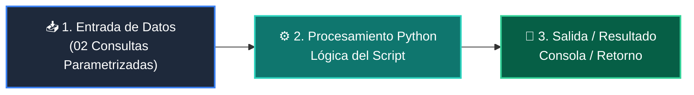

# 📖 02 Consultas Parametrizadas

> **Clase:** Clase 03: Persistencia de Datos: Modelado SQL y Transacciones ACID  
> **Script:** [`main.py`](main.py)  

Consultas Parametrizadas Seguras.

---

## 🗺️ Flujo de Ejecución del Ejemplo



---

## 💻 Ejecución desde Terminal

```bash
python 04-proyecto-final/clase-03-persistencia-sql-transacciones/ejemplos/ejemplo_02_consultas_parametrizadas/main.py
```
