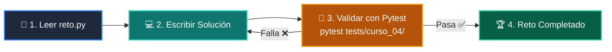

# 🏋️ Reto Práctico: Clase 03: Persistencia de Datos: Modelado SQL y Transacciones ACID

> **Curso:** 04-proyecto-final &bull; **Semana:** CLASE 03  
> **Archivo del Reto:** [`reto.py`](reto.py)  

---

## 🎯 Enunciado del Desafío
> **Crea una tabla 'pedidos' vinculada por clave foránea (FOREIGN KEY) a la tabla de usuarios.**

---

## 🗺️ Flujo de Resolución



---

## 🚀 Cómo Validar tu Código
```bash
pytest tests/curso_04/
```
