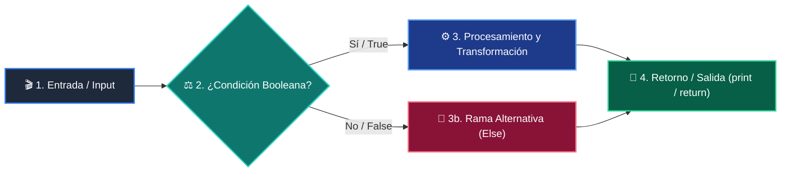

# 📚 Clase 04: Desarrollo del Frontend: Dashboards con Streamlit

> **Programa:** Curso 4: Taller Práctico & Proyecto Final Integrador  
> **Nivel:** Nivel 4 - Integrador  
> **Metáfora Central:** *«Streamlit como el Salón de Control Visual para tu Backend de Python»*  
> **Documento Oficial PDF:** [clase-04-frontend-streamlit.pdf](clase-04-frontend-streamlit.pdf)  
> **Instructor:** **William Rodríguez (Wisrovi)** (AI Solutions Architect & Principal Software Engineer)  

---

## 👤 Perfil del Autor y Mentor

### **William Rodríguez (Wisrovi)**
*AI Solutions Architect & Principal Software Engineer &bull; Badajoz, España*

Ingeniero y arquitecto de software especializado en Inteligencia Artificial Generativa, sistemas multi-agente, Visión por Computador e infraestructuras MLOps de alta disponibilidad. Creador y mantenedor de la suite de software libre wisrovi SUITE en PyPI con más de 26 bibliotecas enfocadas en orquestación de pipelines, caching distribuido y optimización de bases de datos.

*   🐙 **GitHub:** [github.com/wisrovi](https://github.com/wisrovi)
*   💼 **LinkedIn:** [www.linkedin.com/in/wisrovi-rodriguez/](https://www.linkedin.com/in/wisrovi-rodriguez/)
*   🐳 **DockerHub:** [hub.docker.com/u/wisrovi](https://hub.docker.com/u/wisrovi)
*   🌐 **Website:** [wisrovi.dev](https://wisrovi.dev)
*   📦 **PyPI:** [pypi.org/user/wisrovi/](https://pypi.org/user/wisrovi/)

---

### 🚲 La Regla de la Bicicleta

> *"Nadie aprende a montar en bicicleta viendo tutoriales. El verdadero dominio de la programación surge cuando abres tu editor, escribes código con tus propias manos, resuelves errores y construyes proyectos reales."*

---

## 📑 Tabla de Contenidos de la Sesión

1. [💡 Fundamentación Teórica y Modelo Mental](#1--fundamentación-teórica-y-modelo-mental)
2. [🗺️ Arquitectura y Diagrama de Flujo](#2-️-arquitectura-y-diagrama-de-flujo)
3. [💻 Implementación en Python 3.10+](#3--implementación-en-python-310)
4. [🛡️ Buenas Prácticas y Trampas Frecuentes](#4-️-buenas-prácticas-y-trampas-frecuentes)
5. [🏋️ Desafío de Práctica](#5-️-desafío-de-práctica)
6. [📚 Bibliografía y Enlaces Canónicos](#6--bibliografía-y-enlaces-canónicos)

---

## 1. 💡 Fundamentación Teórica y Modelo Mental

Streamlit permite transformar scripts de Python en aplicaciones web interactivas para ciencia de datos e Inteligencia Artificial.

> [!NOTE]
> **🌟 Metáfora Didáctica:** Es como un tablero de mandos de automóvil donde cada botón y pantalla se conecta directamente al motor de tu backend.

### Principios Fundamentales

Modelo Reactivo: Cada vez que el usuario interactúa con un control (botón, slider), Streamlit reejecuta el script de arriba a abajo.

st.session_state: Permite preservar variables y estados entre reejecuciones del script.

> [!IMPORTANT]
> **⚡ Regla de Oro en Python:** Usa st.session_state para almacenar sesiones de chat o datos de formularios sin perderlos al hacer clic.

---

## 2. 🗺️ Arquitectura y Diagrama de Flujo

Ciclo reactivo de eventos en Streamlit e invocación a la API.



### Desglose Paso a Paso del Flujo

| Fase | Acción del Intérprete | Estado en Memoria |
| :--- | :--- | :--- |
| **1. Inicialización** | Renderizado de componentes visuales (título, inputs). | `DOM generado en el navegador.` |
| **2. Evaluación** | Interacción del usuario (clic en botón). | `Evento disparado hacia el servidor.` |
| **3. Transformación** | Petición HTTP hacia el backend FastAPI (requests.post). | `Respuesta JSON recibida.` |
| **4. Retorno / Salida** | Actualización de st.session_state y mensaje de éxito. | `Interfaz actualizada instantáneamente.` |

> [!TIP]
> **🔍 Visualización Mental:** Todo lo que guardes en st.session_state sobrevive a la recarga de página.

---

## 3. 💻 Implementación en Python 3.10+

```python
# CLASE 04 - Código de Demostración
import streamlit as st

st.set_page_config(page_title="Panel de Control", page_icon="🚀")
st.title("🚀 Panel de Gestión de Leads")

if "leads" not in st.session_state:
    st.session_state.leads = []

with st.form("form_lead"):
    nombre = st.text_input("Nombre completo")
    email = st.text_input("Correo electrónico")
    enviado = st.form_submit_button("Guardar Lead")
    
    if enviado and nombre:
        st.session_state.leads.append({"nombre": nombre, "email": email})
        st.success(f"Lead {nombre} registrado con éxito.")

st.write(f"Total registrados: {len(st.session_state.leads)}")
```

*Uso de st.form para agrupar inputs y st.session_state para persistencia de sesión.*

---

## 4. 🛡️ Buenas Prácticas y Trampas Frecuentes

> [!WARNING]
> **⚠️ Gotcha Frecuente (Trampa de Principiante):** Cargar modelos pesados o archivos grandes en cada interacción ralentiza la aplicación.

*   **❌ Antipatrón:**
    ```python
modelo = cargar_modelo_pesado_2gb()  # ❌ Se recarga en cada clic
    ```

*   **✅ Patrón Correcto:**
    ```python
@st.cache_resource
def get_model(): return cargar_modelo()  # ✅ Se ejecuta una sola vez en caché
    ```

> [!TIP]
> **💡 Consejo Profesional:** Usa @st.cache_data para llamadas a APIs y @st.cache_resource para objetos de conexión.

---

## 5. 🏋️ Desafío de Práctica

> **Desafío:** Crea una vista con st.tabs para alternar entre el formulario de registro y la tabla de datos.

Para ejecutar la verificación automática con pytest:
```bash
pytest ejercicios/
```

---

## 6. 📚 Bibliografía y Enlaces Canónicos

| Fuente / Recurso | Descripción | Enlace |
| :--- | :--- | :--- |
| **Documentación Oficial de Python** | Especificación y biblioteca estándar | [docs.python.org/3/](https://docs.python.org/3/) |
| **PEP 8 — Style Guide for Python** | Estándar oficial de formateo y estilo | [peps.python.org/pep-0008/](https://peps.python.org/pep-0008/) |
| **Real Python Tutorials** | Patrones de ingeniería y desarrollo | [realpython.com](https://realpython.com/) |
| **Suite Open Source wisrovi** | Librerías de alto rendimiento | [github.com/wisrovi](https://github.com/wisrovi) |
