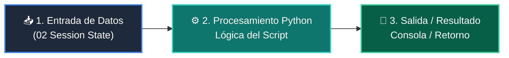

# 📖 02 Session State

> **Clase:** Clase 04: Desarrollo del Frontend: Dashboards con Streamlit  
> **Script:** [`main.py`](main.py)  

Preservación de Estado con session_state.

---

## 🗺️ Flujo de Ejecución del Ejemplo



---

## 💻 Ejecución desde Terminal

```bash
python 04-proyecto-final/clase-04-frontend-streamlit/ejemplos/ejemplo_02_session_state/main.py
```
