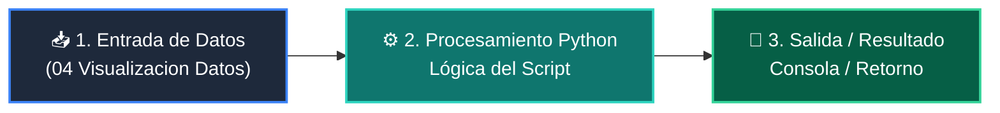

# 📖 04 Visualizacion Datos

> **Clase:** Clase 04: Desarrollo del Frontend: Dashboards con Streamlit  
> **Script:** [`main.py`](main.py)  

Visualización en Pestañas (Tabs).

---

## 🗺️ Flujo de Ejecución del Ejemplo



---

## 💻 Ejecución desde Terminal

```bash
python 04-proyecto-final/clase-04-frontend-streamlit/ejemplos/ejemplo_04_visualizacion_datos/main.py
```
