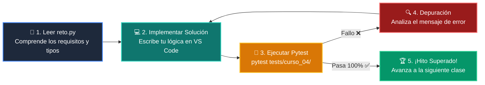

# 🏋️ Reto Práctico: Clase 04: Desarrollo del Frontend: Dashboards con Streamlit

<div align="center">

**Curso 4: Taller Práctico & Proyecto Final Integrador** &bull; **Semana CLASE 04**  
*Archivo de Trabajo:* [`reto.py`](reto.py) &bull; *Suite de Validación:* [`tests/curso_04/test_clase_04_frontend_streamlit.py`](../../tests/curso_04/test_clase_04_frontend_streamlit.py)

</div>

---

## 🎯 Enunciado del Desafío

> **Crea una vista con st.tabs para alternar entre el formulario de registro y la tabla de datos.**

---

## 🗺️ Ciclo de Resolución y Feedback Automatizado



---

## 🚀 Pasos para Resolver el Reto

1. Abre [`reto.py`](reto.py) en tu editor.
2. Lee las firmas de función, docstrings y restricciones.
3. Escribe tu solución reemplazando los comentarios `TODO`.
4. Valida tu solución en cualquier momento ejecutando en la terminal:
   ```bash
   pytest tests/curso_04/
   ```
