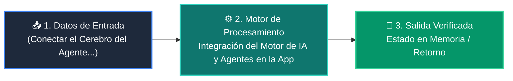

# 📘 Clase 05: Integración del Motor de IA y Agentes en la App

<div align="center">

**Curso 4: Taller Práctico & Proyecto Final Integrador** &bull; **Semana CLASE 05**  
*Nivel:* `Nivel 4 - Integrador` &bull; *Metáfora Central:* **«Conectar el Cerebro del Agente al Sistema Nervioso de la Aplicación»**

[](https://colab.research.google.com/github/wisrovi/wisrovi-python/blob/main/04-proyecto-final/clase-05-integracion-agente-ia/notebook/clase-05-integracion-agente-ia.ipynb)
[](clase-05-integracion-agente-ia.pdf)
[](book.md)

</div>

---

## 🎯 Objetivos de Aprendizaje de la Sesión

*   **Competencia Conceptual:** Comprender el modelo mental de *«Conectar el Cerebro del Agente al Sistema Nervioso de la Aplicación»* (Es como conectar un motor híbrido a un automóvil: debe responder con potencia suave sin tirones para el conductor.).
*   **Competencia Práctica:** Escribir, ejecutar y depurar scripts en Python aplicando buenas prácticas (PEP 8) y tipado.
*   **Competencia de Ingeniería:** Resolver el reto práctico de la sesión y verificar su correcto funcionamiento con la suite de pruebas automatizadas.

---

## 🗺️ Mapa de Arquitectura y Flujo de Ejecución



---

## 📂 Organización de Materiales en esta Clase

```text
clase-05-integracion-agente-ia/
├── 📄 clase-05-integracion-agente-ia.pdf       # Manual técnico oficial de estudio (9 páginas)
├── 📖 book.md                     # Libro digital interactivo con diagramas Mermaid
├── 📝 README.md                   # Esta guía general de la clase
├── 📁 notebook/                   # Cuaderno Jupyter interactivo
│   ├── 📓 clase-05-integracion-agente-ia.ipynb
│   └── 📝 README.md               # Guía con badge a Google Colab
├── 📁 ejemplos/                   # Carpetas de código estructurado paso a paso
│   └── 📝 README.md               # Catálogo de ejemplos con comandos de ejecución
└── 📁 ejercicios/                 # Reto práctico para el estudiante
    ├── 🐍 reto.py                 # Enunciado y plantilla del ejercicio
    └── 📝 README.md               # Instrucciones de resolución y comandos pytest
```

---

## 🏋️ Desafío Práctico de la Sesión
> **Enunciado:** Implementa un generador 'def stream_respuesta()' que entregue palabras una a una simulando streaming.

Abre el archivo [`ejercicios/reto.py`](ejercicios/reto.py), completa tu implementación y valida tu código ejecutando:
```bash
pytest tests/curso_04/test_clase_05_integracion_agente_ia.py
```
