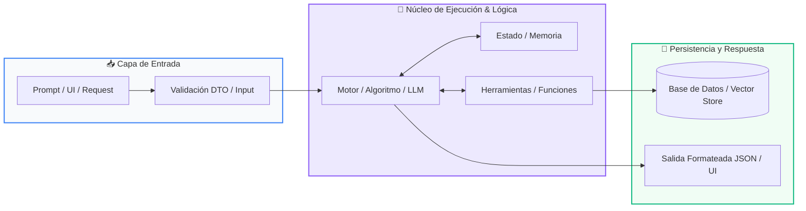

# 📚 Clase 05: Integración del Motor de IA y Agentes en la App

> **Programa:** Curso 4: Taller Práctico & Proyecto Final Integrador  
> **Nivel:** Nivel 4 - Integrador  
> **Metáfora Central:** *«Conectar el Cerebro del Agente al Sistema Nervioso de la Aplicación»*  
> **Documento Oficial PDF:** [clase-05-integracion-agente-ia.pdf](clase-05-integracion-agente-ia.pdf)  
> **Instructor:** **William Rodríguez (Wisrovi)** (AI Solutions Architect & Principal Software Engineer)  

---

## 👤 Perfil del Autor y Mentor

### **William Rodríguez (Wisrovi)**
*AI Solutions Architect & Principal Software Engineer &bull; Badajoz, España*

Ingeniero y arquitecto de software especializado en Inteligencia Artificial Generativa, sistemas multi-agente, Visión por Computador e infraestructuras MLOps de alta disponibilidad. Creador y mantenedor de la suite de software libre wisrovi SUITE en PyPI con más de 26 bibliotecas enfocadas en orquestación de pipelines, caching distribuido y optimización de bases de datos.

*   🐙 **GitHub:** [github.com/wisrovi](https://github.com/wisrovi)
*   💼 **LinkedIn:** [www.linkedin.com/in/wisrovi-rodriguez/](https://www.linkedin.com/in/wisrovi-rodriguez/)
*   🐳 **DockerHub:** [hub.docker.com/u/wisrovi](https://hub.docker.com/u/wisrovi)
*   🌐 **Website:** [wisrovi.dev](https://wisrovi.dev)
*   📦 **PyPI:** [pypi.org/user/wisrovi/](https://pypi.org/user/wisrovi/)

---

### 🚲 La Regla de la Bicicleta

> *"Nadie aprende a montar en bicicleta viendo tutoriales. El verdadero dominio de la programación surge cuando abres tu editor, escribes código con tus propias manos, resuelves errores y construyes proyectos reales."*

---

## 📑 Tabla de Contenidos de la Sesión

1. [💡 Fundamentación Teórica y Modelo Mental](#1--fundamentación-teórica-y-modelo-mental)
2. [🗺️ Arquitectura y Diagrama de Flujo](#2-️-arquitectura-y-diagrama-de-flujo)
3. [💻 Implementación en Python 3.10+](#3--implementación-en-python-310)
4. [🛡️ Buenas Prácticas y Trampas Frecuentes](#4-️-buenas-prácticas-y-trampas-frecuentes)
5. [🏋️ Desafío de Práctica](#5-️-desafío-de-práctica)
6. [📚 Bibliografía y Enlaces Canónicos](#6--bibliografía-y-enlaces-canónicos)

---

## 1. 💡 Fundamentación Teórica y Modelo Mental

Integrar un agente en una aplicación web requiere gestionar latencias, streaming de texto y manejo de errores de API.

> [!NOTE]
> **🌟 Metáfora Didáctica:** Es como conectar un motor híbrido a un automóvil: debe responder con potencia suave sin tirones para el conductor.

### Principios Fundamentales

Streaming de respuestas: Enviar token por token al frontend para que el usuario no espere 10 segundos en blanco.

Manejo de rate limits: Reintentos exponenciales con backoff ante errores 429 de proveedores de IA.

> [!IMPORTANT]
> **⚡ Regla de Oro en Python:** Muestra siempre indicadores visuales de carga (spinners) mientras el agente razona.

---

## 2. 🗺️ Arquitectura y Diagrama de Flujo

Flujo de streaming y comunicación de eventos agente-frontend.



### Desglose Paso a Paso del Flujo

| Fase | Acción del Intérprete | Estado en Memoria |
| :--- | :--- | :--- |
| **1. Inicialización** | Usuario envía mensaje en el chat del frontend. | `Mensaje en cola de envío.` |
| **2. Evaluación** | Backend recibe solicitud y activa el bucle ReAct del agente. | `Agente ejecutando herramientas.` |
| **3. Transformación** | Streaming de tokens hacia el cliente (EventSource / Generator). | `Texto renderizándose en tiempo real.` |
| **4. Retorno / Salida** | Persistencia de la conversación en base de datos. | `Historial actualizado.` |

> [!TIP]
> **🔍 Visualización Mental:** El streaming mejora drásticamente la percepción de velocidad de la aplicación.

---

## 3. 💻 Implementación en Python 3.10+

```python
# CLASE 05 - Código de Demostración
class AgenteService:
    def __init__(self, nombre_bot: str = "WisroviAssistant"):
        self.nombre_bot = nombre_bot

    def procesar_consulta(self, usuario_id: str, prompt: str) -> dict:
        # Lógica de agente con memoria y guardrails
        respuesta = f"[{self.nombre_bot}] He analizado tu solicitud: '{prompt}'. Todo en orden."
        return {
            "usuario_id": usuario_id,
            "respuesta": respuesta,
            "tokens_usados": 42
        }

servicio = AgenteService()
print(servicio.procesar_consulta("usr_1", "Generar balance"))
```

*Encapsulamiento del servicio de IA en una clase desacoplada del framework web.*

---

## 4. 🛡️ Buenas Prácticas y Trampas Frecuentes

> [!WARNING]
> **⚠️ Gotcha Frecuente (Trampa de Principiante):** Escribir las claves de API (OPENAI_API_KEY, GEMINI_API_KEY) en el código del frontend expone tu cuenta.

*   **❌ Antipatrón:**
    ```python
API_KEY = 'sk-123456789'  # ❌ Expuesto en el repositorio
    ```

*   **✅ Patrón Correcto:**
    ```python
API_KEY = os.environ.get('GEMINI_API_KEY')  # ✅ Variable de entorno segura
    ```

> [!TIP]
> **💡 Consejo Profesional:** Usa archivos .env ignorados en .gitignore y la librería python-dotenv.

---

## 5. 🏋️ Desafío de Práctica

> **Desafío:** Implementa un generador 'def stream_respuesta()' que entregue palabras una a una simulando streaming.

Para ejecutar la verificación automática con pytest:
```bash
pytest ejercicios/
```

---

## 6. 📚 Bibliografía y Enlaces Canónicos

| Fuente / Recurso | Descripción | Enlace |
| :--- | :--- | :--- |
| **Documentación Oficial de Python** | Especificación y biblioteca estándar | [docs.python.org/3/](https://docs.python.org/3/) |
| **PEP 8 — Style Guide for Python** | Estándar oficial de formateo y estilo | [peps.python.org/pep-0008/](https://peps.python.org/pep-0008/) |
| **Real Python Tutorials** | Patrones de ingeniería y desarrollo | [realpython.com](https://realpython.com/) |
| **Suite Open Source wisrovi** | Librerías de alto rendimiento | [github.com/wisrovi](https://github.com/wisrovi) |
