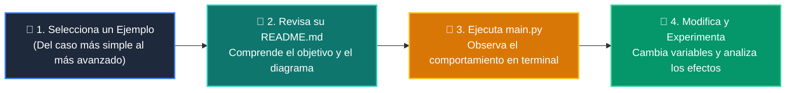

# 💻 Catálogo de Ejemplos Prácticos: Clase 05: Integración del Motor de IA y Agentes en la App

> **Ubicación:** `curso/clase-05-integracion-agente-ia/ejemplos`  
> **Filosofía:** *Aprender programando mediante casos de uso aislados, legibles y comentados.*

---

## 🗺️ Flujo de Estudio Recomendado



---

## 📑 Ejemplos Disponibles en esta Clase

| Directorio | Caso de Uso Demostrado | Script Principal |
| :--- | :--- | :---: |
| [`ejemplo_01_servicio_agente/`](ejemplo_01_servicio_agente/) | 01 Servicio Agente | [`main.py`](ejemplo_01_servicio_agente/main.py) |
| [`ejemplo_02_streaming_tokens/`](ejemplo_02_streaming_tokens/) | 02 Streaming Tokens | [`main.py`](ejemplo_02_streaming_tokens/main.py) |
| [`ejemplo_03_chat_ui_streamlit/`](ejemplo_03_chat_ui_streamlit/) | 03 Chat Ui Streamlit | [`main.py`](ejemplo_03_chat_ui_streamlit/main.py) |
| [`ejemplo_04_variables_entorno_seguras/`](ejemplo_04_variables_entorno_seguras/) | 04 Variables Entorno Seguras | [`main.py`](ejemplo_04_variables_entorno_seguras/main.py) |


---

## 🚀 Cómo Ejecutar Cualquier Ejemplo
Abre tu terminal en la raíz del repositorio y ejecuta:
```bash
python 01-fundamentos-python/clase-05-integracion-agente-ia/ejemplos/<nombre_del_ejemplo>/main.py
```
