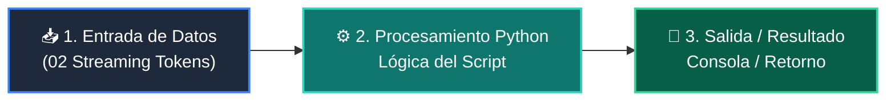

# 📖 02 Streaming Tokens

> **Clase:** Clase 05: Integración del Motor de IA y Agentes en la App  
> **Script:** [`main.py`](main.py)  

Generador de Streaming de Tokens.

---

## 🗺️ Flujo de Ejecución del Ejemplo



---

## 💻 Ejecución desde Terminal

```bash
python 04-proyecto-final/clase-05-integracion-agente-ia/ejemplos/ejemplo_02_streaming_tokens/main.py
```
