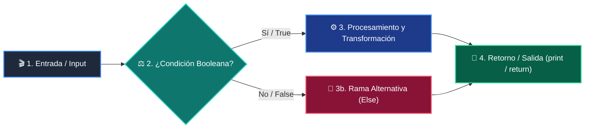

# 📚 Clase 06: Testing Riguroso con Pytest, Mocks y Calidad

> **Programa:** Curso 4: Taller Práctico & Proyecto Final Integrador  
> **Nivel:** Nivel 4 - Integrador  
> **Metáfora Central:** *«Los Tests como el Control de Calidad y Pruebas de Choque de un Vehículo»*  
> **Documento Oficial PDF:** [clase-06-testing-y-calidad.pdf](clase-06-testing-y-calidad.pdf)  
> **Instructor:** **William Rodríguez (Wisrovi)** (AI Solutions Architect & Principal Software Engineer)  

---

## 👤 Perfil del Autor y Mentor

### **William Rodríguez (Wisrovi)**
*AI Solutions Architect & Principal Software Engineer &bull; Badajoz, España*

Ingeniero y arquitecto de software especializado en Inteligencia Artificial Generativa, sistemas multi-agente, Visión por Computador e infraestructuras MLOps de alta disponibilidad. Creador y mantenedor de la suite de software libre wisrovi SUITE en PyPI con más de 26 bibliotecas enfocadas en orquestación de pipelines, caching distribuido y optimización de bases de datos.

*   🐙 **GitHub:** [github.com/wisrovi](https://github.com/wisrovi)
*   💼 **LinkedIn:** [www.linkedin.com/in/wisrovi-rodriguez/](https://www.linkedin.com/in/wisrovi-rodriguez/)
*   🐳 **DockerHub:** [hub.docker.com/u/wisrovi](https://hub.docker.com/u/wisrovi)
*   🌐 **Website:** [wisrovi.dev](https://wisrovi.dev)
*   📦 **PyPI:** [pypi.org/user/wisrovi/](https://pypi.org/user/wisrovi/)

---

### 🚲 La Regla de la Bicicleta

> *"Nadie aprende a montar en bicicleta viendo tutoriales. El verdadero dominio de la programación surge cuando abres tu editor, escribes código con tus propias manos, resuelves errores y construyes proyectos reales."*

---

## 📑 Tabla de Contenidos de la Sesión

1. [💡 Fundamentación Teórica y Modelo Mental](#1--fundamentación-teórica-y-modelo-mental)
2. [🗺️ Arquitectura y Diagrama de Flujo](#2-️-arquitectura-y-diagrama-de-flujo)
3. [💻 Implementación en Python 3.10+](#3--implementación-en-python-310)
4. [🛡️ Buenas Prácticas y Trampas Frecuentes](#4-️-buenas-prácticas-y-trampas-frecuentes)
5. [🏋️ Desafío de Práctica](#5-️-desafío-de-práctica)
6. [📚 Bibliografía y Enlaces Canónicos](#6--bibliografía-y-enlaces-canónicos)

---

## 1. 💡 Fundamentación Teórica y Modelo Mental

El testing automatizado es la única garantía de que los cambios nuevos no rompan funcionalidades existentes en producción.

> [!NOTE]
> **🌟 Metáfora Didáctica:** Hacer tests es como las pruebas de choque de los coches: verificas que los frenos funcionan antes de salir a la autopista.

### Principios Fundamentales

Mocks y Stubs: Simulan respuestas de servicios externos (como APIs de pago o LLMs) para tests rápidos y gratuitos.

Fixtures de Pytest: Preparan el entorno (bases de datos temporales, clientes HTTP) antes de cada prueba.

> [!IMPORTANT]
> **⚡ Regla de Oro en Python:** Tus tests nunca deben depender de servicios externos reales ni requerir conexión a internet.

---

## 2. 🗺️ Arquitectura y Diagrama de Flujo

Ejecución de suite de tests, fixtures y reporte de cobertura (Coverage).



### Desglose Paso a Paso del Flujo

| Fase | Acción del Intérprete | Estado en Memoria |
| :--- | :--- | :--- |
| **1. Inicialización** | Descubrimiento de archivos test_*.py. | `Tests recolectados por pytest.` |
| **2. Evaluación** | Inicialización de fixtures y mocks. | `Entorno aislado preparado.` |
| **3. Transformación** | Ejecución de assertions (assert a == b). | `Verificación de invariantes.` |
| **4. Retorno / Salida** | Tear-down y emisión de reporte verde (PASSED). | `Suite completada.` |

> [!TIP]
> **🔍 Visualización Mental:** Si un test es difícil de escribir, significa que tu código está demasiado acoplado.

---

## 3. 💻 Implementación en Python 3.10+

```python
# CLASE 06 - Código de Demostración
def calcular_subtotal(items: list[dict]) -> float:
    return sum(i["precio"] * i["cantidad"] for i in items)

def test_calculo_subtotal():
    carrito = [
        {"precio": 10.0, "cantidad": 2},
        {"precio": 5.0, "cantidad": 1}
    ]
    assert calcular_subtotal(carrito) == 25.0

def test_carrito_vacio():
    assert calcular_subtotal([]) == 0.0

print("Ejecutando tests...")
test_calculo_subtotal()
test_carrito_vacio()
print("✅ Todos los tests pasaron exitosamente.")
```

*Uso de aserciones simples y cobertura de casos normales y casos límite (carrito vacío).*

---

## 4. 🛡️ Buenas Prácticas y Trampas Frecuentes

> [!WARNING]
> **⚠️ Gotcha Frecuente (Trampa de Principiante):** Hacer que los tests llamen a APIs reales falla si no hay internet y consume cuota de pago.

*   **❌ Antipatrón:**
    ```python
def test_llm():
    res = llamar_api_real_openai()  # ❌ Lento, frágil y cuesta dinero
    ```

*   **✅ Patrón Correcto:**
    ```python
def test_llm(mocker):
    mocker.patch('llm.call', return_value='Respuesta Mock')  # ✅ Rápido y determinista
    ```

> [!TIP]
> **💡 Consejo Profesional:** Configura coverage para medir qué porcentaje de tu código está cubierto por pruebas.

---

## 5. 🏋️ Desafío de Práctica

> **Desafío:** Escribe un test parametrizado con @pytest.mark.parametrize para validar 5 casos de cálculo de IVA.

Para ejecutar la verificación automática con pytest:
```bash
pytest ejercicios/
```

---

## 6. 📚 Bibliografía y Enlaces Canónicos

| Fuente / Recurso | Descripción | Enlace |
| :--- | :--- | :--- |
| **Documentación Oficial de Python** | Especificación y biblioteca estándar | [docs.python.org/3/](https://docs.python.org/3/) |
| **PEP 8 — Style Guide for Python** | Estándar oficial de formateo y estilo | [peps.python.org/pep-0008/](https://peps.python.org/pep-0008/) |
| **Real Python Tutorials** | Patrones de ingeniería y desarrollo | [realpython.com](https://realpython.com/) |
| **Suite Open Source wisrovi** | Librerías de alto rendimiento | [github.com/wisrovi](https://github.com/wisrovi) |
