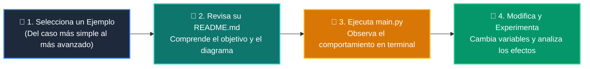

# 💻 Catálogo de Ejemplos Prácticos: Clase 06: Testing Riguroso con Pytest, Mocks y Calidad

> **Ubicación:** `curso/clase-06-testing-y-calidad/ejemplos`  
> **Filosofía:** *Aprender programando mediante casos de uso aislados, legibles y comentados.*

---

## 🗺️ Flujo de Estudio Recomendado



---

## 📑 Ejemplos Disponibles en esta Clase

| Directorio | Caso de Uso Demostrado | Script Principal |
| :--- | :--- | :---: |
| [`ejemplo_01_test_unitario_simple/`](ejemplo_01_test_unitario_simple/) | 01 Test Unitario Simple | [`main.py`](ejemplo_01_test_unitario_simple/main.py) |
| [`ejemplo_02_pytest_fixtures/`](ejemplo_02_pytest_fixtures/) | 02 Pytest Fixtures | [`main.py`](ejemplo_02_pytest_fixtures/main.py) |
| [`ejemplo_03_mocking_servicios/`](ejemplo_03_mocking_servicios/) | 03 Mocking Servicios | [`main.py`](ejemplo_03_mocking_servicios/main.py) |
| [`ejemplo_04_testclient_fastapi/`](ejemplo_04_testclient_fastapi/) | 04 Testclient Fastapi | [`main.py`](ejemplo_04_testclient_fastapi/main.py) |


---

## 🚀 Cómo Ejecutar Cualquier Ejemplo
Abre tu terminal en la raíz del repositorio y ejecuta:
```bash
python 01-fundamentos-python/clase-06-testing-y-calidad/ejemplos/<nombre_del_ejemplo>/main.py
```
