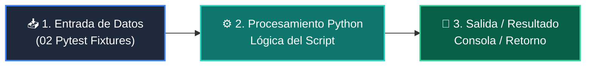

# 📖 02 Pytest Fixtures

> **Clase:** Clase 06: Testing Riguroso con Pytest, Mocks y Calidad  
> **Script:** [`main.py`](main.py)  

Fixtures de Pytest.

---

## 🗺️ Flujo de Ejecución del Ejemplo



---

## 💻 Ejecución desde Terminal

```bash
python 04-proyecto-final/clase-06-testing-y-calidad/ejemplos/ejemplo_02_pytest_fixtures/main.py
```
