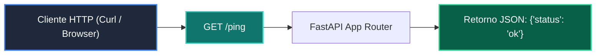

# 📖 04 Testclient Fastapi

> **Clase:** Clase 06: Testing Riguroso con Pytest, Mocks y Calidad  
> **Script:** [`main.py`](main.py)  

Pruebas de API con TestClient.

---

## 🗺️ Flujo de Ejecución del Ejemplo



---

## 💻 Ejecución desde Terminal

```bash
python 04-proyecto-final/clase-06-testing-y-calidad/ejemplos/ejemplo_04_testclient_fastapi/main.py
```
