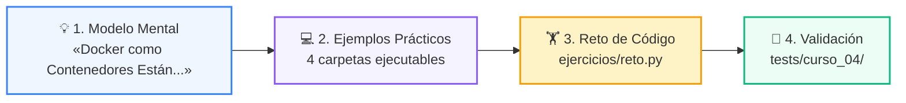
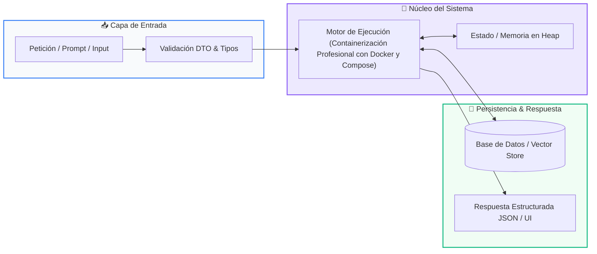

# 📘 Clase 07: Containerización Profesional con Docker y Compose

> **Curso:** Curso 4: Taller Práctico & Proyecto Final Integrador (CLASE 07)  
> **Nivel:** Nivel 4 - Integrador  
> **Metáfora Central:** *«Docker como Contenedores Estándar de Carga Marítima para Software»*  

---

## 🌀 Posición en el Aprendizaje en Espiral

Esta clase aborda los conceptos clave mediante el ciclo de 3 fases:

1. **💡 Modelo Mental:** Un contenedor Docker es como un contenedor de barco: no importa si va en tren o camión, su contenido viaja aislado y seguro.
2. **💻 Experimentación Guiada:** 4+ ejemplos estructurados para correr y depurar.
3. **🏋️ Desafío Práctico:** Reto de consolidación validado con tests.

---

## 🗺️ Arquitectura de la Sesión

---

## 📑 Recursos Disponibles en esta Carpeta

*   📄 [`clase-07-docker-y-compose.pdf`](clase-07-docker-y-compose.pdf): Manual técnico oficial en PDF (9 páginas de estudio).
*   📖 [`book.md`](book.md): Libro de estudio digital completo con diagramas Mermaid nativos.
*   📁 [`notebook/`](notebook/): Cuaderno interactivo Jupyter ejecutable en local y en Google Colab con 1 clic.
*   📁 [`ejemplos/`](ejemplos/): 4 carpetas con código fuente funcional y comentado.
*   📁 [`ejercicios/`](ejercicios/): Reto práctico para afianzar conceptos.
