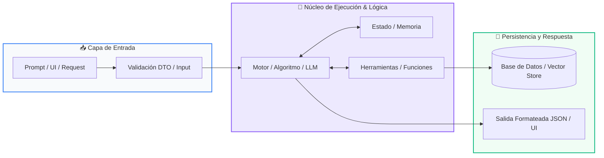

# 📚 Clase 07: Containerización Profesional con Docker y Compose

> **Programa:** Curso 4: Taller Práctico & Proyecto Final Integrador  
> **Nivel:** Nivel 4 - Integrador  
> **Metáfora Central:** *«Docker como Contenedores Estándar de Carga Marítima para Software»*  
> **Documento Oficial PDF:** [clase-07-docker-y-compose.pdf](clase-07-docker-y-compose.pdf)  
> **Instructor:** **William Rodríguez (Wisrovi)** (AI Solutions Architect & Principal Software Engineer)  

---

## 👤 Perfil del Autor y Mentor

### **William Rodríguez (Wisrovi)**
*AI Solutions Architect & Principal Software Engineer &bull; Badajoz, España*

Ingeniero y arquitecto de software especializado en Inteligencia Artificial Generativa, sistemas multi-agente, Visión por Computador e infraestructuras MLOps de alta disponibilidad. Creador y mantenedor de la suite de software libre wisrovi SUITE en PyPI con más de 26 bibliotecas enfocadas en orquestación de pipelines, caching distribuido y optimización de bases de datos.

*   🐙 **GitHub:** [github.com/wisrovi](https://github.com/wisrovi)
*   💼 **LinkedIn:** [www.linkedin.com/in/wisrovi-rodriguez/](https://www.linkedin.com/in/wisrovi-rodriguez/)
*   🐳 **DockerHub:** [hub.docker.com/u/wisrovi](https://hub.docker.com/u/wisrovi)
*   🌐 **Website:** [wisrovi.dev](https://wisrovi.dev)
*   📦 **PyPI:** [pypi.org/user/wisrovi/](https://pypi.org/user/wisrovi/)

---

### 🚲 La Regla de la Bicicleta

> *"Nadie aprende a montar en bicicleta viendo tutoriales. El verdadero dominio de la programación surge cuando abres tu editor, escribes código con tus propias manos, resuelves errores y construyes proyectos reales."*

---

## 📑 Tabla de Contenidos de la Sesión

1. [💡 Fundamentación Teórica y Modelo Mental](#1--fundamentación-teórica-y-modelo-mental)
2. [🗺️ Arquitectura y Diagrama de Flujo](#2-️-arquitectura-y-diagrama-de-flujo)
3. [💻 Implementación en Python 3.10+](#3--implementación-en-python-310)
4. [🛡️ Buenas Prácticas y Trampas Frecuentes](#4-️-buenas-prácticas-y-trampas-frecuentes)
5. [🏋️ Desafío de Práctica](#5-️-desafío-de-práctica)
6. [📚 Bibliografía y Enlaces Canónicos](#6--bibliografía-y-enlaces-canónicos)

---

## 1. 💡 Fundamentación Teórica y Modelo Mental

Docker elimina el famoso problema de 'en mi máquina sí funciona' empaquetando el código con todas sus dependencias.

> [!NOTE]
> **🌟 Metáfora Didáctica:** Un contenedor Docker es como un contenedor de barco: no importa si va en tren o camión, su contenido viaja aislado y seguro.

### Principios Fundamentales

Dockerfile: La receta paso a paso para construir la imagen del contenedor.

Docker Compose: La herramienta para definir y correr aplicaciones multi-contenedor con un solo comando.

> [!IMPORTANT]
> **⚡ Regla de Oro en Python:** Usa imágenes base ligeras (ej. python:3.11-slim) para reducir el tamaño y vulnerabilidades.

---

## 2. 🗺️ Arquitectura y Diagrama de Flujo

Arquitectura de contenedores aislados comunicados por red interna.



### Desglose Paso a Paso del Flujo

| Fase | Acción del Intérprete | Estado en Memoria |
| :--- | :--- | :--- |
| **1. Inicialización** | Lectura de docker-compose.yml. | `Servicios definidos.` |
| **2. Evaluación** | Build de imágenes para FastAPI y Streamlit. | `Imágenes construidas localmente.` |
| **3. Transformación** | Arranque de PostgreSQL con volumen persistente. | `Base de datos en estado Healthy.` |
| **4. Retorno / Salida** | Vinculación de puertos (8000, 8501, 5432) hacia el host. | `Aplicación disponible en localhost.` |

> [!TIP]
> **🔍 Visualización Mental:** Los contenedores son efímeros; los datos permanentes deben vivir en un 'volume'.

---

## 3. 💻 Implementación en Python 3.10+

```python
# CLASE 07 - Código de Demostración
DOCKERFILE_EXAMPLE = """FROM python:3.11-slim
WORKDIR /app
COPY requirements.txt .
RUN pip install --no-cache-dir -r requirements.txt
COPY . .
EXPOSE 8000
CMD ["uvicorn", "main:app", "--host", "0.0.0.0", "--port", "8000"]"""

print("Dockerfile de producción configurado:")
print(DOCKERFILE_EXAMPLE)
```

*Uso de flags --no-cache-dir y copia en capas para aprovechar la caché de Docker.*

---

## 4. 🛡️ Buenas Prácticas y Trampas Frecuentes

> [!WARNING]
> **⚠️ Gotcha Frecuente (Trampa de Principiante):** Usar imágenes completas basadas en Ubuntu instala compiladores innecesarios generando imágenes de más de 2 GB.

*   **❌ Antipatrón:**
    ```python
FROM ubuntu:latest  # ❌ Imagen pesada y lenta de descargar
    ```

*   **✅ Patrón Correcto:**
    ```python
FROM python:3.11-slim  # ✅ Ligera (~150 MB) y rápida
    ```

> [!TIP]
> **💡 Consejo Profesional:** Crea un archivo .dockerignore para evitar copiar venv, git y cachés dentro de la imagen.

---

## 5. 🏋️ Desafío de Práctica

> **Desafío:** Crea un archivo docker-compose.yml que levante un servicio web y un servicio de Redis.

Para ejecutar la verificación automática con pytest:
```bash
pytest ejercicios/
```

---

## 6. 📚 Bibliografía y Enlaces Canónicos

| Fuente / Recurso | Descripción | Enlace |
| :--- | :--- | :--- |
| **Documentación Oficial de Python** | Especificación y biblioteca estándar | [docs.python.org/3/](https://docs.python.org/3/) |
| **PEP 8 — Style Guide for Python** | Estándar oficial de formateo y estilo | [peps.python.org/pep-0008/](https://peps.python.org/pep-0008/) |
| **Real Python Tutorials** | Patrones de ingeniería y desarrollo | [realpython.com](https://realpython.com/) |
| **Suite Open Source wisrovi** | Librerías de alto rendimiento | [github.com/wisrovi](https://github.com/wisrovi) |
