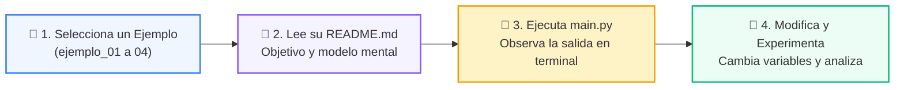

# 💻 Catálogo de Ejemplos Prácticos: Clase 07: Containerización Profesional con Docker y Compose

> **Ubicación:** `04-proyecto-final/clase-07-docker-y-compose/ejemplos`  
> **Metodología:** *La Regla de la Bicicleta (Pedaleo en VS Code)*  

Esta carpeta contiene los ejemplos de código interactivos y comentados diseñados para ver la teoría en acción.

---

## 🌀 Flujo de Experimentación y Pedaleo



---

## 📑 Ejemplos Disponibles

| Subcarpeta | Tipo de Demostración | Archivo de Código |
| :--- | :--- | :---: |
| [`ejemplo_01_dockerfile_python/`](ejemplo_01_dockerfile_python/) | Demostración paso a paso | [`main.py`](ejemplo_01_dockerfile_python/main.py) |
| [`ejemplo_02_dockerignore/`](ejemplo_02_dockerignore/) | Demostración paso a paso | [`main.py`](ejemplo_02_dockerignore/main.py) |
| [`ejemplo_03_docker_compose_yml/`](ejemplo_03_docker_compose_yml/) | Demostración paso a paso | [`main.py`](ejemplo_03_docker_compose_yml/main.py) |
| [`ejemplo_04_healthcheck_db/`](ejemplo_04_healthcheck_db/) | Demostración paso a paso | [`main.py`](ejemplo_04_healthcheck_db/main.py) |


---

## 🚀 Cómo Ejecutar los Ejemplos
Desde la terminal en la raíz del repositorio:
```bash
python 04-proyecto-final/clase-07-docker-y-compose/ejemplos/<carpeta_ejemplo>/main.py
```
