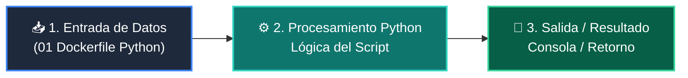

# 📖 01 Dockerfile Python

> **Clase:** Clase 07: Containerización Profesional con Docker y Compose  
> **Script:** [`main.py`](main.py)  

Dockerfile Ligero (python:3.11-slim).

---

## 🗺️ Flujo de Ejecución del Ejemplo



---

## 💻 Ejecución desde Terminal

```bash
python 04-proyecto-final/clase-07-docker-y-compose/ejemplos/ejemplo_01_dockerfile_python/main.py
```
