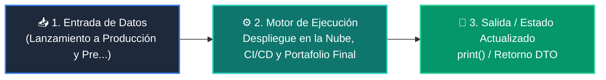

# 📘 Clase 08: Despliegue en la Nube, CI/CD y Portafolio Final

> **Curso:** Curso 4: Taller Práctico & Proyecto Final Integrador (CLASE 08)  
> **Nivel:** Nivel 4 - Integrador &bull; **Metáfora:** *«Lanzamiento a Producción y Presentación de tu Proyecto ante el Mundo»*  

---

## 🗺️ Diagrama de Arquitectura y Flujo de la Clase

---

## 📑 Recursos Disponibles en esta Clase

*   📄 [`clase-08-despliegue-cicd-portafolio.pdf`](clase-08-despliegue-cicd-portafolio.pdf): Manual técnico oficial en PDF (9 páginas).
*   📖 [`book.md`](book.md): Libro de estudio digital con teoría profunda y diagramas Mermaid.
*   📁 [`notebook/`](notebook/): Cuaderno interactivo Jupyter ejecutable en local y en Google Colab con 1 clic.
*   📁 [`ejemplos/`](ejemplos/): Carpetas de código funcional con casos prácticos comentados.
*   📁 [`ejercicios/`](ejercicios/): Reto práctico para afianzar conceptos.
