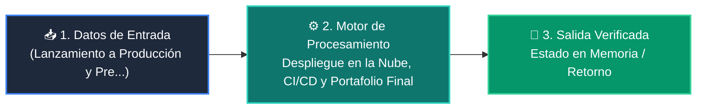

# 📘 Clase 08: Despliegue en la Nube, CI/CD y Portafolio Final

<div align="center">

**Curso 4: Taller Práctico & Proyecto Final Integrador** &bull; **Semana CLASE 08**  
*Nivel:* `Nivel 4 - Integrador` &bull; *Metáfora Central:* **«Lanzamiento a Producción y Presentación de tu Proyecto ante el Mundo»**

[](https://colab.research.google.com/github/wisrovi/wisrovi-python/blob/main/04-proyecto-final/clase-08-despliegue-cicd-portafolio/notebook/clase-08-despliegue-cicd-portafolio.ipynb)
[](clase-08-despliegue-cicd-portafolio.pdf)
[](book.md)

</div>

---

## 🎯 Objetivos de Aprendizaje de la Sesión

*   **Competencia Conceptual:** Comprender el modelo mental de *«Lanzamiento a Producción y Presentación de tu Proyecto ante el Mundo»* (Es el corte de cinta inaugural de tu edificio de software: listo para recibir usuarios reales en todo el mundo.).
*   **Competencia Práctica:** Escribir, ejecutar y depurar scripts en Python aplicando buenas prácticas (PEP 8) y tipado.
*   **Competencia de Ingeniería:** Resolver el reto práctico de la sesión y verificar su correcto funcionamiento con la suite de pruebas automatizadas.

---

## 🗺️ Mapa de Arquitectura y Flujo de Ejecución



---

## 📂 Organización de Materiales en esta Clase

```text
clase-08-despliegue-cicd-portafolio/
├── 📄 clase-08-despliegue-cicd-portafolio.pdf       # Manual técnico oficial de estudio (9 páginas)
├── 📖 book.md                     # Libro digital interactivo con diagramas Mermaid
├── 📝 README.md                   # Esta guía general de la clase
├── 📁 notebook/                   # Cuaderno Jupyter interactivo
│   ├── 📓 clase-08-despliegue-cicd-portafolio.ipynb
│   └── 📝 README.md               # Guía con badge a Google Colab
├── 📁 ejemplos/                   # Carpetas de código estructurado paso a paso
│   └── 📝 README.md               # Catálogo de ejemplos con comandos de ejecución
└── 📁 ejercicios/                 # Reto práctico para el estudiante
    ├── 🐍 reto.py                 # Enunciado y plantilla del ejercicio
    └── 📝 README.md               # Instrucciones de resolución y comandos pytest
```

---

## 🏋️ Desafío Práctico de la Sesión
> **Enunciado:** Abre tu Pull Request en '04-proyecto-final/proyectos-estudiantes/' para unirte al Cuadro de Honor.

Abre el archivo [`ejercicios/reto.py`](ejercicios/reto.py), completa tu implementación y valida tu código ejecutando:
```bash
pytest tests/curso_04/test_clase_08_despliegue_cicd_portafolio.py
```
