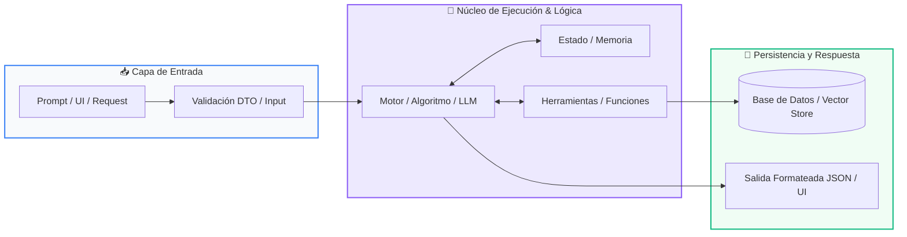

# 📚 Clase 08: Despliegue en la Nube, CI/CD y Portafolio Final

> **Programa:** Curso 4: Taller Práctico & Proyecto Final Integrador  
> **Nivel:** Nivel 4 - Integrador  
> **Metáfora Central:** *«Lanzamiento a Producción y Presentación de tu Proyecto ante el Mundo»*  
> **Documento Oficial PDF:** [clase-08-despliegue-cicd-portafolio.pdf](clase-08-despliegue-cicd-portafolio.pdf)  
> **Instructor:** **William Rodríguez (Wisrovi)** (AI Solutions Architect & Principal Software Engineer)  

---

## 👤 Perfil del Autor y Mentor

### **William Rodríguez (Wisrovi)**
*AI Solutions Architect & Principal Software Engineer &bull; Badajoz, España*

Ingeniero y arquitecto de software especializado en Inteligencia Artificial Generativa, sistemas multi-agente, Visión por Computador e infraestructuras MLOps de alta disponibilidad. Creador y mantenedor de la suite de software libre wisrovi SUITE en PyPI con más de 26 bibliotecas enfocadas en orquestación de pipelines, caching distribuido y optimización de bases de datos.

*   🐙 **GitHub:** [github.com/wisrovi](https://github.com/wisrovi)
*   💼 **LinkedIn:** [www.linkedin.com/in/wisrovi-rodriguez/](https://www.linkedin.com/in/wisrovi-rodriguez/)
*   🐳 **DockerHub:** [hub.docker.com/u/wisrovi](https://hub.docker.com/u/wisrovi)
*   🌐 **Website:** [wisrovi.dev](https://wisrovi.dev)
*   📦 **PyPI:** [pypi.org/user/wisrovi/](https://pypi.org/user/wisrovi/)

---

### 🚲 La Regla de la Bicicleta

> *"Nadie aprende a montar en bicicleta viendo tutoriales. El verdadero dominio de la programación surge cuando abres tu editor, escribes código con tus propias manos, resuelves errores y construyes proyectos reales."*

---

## 📑 Tabla de Contenidos de la Sesión

1. [💡 Fundamentación Teórica y Modelo Mental](#1--fundamentación-teórica-y-modelo-mental)
2. [🗺️ Arquitectura y Diagrama de Flujo](#2-️-arquitectura-y-diagrama-de-flujo)
3. [💻 Implementación en Python 3.10+](#3--implementación-en-python-310)
4. [🛡️ Buenas Prácticas y Trampas Frecuentes](#4-️-buenas-prácticas-y-trampas-frecuentes)
5. [🏋️ Desafío de Práctica](#5-️-desafío-de-práctica)
6. [📚 Bibliografía y Enlaces Canónicos](#6--bibliografía-y-enlaces-canónicos)

---

## 1. 💡 Fundamentación Teórica y Modelo Mental

La graduación del programa culmina con el despliegue de tu solución y la consolidación de tu portafolio profesional.

> [!NOTE]
> **🌟 Metáfora Didáctica:** Es el corte de cinta inaugural de tu edificio de software: listo para recibir usuarios reales en todo el mundo.

### Principios Fundamentales

Pipelines de CI/CD: Automatizan la ejecución de tests y el despliegue automático tras cada git push.

Documentación README: La carta de presentación de tu proyecto para reclutadores y la comunidad.

> [!IMPORTANT]
> **⚡ Regla de Oro en Python:** Un proyecto sin README ni tests no está terminado; la excelencia de ingeniería se demuestra en los detalles.

---

## 2. 🗺️ Arquitectura y Diagrama de Flujo

Flujo de integración continua: Git Push -> CI Runner -> Tests -> Deploy.



### Desglose Paso a Paso del Flujo

| Fase | Acción del Intérprete | Estado en Memoria |
| :--- | :--- | :--- |
| **1. Inicialización** | Desarrollador hace push a la rama main. | `Commit registrado en GitHub.` |
| **2. Evaluación** | GitHub Actions activa el runner ubuntu-latest. | `Entorno virtual aprovisionado.` |
| **3. Transformación** | Ejecución de linter (Ruff) y suite de pruebas (Pytest). | `100% Tests verdes confirmados.` |
| **4. Retorno / Salida** | Despliegue a producción y notificación. | `Aplicación en vivo y certificada.` |

> [!TIP]
> **🔍 Visualización Mental:** Automatizar tu pipeline te da la libertad de desplegar en cualquier momento sin miedo a fallos.

---

## 3. 💻 Implementación en Python 3.10+

```python
# CLASE 08 - Código de Demostración
class ChecklistGraduacion:
    def __init__(self, autor: str, proyecto: str):
        self.autor = autor
        self.proyecto = proyecto
        self.items = {
            "1. Codigo modular y PEP 8": True,
            "2. Suite de pruebas con Pytest": True,
            "3. Dockerfile y Docker Compose": True,
            "4. Documentacion README completa": True,
            "5. Video demo o capturas": True
        }

    def verificar(self) -> bool:
        return all(self.items.values())

grad = ChecklistGraduacion("Wisrovi Student", "AI Support Hub")
print(f"Estado de Graduación para {grad.autor}:")
for k, v in grad.items.items():
    print(f"  [{'X' if v else ' '}] {k}")
print(f"🏆 ¿Aprobado para Certificación?: {grad.verificar()}")
```

*Estructura de validación final para el egreso y presentación de proyectos en el repositorio.*

---

## 4. 🛡️ Buenas Prácticas y Trampas Frecuentes

> [!WARNING]
> **⚠️ Gotcha Frecuente (Trampa de Principiante):** Subir archivos temporales (__pycache__, .env, .venv) por no configurar un .gitignore limpio.

*   **❌ Antipatrón:**
    ```python
# Repositorio con 100 archivos .pyc y credenciales secretas ❌
    ```

*   **✅ Patrón Correcto:**
    ```python
# Repositorio con .gitignore estándar de Python y variables en secretos de GitHub ✅
    ```

> [!TIP]
> **💡 Consejo Profesional:** Agrega tu proyecto final a la galería de graduados abriendo un Pull Request.

---

## 5. 🏋️ Desafío de Práctica

> **Desafío:** Abre tu Pull Request en '04-proyecto-final/proyectos-estudiantes/' para unirte al Cuadro de Honor.

Para ejecutar la verificación automática con pytest:
```bash
pytest ejercicios/
```

---

## 6. 📚 Bibliografía y Enlaces Canónicos

| Fuente / Recurso | Descripción | Enlace |
| :--- | :--- | :--- |
| **Documentación Oficial de Python** | Especificación y biblioteca estándar | [docs.python.org/3/](https://docs.python.org/3/) |
| **PEP 8 — Style Guide for Python** | Estándar oficial de formateo y estilo | [peps.python.org/pep-0008/](https://peps.python.org/pep-0008/) |
| **Real Python Tutorials** | Patrones de ingeniería y desarrollo | [realpython.com](https://realpython.com/) |
| **Suite Open Source wisrovi** | Librerías de alto rendimiento | [github.com/wisrovi](https://github.com/wisrovi) |
