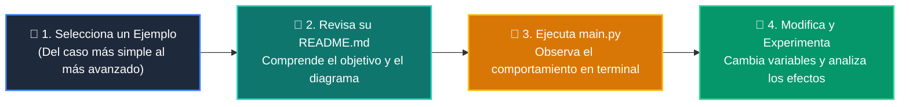

# 💻 Catálogo de Ejemplos Prácticos: Clase 08: Despliegue en la Nube, CI/CD y Portafolio Final

> **Ubicación:** `curso/clase-08-despliegue-cicd-portafolio/ejemplos`  
> **Filosofía:** *Aprender programando mediante casos de uso aislados, legibles y comentados.*

---

## 🗺️ Flujo de Estudio Recomendado



---

## 📑 Ejemplos Disponibles en esta Clase

| Directorio | Caso de Uso Demostrado | Script Principal |
| :--- | :--- | :---: |
| [`ejemplo_01_github_actions_workflow/`](ejemplo_01_github_actions_workflow/) | 01 Github Actions Workflow | [`main.py`](ejemplo_01_github_actions_workflow/main.py) |
| [`ejemplo_02_checklist_entrega/`](ejemplo_02_checklist_entrega/) | 02 Checklist Entrega | [`main.py`](ejemplo_02_checklist_entrega/main.py) |
| [`ejemplo_03_config_produccion/`](ejemplo_03_config_produccion/) | 03 Config Produccion | [`main.py`](ejemplo_03_config_produccion/main.py) |
| [`ejemplo_04_plantilla_pr_graduacion/`](ejemplo_04_plantilla_pr_graduacion/) | 04 Plantilla Pr Graduacion | [`main.py`](ejemplo_04_plantilla_pr_graduacion/main.py) |


---

## 🚀 Cómo Ejecutar Cualquier Ejemplo
Abre tu terminal en la raíz del repositorio y ejecuta:
```bash
python 01-fundamentos-python/clase-08-despliegue-cicd-portafolio/ejemplos/<nombre_del_ejemplo>/main.py
```
