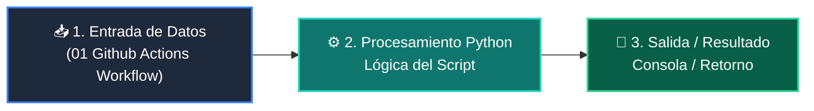

# 📖 01 Github Actions Workflow

> **Clase:** Clase 08: Despliegue en la Nube, CI/CD y Portafolio Final  
> **Script:** [`main.py`](main.py)  

Pipeline de CI en GitHub Actions.

---

## 🗺️ Flujo de Ejecución del Ejemplo



---

## 💻 Ejecución desde Terminal

```bash
python 04-proyecto-final/clase-08-despliegue-cicd-portafolio/ejemplos/ejemplo_01_github_actions_workflow/main.py
```
