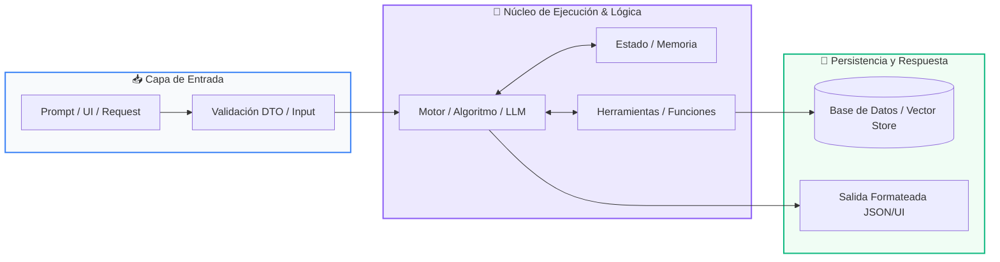

# 📖 Track 01: Aplicaciones Web con Python (FastAPI & Streamlit)

> **Programa:** Curso 4: Taller Práctico & Proyecto Final Personalizado (Nivel 4 (Integrador))  
> **Nivel de Dificultad:** Integrador / Producción  
> **Metáfora Central:** *«El Restaurante: La Carta (Frontend) y la Cocina de Alta Eficiencia (Backend)»*  
> **Python Version:** 3.10+ | **Licencia:** MIT  

---

## 👤 Acerca del Autor y Mentor

### **William Rodríguez (Wisrovi)**
**AI Solutions Architect & Principal Software Engineer** &bull; *Badajoz, España*

Ingeniero y arquitecto de software especializado en Inteligencia Artificial Generativa, sistemas multi-agente, Visión por Computador e infraestructuras MLOps de alta disponibilidad. Creador y mantenedor de la suite de software libre <strong>wisrovi SUITE</strong> en PyPI con más de 26 bibliotecas enfocadas en orquestación de pipelines, caching distribuido y optimización de bases de datos.

*   🐙 **GitHub:** [github.com/wisrovi](https://github.com/wisrovi)
*   💼 **LinkedIn:** [www.linkedin.com/in/wisrovi-rodriguez/](https://www.linkedin.com/in/wisrovi-rodriguez/)
*   🐳 **DockerHub:** [hub.docker.com/u/wisrovi](https://hub.docker.com/u/wisrovi)
*   🌐 **Website:** [wisrovi.dev](https://wisrovi.dev)
*   📦 **PyPI:** [pypi.org/user/wisrovi/](https://pypi.org/user/wisrovi/)

---

### 🚲 Metodología de Aprendizaje: La Regla de la Bicicleta

> *"Nadie aprende a montar en bicicleta viendo tutoriales. El verdadero dominio de la programación surge cuando abres tu editor, escribes código con tus propias manos, resuelves errores y construyes proyectos reales."*

> [!TIP]
> **El Compromiso Activo del Estudiante:** Abre Visual Studio Code en cada sesión. Escribe cada ejemplo con tus propias manos. Cambia los números, rompe el código deliberadamente para ver el mensaje de error de Python, y luego arréglalo.

---

## 📑 Tabla de Contenidos

| Capítulo | Tema | Enfoque Principal |
| :--- | :--- | :--- |
| **01** | **Fundamentos & Metáfora** | Arquitectura Cliente-Servidor y APIs Modernas |
| **02** | **Arquitectura de Flujo** | Diagrama de Flujo Full-Stack: Streamlit <-> FastAPI <-> DB |
| **03** | **Implementación Práctica** | Backend FastAPI con Endpoint RESTful Tipado |
| **04** | **Patrones & Debugging** | Gotchas y Seguridad en Aplicaciones Web |
| **05** | **Conclusiones & Cierre** | Resumen ejecutivo, notas del mentor y agradecimiento |
| **06** | **Bibliografía & Recursos** | Fuentes oficiales y retos de autoestudio |

### 🎯 Objetivos de Aprendizaje

*   **Competencia Conceptual:** Comprender la separación de responsabilidades Cliente-Servidor, APIs RESTful y el paradigma asíncrono async/await.
*   **Competencia Práctica:** Construir y desplegar una aplicación web completa con endpoints RESTful, validación con Pydantic y dashboard interactivo.

---

## 1. 💡 Arquitectura Cliente-Servidor y APIs Modernas

Una aplicación web desacoplada divide la presentación visual del procesamiento central de datos mediante contratos de comunicación HTTP (APIs REST).

> [!NOTE]
> ### 🌟 Metáfora Central: El Restaurante: La Carta (Frontend) y la Cocina de Alta Eficiencia (Backend)
> El frontend (Streamlit) es la carta elegante y el mozo que atiende al comensal en la mesa. El backend (FastAPI) es la cocina profesional donde los chefs procesan las comandas con máxima higiene, rapidez y orden, entregando los platos listos en formato JSON.

### Principios Teóricos y Modelo Mental

FastAPI: Framework moderno, basado en Starlette y Pydantic, con soporte nativo de asincronía (ASGI) y tipado estático.

Verbos HTTP Semánticos: GET (consultar datos), POST (crear nuevos registros), PUT (actualizar), DELETE (eliminar).

> [!IMPORTANT]
> ### ⚡ Regla de Oro en Python
> Nunca mezcles lógica pesada de base de datos en el cliente visual; el cliente solo consume y renderiza.

---

## 2. 🗺️ Diagrama de Flujo Full-Stack: Streamlit <-> FastAPI <-> DB

Comunicación asíncrona mediante peticiones HTTP/JSON y validación cruzada.

### Diagrama Visual del Flujo



### Desglose Paso a Paso del Flujo

| Fase del Flujo | Acción del Intérprete | Estado en Memoria |
| :--- | :--- | :--- |
| **1. Inicialización** | El usuario interactúa con widgets en Streamlit y presiona un botón. | `Evento en UI` |
| **2. Evaluación** | Streamlit envía una petición HTTP POST /api/v1/recurso con payload JSON. | `Request sobre HTTP` |
| **3. Transformación** | FastAPI valida los datos con Pydantic, ejecuta la lógica y persiste en DB. | `Validación & Persistencia` |
| **4. Retorno / Salida** | FastAPI responde HTTP 201 Created y Streamlit actualiza la vista reactivamente. | `UI actualizada` |

> [!TIP]
> **Visualización Mental:** FastAPI genera automáticamente documentación Swagger interactiva en la ruta /docs para probar todos tus endpoints.

---

## 3. 💻 Backend FastAPI con Endpoint RESTful Tipado

Servicio web profesional con validación de modelos y control de estado HTTP:

```python
# main.py - Python 3.10+ PEP 8 Compliant
from fastapi import FastAPI, HTTPException, status
from pydantic import BaseModel

app = FastAPI(title="API de Gestión de Productos", version="1.0.0")

class ProductoDTO(BaseModel):
    nombre: str
    precio: float
    categoria: str

db_productos: list[dict] = []

@app.post("/productos", status_code=status.HTTP_201_CREATED)
async def crear_producto(prod: ProductoDTO):
    nuevo = {"id": len(db_productos) + 1, **prod.model_dump()}
    db_productos.append(nuevo)
    return {"mensaje": "Producto creado", "data": nuevo}

@app.get("/productos")
async def listar_productos():
    return {"total": len(db_productos), "productos": db_productos}
```

### Análisis del Código Fuente

Endpoints asíncronos decorados con FastAPI, validación automática mediante Pydantic DTO y códigos de estado HTTP semánticos.

---

## 4. 🛡️ Gotchas y Seguridad en Aplicaciones Web

Vulnerabilidades y errores de arquitectura en APIs de producción:

> [!WARNING]
> ### ⚠️ Gotcha Frecuente (Trampa de Principiante)
> Olvidar configurar el middleware CORS (Cross-Origin Resource Sharing), bloqueando las peticiones del frontend.

### Comparativa: Antipatrón vs Patrón Recomendado

#### ❌ Antipatrón / Mal Código:
```python
# Sin configuración CORS: Streamlit o React no podrán consumir la API
```

#### ✅ Patrón Pythonic / Correcto:
```python
from fastapi.middleware.cors import CORSMiddleware
app.add_middleware(CORSMiddleware, allow_origins=['*'])
```

> [!TIP]
> **Consejo de Resiliencia en Producción:** Utiliza uvicorn main:app --reload durante desarrollo y despliega con contenedores Docker en producción.

---

## 5. 🏆 Conclusiones y Resumen Ejecutivo

Dominas el desarrollo de aplicaciones web full-stack profesionales en Python con FastAPI y Streamlit.

> [!NOTE]
> ### 🎖️ Logro Alcanzado
> Capacidad para diseñar y desplegar APIs REST escalables con interfaces interactivas para tu portafolio.

### 📝 Notas del Instructor
Acompañamiento personalizado disponible para la arquitectura y el despliegue de tu proyecto final.

### 🤝 Mensaje de Agradecimiento
Muchas gracias por tu entusiasmo, disciplina y dedicación al participar en este programa formativo. La programación es un superpoder que transforma vidas cuando se ejerce con constancia y curiosidad. ¡Nos vemos en la próxima sesión para seguir construyendo juntos! 💻🚀

---

## 6. 📚 Bibliografía y Fuentes de Estudio

| Fuente / Recurso | Descripción Temática | Enlace Oficial |
| :--- | :--- | :--- |
| **Documentación Oficial de Python** | Referencia canónica del lenguaje y librería estándar | [docs.python.org/3/](https://docs.python.org/3/) |
| **PEP 8 — Style Guide for Python** | Guía oficial de estilo, formato e indentación | [peps.python.org/pep-0008/](https://peps.python.org/pep-0008/) |
| **Real Python Tutorials** | Artículos técnicos y patrones de desarrollo moderno | [realpython.com](https://realpython.com/) |
| **Python Type Checking (PEP 484)** | Anotaciones de tipo y análisis estático | [docs.python.org/typing](https://docs.python.org/3/library/typing.html) |
| **Suite Open Source wisrovi** | Paquetes Python para orquestación y rendimiento | [github.com/wisrovi](https://github.com/wisrovi) |

> [!TIP]
> ### 🏋️ Desafío de Autoestudio Recomendado
> Integra autenticación JWT (JSON Web Tokens) en tu API de FastAPI para proteger endpoints sensibles.
