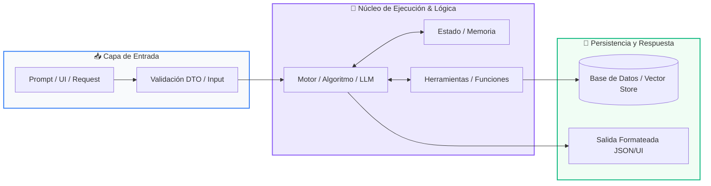

# 📖 Track 02: Chatbot Inteligente para Atención al Cliente

> **Programa:** Curso 4: Taller Práctico & Proyecto Final Personalizado (Nivel 4 (Integrador))  
> **Nivel de Dificultad:** Integrador / Producción  
> **Metáfora Central:** *«El Recepcionista Omnicanal y el Manual de Operaciones»*  
> **Python Version:** 3.10+ | **Licencia:** MIT  

---

## 👤 Acerca del Autor y Mentor

### **William Rodríguez (Wisrovi)**
**AI Solutions Architect & Principal Software Engineer** &bull; *Badajoz, España*

Ingeniero y arquitecto de software especializado en Inteligencia Artificial Generativa, sistemas multi-agente, Visión por Computador e infraestructuras MLOps de alta disponibilidad. Creador y mantenedor de la suite de software libre <strong>wisrovi SUITE</strong> en PyPI con más de 26 bibliotecas enfocadas en orquestación de pipelines, caching distribuido y optimización de bases de datos.

*   🐙 **GitHub:** [github.com/wisrovi](https://github.com/wisrovi)
*   💼 **LinkedIn:** [www.linkedin.com/in/wisrovi-rodriguez/](https://www.linkedin.com/in/wisrovi-rodriguez/)
*   🐳 **DockerHub:** [hub.docker.com/u/wisrovi](https://hub.docker.com/u/wisrovi)
*   🌐 **Website:** [wisrovi.dev](https://wisrovi.dev)
*   📦 **PyPI:** [pypi.org/user/wisrovi/](https://pypi.org/user/wisrovi/)

---

### 🚲 Metodología de Aprendizaje: La Regla de la Bicicleta

> *"Nadie aprende a montar en bicicleta viendo tutoriales. El verdadero dominio de la programación surge cuando abres tu editor, escribes código con tus propias manos, resuelves errores y construyes proyectos reales."*

> [!TIP]
> **El Compromiso Activo del Estudiante:** Abre Visual Studio Code en cada sesión. Escribe cada ejemplo con tus propias manos. Cambia los números, rompe el código deliberadamente para ver el mensaje de error de Python, y luego arréglalo.

---

## 📑 Tabla de Contenidos

| Capítulo | Tema | Enfoque Principal |
| :--- | :--- | :--- |
| **01** | **Fundamentos & Metáfora** | Arquitectura de un Chatbot Conversacional de Negocio |
| **02** | **Arquitectura de Flujo** | Diagrama de Flujo Conversacional y Webhooks |
| **03** | **Implementación Práctica** | Motor de Chatbot con Historial de Sesión |
| **04** | **Patrones & Debugging** | Gotchas en Chatbots de Producción |
| **05** | **Conclusiones & Cierre** | Resumen ejecutivo, notas del mentor y agradecimiento |
| **06** | **Bibliografía & Recursos** | Fuentes oficiales y retos de autoestudio |

### 🎯 Objetivos de Aprendizaje

*   **Competencia Conceptual:** Comprender la gestión del estado conversacional, el enrutamiento de intenciones y la prevención de alucinaciones corporativas.
*   **Competencia Práctica:** Construir un bot conversacional con historial de diálogo, base de conocimiento RAG y despliegue en Telegram o Web.

---

## 1. 💡 Arquitectura de un Chatbot Conversacional de Negocio

Un chatbot empresarial no solo charla: responde preguntas frecuentes con precisión quirúrgica, consulta el estado de pedidos y transfiere a humanos cuando es necesario.

> [!NOTE]
> ### 🌟 Metáfora Central: El Recepcionista Omnicanal y el Manual de Operaciones
> El chatbot es como el recepcionista estrella de una empresa: saluda cordialmente, recuerda todo lo que le dijiste en la conversación actual (memoria de sesión) y consulta de inmediato el manual de operaciones antes de dar una respuesta oficial.

### Principios Teóricos y Modelo Mental

Gestión de Sesión: Cada usuario tiene un session_id único asociado a su buffer de historial en memoria (o en Redis).

Guardrails y System Prompt: Delimitan estrictamente las fronteras temáticas del bot para evitar que hable de temas ajenos a la empresa.

> [!IMPORTANT]
> ### ⚡ Regla de Oro en Python
> Instruye siempre al chatbot en su System Prompt para que admita honestamente si no conoce una respuesta en lugar de inventar información.

---

## 2. 🗺️ Diagrama de Flujo Conversacional y Webhooks

Ciclo de vida del mensaje desde la app de mensajería hasta la síntesis de respuesta.

### Diagrama Visual del Flujo



### Desglose Paso a Paso del Flujo

| Fase del Flujo | Acción del Intérprete | Estado en Memoria |
| :--- | :--- | :--- |
| **1. Inicialización** | El usuario envía un mensaje en Telegram/WhatsApp; la plataforma emite un Webhook HTTP. | `Mensaje entrante` |
| **2. Evaluación** | El Session Manager recupera el historial previo del usuario desde la memoria caché. | `Historial de diálogo cargado` |
| **3. Transformación** | Se inyecta el contexto RAG de la empresa y el LLM formula la respuesta corporativa. | `Inferencia contextualizada` |
| **4. Retorno / Salida** | Se guarda el nuevo turno en el historial y se envía el mensaje al canal del usuario. | `Respuesta entregada al chat` |

> [!TIP]
> **Visualización Mental:** Mantén los prompts del sistema concisos y enfócate en el tono de voz (amable, formal, conciso).

---

## 3. 💻 Motor de Chatbot con Historial de Sesión

Gestor de memoria de diálogo multi-usuario en Python:

```python
# main.py - Python 3.10+ PEP 8 Compliant
class ChatbotAtencionCliente:
    def __init__(self, nombre_empresa: str):
        self.nombre_empresa = nombre_empresa
        self.sesiones: dict[str, list] = {}
        self.system_prompt = f"Eres el asistente virtual de {nombre_empresa}. Sé conciso y formal."

    def responder_usuario(self, user_id: str, mensaje: str) -> str:
        if user_id not in self.sesiones:
            self.sesiones[user_id] = [{"role": "system", "content": self.system_prompt}]
        
        # Agregar turno del usuario
        self.sesiones[user_id].append({"role": "user", "content": mensaje})
        
        # Simulación de respuesta del LLM contextualizada
        respuesta = f"Hola, gracias por contactar a {self.nombre_empresa}. ¿En qué puedo ayudarte?"
        self.sesiones[user_id].append({"role": "assistant", "content": respuesta})
        
        return respuesta
```

### Análisis del Código Fuente

Clase que gestiona sesiones independientes por usuario, acumulando el historial en el formato canónico de roles de los LLMs.

---

## 4. 🛡️ Gotchas en Chatbots de Producción

Errores comunes en sistemas conversacionales:

> [!WARNING]
> ### ⚠️ Gotcha Frecuente (Trampa de Principiante)
> No limitar el tamaño del historial acumulado; con el tiempo la conversación agota la ventana de contexto y eleva los costes innecesariamente.

### Comparativa: Antipatrón vs Patrón Recomendado

#### ❌ Antipatrón / Mal Código:
```python
# Acumular cientos de mensajes sin podar el historial
```

#### ✅ Patrón Pythonic / Correcto:
```python
# Mantener solo los últimos K mensajes (Sliding Window Memory)
```

> [!TIP]
> **Consejo de Resiliencia en Producción:** Usa una ventana deslizante (ej: últimos 10 mensajes) o resume periódicamente los turnos anteriores.

---

## 5. 🏆 Conclusiones y Resumen Ejecutivo

Dominas la arquitectura completa de un agente conversacional inteligente para atención a clientes.

> [!NOTE]
> ### 🎖️ Logro Alcanzado
> Capacidad para construir y desplegar chatbots empresariales con memoria y contexto corporativo.

### 📝 Notas del Instructor
Presenta este proyecto en tu portafolio como demostración de integración práctica de IA en procesos de negocio.

### 🤝 Mensaje de Agradecimiento
Muchas gracias por tu entusiasmo, disciplina y dedicación al participar en este programa formativo. La programación es un superpoder que transforma vidas cuando se ejerce con constancia y curiosidad. ¡Nos vemos en la próxima sesión para seguir construyendo juntos! 💻🚀

---

## 6. 📚 Bibliografía y Fuentes de Estudio

| Fuente / Recurso | Descripción Temática | Enlace Oficial |
| :--- | :--- | :--- |
| **Documentación Oficial de Python** | Referencia canónica del lenguaje y librería estándar | [docs.python.org/3/](https://docs.python.org/3/) |
| **PEP 8 — Style Guide for Python** | Guía oficial de estilo, formato e indentación | [peps.python.org/pep-0008/](https://peps.python.org/pep-0008/) |
| **Real Python Tutorials** | Artículos técnicos y patrones de desarrollo moderno | [realpython.com](https://realpython.com/) |
| **Python Type Checking (PEP 484)** | Anotaciones de tipo y análisis estático | [docs.python.org/typing](https://docs.python.org/3/library/typing.html) |
| **Suite Open Source wisrovi** | Paquetes Python para orquestación y rendimiento | [github.com/wisrovi](https://github.com/wisrovi) |

> [!TIP]
> ### 🏋️ Desafío de Autoestudio Recomendado
> Integra la biblioteca python-telegram-bot para publicar tu chatbot en vivo en un canal de Telegram.
