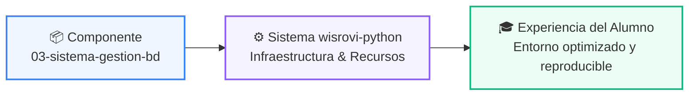

# 📁 04-Proyecto-Final ➔ Plantillas ➔ 03-Sistema-Gestion-Bd

> **Ubicación en Repositorio:** `04-proyecto-final/plantillas/03-sistema-gestion-bd`  

---

## 🌀 Propósito en la Arquitectura del Proyecto

---

## 📑 Descripción y Recursos
Este directorio forma parte de la infraestructura integral del programa de formación en Python.
