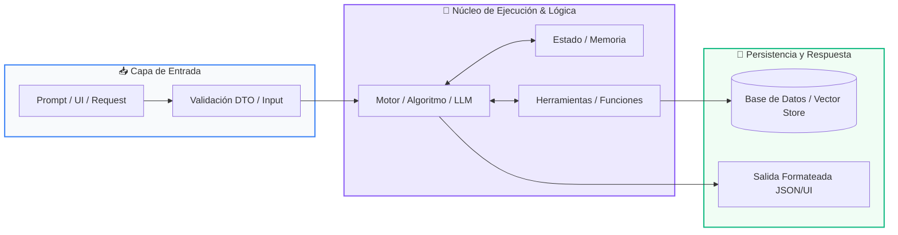

# 📖 Track 03: Sistema de Gestión con Base de Datos Relacional

> **Programa:** Curso 4: Taller Práctico & Proyecto Final Personalizado (Nivel 4 (Integrador))  
> **Nivel de Dificultad:** Integrador / Producción  
> **Metáfora Central:** *«El Archivo Notarial y la Bóveda de Datos ACID»*  
> **Python Version:** 3.10+ | **Licencia:** MIT  

---

## 👤 Acerca del Autor y Mentor

### **William Rodríguez (Wisrovi)**
**AI Solutions Architect & Principal Software Engineer** &bull; *Badajoz, España*

Ingeniero y arquitecto de software especializado en Inteligencia Artificial Generativa, sistemas multi-agente, Visión por Computador e infraestructuras MLOps de alta disponibilidad. Creador y mantenedor de la suite de software libre <strong>wisrovi SUITE</strong> en PyPI con más de 26 bibliotecas enfocadas en orquestación de pipelines, caching distribuido y optimización de bases de datos.

*   🐙 **GitHub:** [github.com/wisrovi](https://github.com/wisrovi)
*   💼 **LinkedIn:** [www.linkedin.com/in/wisrovi-rodriguez/](https://www.linkedin.com/in/wisrovi-rodriguez/)
*   🐳 **DockerHub:** [hub.docker.com/u/wisrovi](https://hub.docker.com/u/wisrovi)
*   🌐 **Website:** [wisrovi.dev](https://wisrovi.dev)
*   📦 **PyPI:** [pypi.org/user/wisrovi/](https://pypi.org/user/wisrovi/)

---

### 🚲 Metodología de Aprendizaje: La Regla de la Bicicleta

> *"Nadie aprende a montar en bicicleta viendo tutoriales. El verdadero dominio de la programación surge cuando abres tu editor, escribes código con tus propias manos, resuelves errores y construyes proyectos reales."*

> [!TIP]
> **El Compromiso Activo del Estudiante:** Abre Visual Studio Code en cada sesión. Escribe cada ejemplo con tus propias manos. Cambia los números, rompe el código deliberadamente para ver el mensaje de error de Python, y luego arréglalo.

---

## 📑 Tabla de Contenidos

| Capítulo | Tema | Enfoque Principal |
| :--- | :--- | :--- |
| **01** | **Fundamentos & Metáfora** | Persistencia de Datos e Integridad Transaccional (ACID) |
| **02** | **Arquitectura de Flujo** | Diagrama de Capas: Aplicación <-> Repositorio <-> Motor SQL |
| **03** | **Implementación Práctica** | Repositorio de Datos Seguro con SQLite |
| **04** | **Patrones & Debugging** | Gotchas en Gestión de Bases de Datos |
| **05** | **Conclusiones & Cierre** | Resumen ejecutivo, notas del mentor y agradecimiento |
| **06** | **Bibliografía & Recursos** | Fuentes oficiales y retos de autoestudio |

### 🎯 Objetivos de Aprendizaje

*   **Competencia Conceptual:** Comprender el modelo relacional de datos, las claves primarias/foráneas y la integridad transaccional ACID.
*   **Competencia Práctica:** Construir un sistema de persistencia completo con repositorios en Python puro interactuando con SQLite / PostgreSQL.

---

## 1. 💡 Persistencia de Datos e Integridad Transaccional (ACID)

La memoria RAM se borra al apagar la computadora; una base de datos relacional garantiza que la información de tus clientes y finanzas persista para siempre de forma atómica e íntegra.

> [!NOTE]
> ### 🌟 Metáfora Central: El Archivo Notarial y la Bóveda de Datos ACID
> Una base de datos relacional es como una bóveda notarial de alta seguridad: cada tabla es un libro de registros con columnas estrictas, y cada transacción es un contrato firmado. O se realizan todos los pasos de la operación o se cancela por completo sin dejar inconsistencias a medias.

### Principios Teóricos y Modelo Mental

Propiedades ACID: Atomicidad (todo o nada), Consistencia (cumple reglas), Aislamiento (concurrencia segura), Durabilidad (persiste en disco).

Inyección SQL: La vulnerabilidad #1 en bases de datos; ocurre al concatenar texto crudo en queries. Se previene siempre con consultas parametrizadas (?) o (%s).

> [!IMPORTANT]
> ### ⚡ Regla de Oro en Python
> NUNCA uses f-strings para construir sentencias SQL (ej: f'SELECT * FROM u WHERE id={id}'); usa siempre queries parametrizadas con tuplas.

---

## 2. 🗺️ Diagrama de Capas: Aplicación <-> Repositorio <-> Motor SQL

Arquitectura en capas (Layered Architecture) para aislar las sentencias SQL de la lógica de negocio.

### Diagrama Visual del Flujo



### Desglose Paso a Paso del Flujo

| Fase del Flujo | Acción del Intérprete | Estado en Memoria |
| :--- | :--- | :--- |
| **1. Inicialización** | La capa de negocio solicita guardar o consultar una entidad. | `Llamada a método del Repositorio` |
| **2. Evaluación** | El Repositorio abre una conexión/cursor y prepara la sentencia parametrizada. | `Preparación de la query` |
| **3. Transformación** | El motor de base de datos ejecuta la transacción y valida claves únicas. | `Ejecución ACID en disco` |
| **4. Retorno / Salida** | Se realiza commit() para asegurar los cambios y se cierra la conexión de forma segura. | `Datos persistidos permanentemente` |

> [!TIP]
> **Visualización Mental:** Utiliza siempre context managers (with sqlite3.connect(...) as conn:) para asegurar el cierre de conexiones.

---

## 3. 💻 Repositorio de Datos Seguro con SQLite

Implementación de persistencia relacional con transacciones y consultas parametrizadas:

```python
# main.py - Python 3.10+ PEP 8 Compliant
import sqlite3

class RepositorioUsuarios:
    def __init__(self, db_path: str = "app.db"):
        self.db_path = db_path
        self._crear_tabla()

    def _crear_tabla(self) -> None:
        with sqlite3.connect(self.db_path) as conn:
            cursor = conn.cursor()
            cursor.execute('''
                CREATE TABLE IF NOT EXISTS usuarios (
                    id INTEGER PRIMARY KEY AUTOINCREMENT,
                    nombre TEXT NOT NULL,
                    email TEXT UNIQUE NOT NULL,
                    saldo REAL DEFAULT 0.0
                )
            ''')
            conn.commit()

    def insertar_usuario(self, nombre: str, email: str, saldo: float) -> int:
        with sqlite3.connect(self.db_path) as conn:
            cursor = conn.cursor()
            # Consulta parametrizada segura contra Inyección SQL
            cursor.execute(
                "INSERT INTO usuarios (nombre, email, saldo) VALUES (?, ?, ?)",
                (nombre, email, saldo)
            )
            conn.commit()
            return cursor.lastrowid
```

### Análisis del Código Fuente

Clase Repository que encapsula la lógica SQL, maneja el ciclo de vida de conexiones y previene vulnerabilidades de inyección SQL.

---

## 4. 🛡️ Gotchas en Gestión de Bases de Datos

Errores críticos que provocan pérdida de datos o brechas de seguridad:

> [!WARNING]
> ### ⚠️ Gotcha Frecuente (Trampa de Principiante)
> Concatenar variables de usuario directamente dentro de sentencias SQL, permitiendo ataques de Inyección SQL.

### Comparativa: Antipatrón vs Patrón Recomendado

#### ❌ Antipatrón / Mal Código:
```python
cursor.execute(f"SELECT * FROM users WHERE user = '{user}'") # ¡Vulnerable!
```

#### ✅ Patrón Pythonic / Correcto:
```python
cursor.execute("SELECT * FROM users WHERE user = ?", (user,)) # Inmune a inyección
```

> [!TIP]
> **Consejo de Resiliencia en Producción:** Crea siempre índices (CREATE INDEX) sobre las columnas que uses frecuentemente en cláusulas WHERE o JOIN.

---

## 5. 🏆 Conclusiones y Resumen Ejecutivo

¡Felicitaciones! Has dominado el diseño y persistencia de bases de datos relacionales en Python.

> [!NOTE]
> ### 🎖️ Logro Alcanzado
> Capacidad para construir sistemas de información profesionales con integridad de datos garantizada.

### 📝 Notas del Instructor
Presenta este sistema con su esquema relacional como parte de tu proyecto final integrador.

### 🤝 Mensaje de Agradecimiento
Muchas gracias por tu entusiasmo, disciplina y dedicación al participar en este programa formativo. La programación es un superpoder que transforma vidas cuando se ejerce con constancia y curiosidad. ¡Nos vemos en la próxima sesión para seguir construyendo juntos! 💻🚀

---

## 6. 📚 Bibliografía y Fuentes de Estudio

| Fuente / Recurso | Descripción Temática | Enlace Oficial |
| :--- | :--- | :--- |
| **Documentación Oficial de Python** | Referencia canónica del lenguaje y librería estándar | [docs.python.org/3/](https://docs.python.org/3/) |
| **PEP 8 — Style Guide for Python** | Guía oficial de estilo, formato e indentación | [peps.python.org/pep-0008/](https://peps.python.org/pep-0008/) |
| **Real Python Tutorials** | Artículos técnicos y patrones de desarrollo moderno | [realpython.com](https://realpython.com/) |
| **Python Type Checking (PEP 484)** | Anotaciones de tipo y análisis estático | [docs.python.org/typing](https://docs.python.org/3/library/typing.html) |
| **Suite Open Source wisrovi** | Paquetes Python para orquestación y rendimiento | [github.com/wisrovi](https://github.com/wisrovi) |

> [!TIP]
> ### 🏋️ Desafío de Autoestudio Recomendado
> Implementa una transacción bancaria que transfiera saldo entre dos usuarios asegurando atomicidad con rollback en caso de error.
