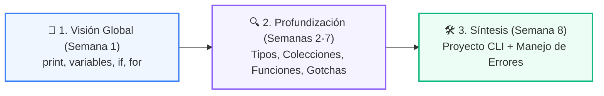
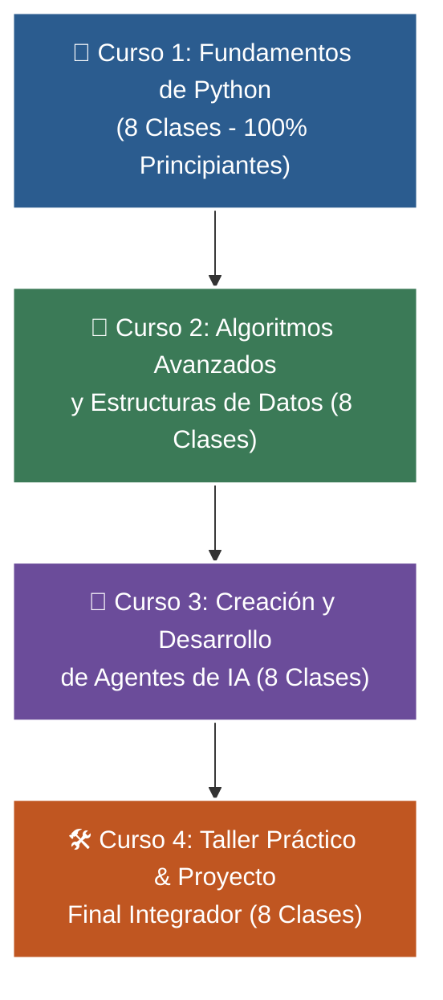

# 🐍 Programa Integral de Formación en Python: De Cero a Agentes de IA

[](https://www.python.org/)
[](https://codespaces.new/wisrovi/wisrovi-python)
[](https://github.com/wisrovi/wisrovi-python/actions/workflows/ci.yml)
[](https://academy_python.wisrovi.dev/)
[]()
[](LICENSE)

Bienvenido/a al repositorio oficial del **Programa de Formación en Python**. Este espacio está estructurado de forma profesional, modular y progresiva para guiarte desde tus primeros pasos en la programación hasta el diseño, desarrollo y despliegue de **Agentes de Inteligencia Artificial** y aplicaciones del mundo real.

---

## 👤 Acerca del Autor y Mentor

### **William Rodríguez (Wisrovi)**
*AI Solutions Architect & Principal Software Engineer &bull; Badajoz, España*

Ingeniero y arquitecto de software especializado en Inteligencia Artificial Generativa, sistemas multi-agente, Visión por Computador e infraestructuras MLOps de alta disponibilidad. Creador y mantenedor de la suite de software libre **wisrovi SUITE** en PyPI con más de 26 bibliotecas enfocadas en orquestación de pipelines, caching distribuido y optimización de bases de datos.

* 🐙 **GitHub:** [github.com/wisrovi](https://github.com/wisrovi)
* 💼 **LinkedIn:** [linkedin.com/in/wisrovi-rodriguez](https://www.linkedin.com/in/wisrovi-rodriguez/)
* 🐳 **DockerHub:** [hub.docker.com/u/wisrovi](https://hub.docker.com/u/wisrovi)
* 🌐 **Website:** [wisrovi.dev](https://wisrovi.dev)
* 📦 **PyPI:** [pypi.org/user/wisrovi/](https://pypi.org/user/wisrovi/)

---

## 🚲 Filosofía Pedagógica: La Regla de la Bicicleta

> *"Por más libros que leas o explicaciones que escuches sobre cómo guardar el equilibrio, si no te subes a la bicicleta y pedaleas por ti mismo, nunca vas a aprender a andar en bici."*

Aprender a programar es una habilidad 100% práctica. Tu verdadero aprendizaje ocurrirá cuando abras Visual Studio Code, escribas el código con tus propias manos, ejecutes las suites de tests y resuelvas los ejercicios. ¡Súbete a la bici y pedalea! 🚴‍♂️

---

## 🌀 Metodología Didáctica: Aprendizaje en Espiral *(Spiral Learning)*

El diseño curricular del programa está estructurado bajo el principio pedagógico del **Aprendizaje en Espiral**, garantizando que el estudiante nunca memorice conceptos aislados, sino que los asimile mediante ciclos iterativos de complejidad creciente:

1. **🎯 1. Visión Global y Gratificación Inmediata (Semana 1):**  
   Desde la primera clase, el alumno experimenta los **4 pilares fundamentales de Python** trabajando en armonía: salida estándar con `print()`, almacenamiento en memoria con `variables`, toma de decisiones con `if / else` y automatización con bucles `for`. Comprende *para qué sirve programar* desde el minuto uno.
2. **🔍 2. Profundización y Rigor de Ingeniería (Semanas 2 a 7):**  
   Cada pilar se retoma y profundiza con precisión: modelos de memoria (heap y referencias), tipado fuerte, mutabilidad vs inmutabilidad, operadores lógicos avanzados, colecciones lineales y asociativas (`list`, `tuple`, `dict`, `set`), alcance léxico (LEGB) y prevención de errores frecuentes (*gotchas*).
3. **🛠️ 3. Síntesis y Creación de Producto (Semana 8):**  
   El estudiante consolida todo lo aprendido construyendo un **Proyecto Integrador CLI** completo con interfaz de consola, validación robusta de datos con `try/except` y arquitectura modular.



---

## 🚀 La Ruta de Aprendizaje (4 Niveles &bull; 32 Semanas)



---

## 📚 Mapa Detallado de Cursos y Manuales

| Curso | Nivel | Manual Digital | PDF Oficial | Descripción |
| :---: | :--- | :---: | :---: | :--- |
| **1** | **Fundamentos Básicos** (8 Clases) | [📖 Ver Libro](01-fundamentos-python/book.md) | [📄 PDF Completo](01-fundamentos-python/curso-01-fundamentos-python.pdf) | Variables, condicionales `if`, bucles `for`/`while`, colecciones, funciones y proyecto CLI. |
| **2** | **Algoritmos y Estructuras** (8 Clases) | [📖 Ver Libro](02-algoritmos-estructuras/book.md) | [📄 PDF Completo](02-algoritmos-estructuras/curso-02-algoritmos-estructuras.pdf) | Pilas, colas `deque`, sets, Big-O, búsqueda binaria, QuickSort y recursión con memoización. |
| **3** | **Agentes de IA** (8 Clases) | [📖 Ver Libro](03-agentes-ia/book.md) | [📄 PDF Completo](03-agentes-ia/curso-03-agentes-ia.pdf) | LLMs, salidas estructuradas Pydantic, Tool Calling, memoria vectorial, RAG y ciclo ReAct. |
| **4** | **Proyecto Final Integrador** (8 Clases) | [📖 Ver Libro](04-proyecto-final/book.md) | [📄 PDF Completo](04-proyecto-final/curso-04-proyecto-final.pdf) | Aplicación Web Full-Stack (FastAPI + Streamlit), Chatbot con memoria y BD relacional SQLite. |

---

## ⚡ Inicio Rápido (Quickstart)

### Opción A: En la Nube con 1 Clic (Recomendado)
Haz clic en el botón de abajo para abrir todo el repositorio listo para programar en tu navegador con GitHub Codespaces:

[](https://codespaces.new/wisrovi/wisrovi-python)

### Opción B: En tu Máquina Local
```bash
# 1. Clonar el repositorio
git clone https://github.com/wisrovi/wisrovi-python.git
cd wisrovi-python

# 2. Crear y activar entorno virtual
python3 -m venv venv
source venv/bin/activate  # En Windows: venv\Scripts\activate

# 3. Instalar dependencias con soporte para tests e IA
pip install -e ".[all]"

# 4. Ejecutar la suite completa de pruebas
pytest -v
```

---

## 🧪 Autoevaluación y Tests de Código

Toda la infraestructura de pruebas automatizadas está centralizada en la carpeta [`/tests`](tests/) para mantener las carpetas de clase de los alumnos limpias y enfocadas exclusivamente en el código pedagógico:

```bash
# Ejecutar todos los tests del repositorio (34 tests en < 0.5s)
pytest

# Ejecutar los tests de un curso específico
pytest tests/curso_01/
pytest tests/curso_02/
pytest tests/curso_03/
pytest tests/curso_04/

# O usar la herramienta CLI oficial de wisrovi
wisrovi test 1
```

---

## 🗺️ Estructura del Repositorio

```text
wisrovi-python/
├── 📁 .devcontainer/                   # 💻 Configuración de Codespaces y VS Code Containers
├── 📁 .github/workflows/               # ⚙️ CI/CD (Pytest, Ruff, Deploy MkDocs)
├── 📁 01-fundamentos-python/           # 🎯 Curso 1: Fundamentos (8 Clases con PDFs, libros, notebooks y ejemplos)
├── 📁 02-algoritmos-estructuras/       # 🚀 Curso 2: Algoritmos y Data Structures (8 Clases)
├── 📁 03-agentes-ia/                   # 🤖 Curso 3: Desarrollo de Agentes de IA (8 Clases)
├── 📁 04-proyecto-final/               # 🛠️ Curso 4: Taller Práctico & Proyecto Integrador (8 Clases)
├── 📁 docs/                            # 🌐 Portal web con MkDocs Material (academy_python.wisrovi.dev)
├── 📁 tests/                           # 🧪 Suite centralizada de pruebas unitarias (Pytest)
├── 📁 src/                             # 📦 Herramienta CLI wisrovi de línea de comandos
├── 📄 mkdocs.yml                       # 📑 Configuración del sitio web documental
├── 📄 pyproject.toml                   # 📦 Configuración moderna de dependencias Python
└── 📄 README.md                        # 📌 Portal principal
```

---

## 📜 Licencia y Comunidad

Este proyecto se distribuye bajo licencia **MIT**. Eres libre de usarlo, estudiarlo y adaptarlo para tu formación académica y profesional.

Si este material te resulta útil para tu aprendizaje, ¡te agradecemos una ⭐️ en GitHub!