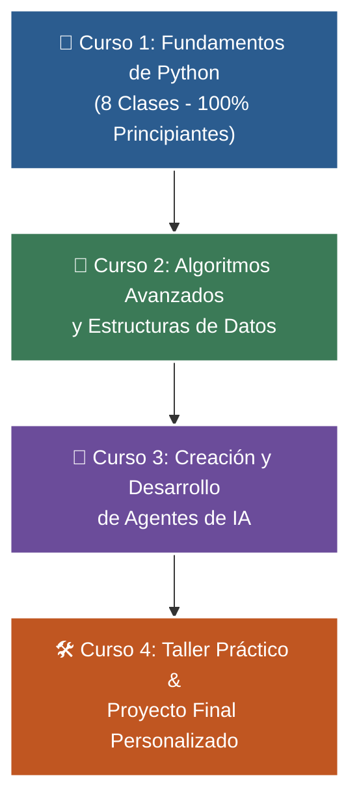

# 🐍 Programa Integral de Formación en Python: De Cero a Agentes de IA


Bienvenido/a al repositorio oficial del **Programa de Formación en Python**. Este espacio está estructurado de forma intuitiva, profesional y progresiva para guiarte desde tus primeros pasos en la programación hasta la creación de tus propios Agentes de Inteligencia Artificial y aplicaciones del mundo real.

---

## 🎯 1. Objetivo del Programa

Este programa inicia desde el nivel de **principiantes absolutos** (personas que nunca han escrito una sola línea de código). El objetivo principal del **Curso 1** es perderle el miedo a la programación, desarrollar el pensamiento lógico de un programador y construir una base sólida para afrontar retos de mayor complejidad.

---

## 🚀 2. La Ruta de Aprendizaje (4 Niveles)

El programa se compone de 4 cursos secuenciales diseñados para potenciar tus habilidades paso a paso:



### 📚 Detalle de los Cursos

| Curso | Nombre | Enlace al Material | Descripción |
| :---: | :--- | :---: | :--- |
| **1** | **Fundamentos básicos de Python (8 Clases)** | [📁 Ver Curso 1](01-fundamentos-python/) | 8 Clases con metáforas, 5 ejemplos cada una: variables, `if`, `for`, `def`, colecciones y proyecto. |
| **2** | **Algoritmos avanzados y estructuras de datos** | [📁 Ver Curso 2](02-algoritmos-estructuras/) | Optimización, notación Big-O, listas avanzadas, árboles, búsqueda y ordenamiento. |
| **3** | **Creación y desarrollo de Agentes de IA** | [📁 Ver Curso 3](03-agentes-ia/) | LLMs, Prompt Engineering, Prompt/Tool Calling, RAG y agentes autónomos. |
| **4** | **Proyecto Final Personalizado** | [📁 Ver Curso 4](04-proyecto-final/) | Taller práctico donde construirás tu propia solución real (Web, Chatbot o BD). |

> 💡 **¿Qué podrás crear en el Curso 4?** Lo que tú decidas: desde una página web interactiva o un chatbot para atención a clientes, hasta un sistema de gestión con base de datos. Contarás con **acompañamiento paso a paso**, ayuda en la arquitectura y revisión directa de tu código.

---

## 💻 3. Formato de las Clases y Grabaciones

- 🗓️ **Días y Horario:** Todos los sábados de **20:00 a 21:00 h**.
- 🎥 **Plataforma:** Transmisión en vivo por **Zoom**.
- 📺 **Grabaciones:** Cada clase será grabada y subida a **YouTube**. Si algún día no puedes conectarte en directo o necesitas repasar un tema, podrás ver la grabación las veces que sean necesarias.

---

## 🚲 4. Tu Compromiso: La regla de la bicicleta

> *"Por más libros que leas o explicaciones que escuches sobre cómo guardar el equilibrio, si no te subes a la bicicleta y pedaleas por ti mismo, nunca vas a aprender a andar en bici."*

Aprender a programar es una habilidad 100% práctica. Tu verdadero aprendizaje ocurrirá cuando abras Visual Studio Code, escribas el código con tus propias manos y resuelvas los ejercicios. Si no practicas, no desarrollarás la habilidad. ¡Súbete a la bici y pedalea! 🚴‍♂️

---

## 🛠️ 5. Tarea Obligatoria ANTES de la Primera Clase

Para no perder tiempo configurando herramientas durante la primera sesión, todos deben completar estos dos pasos previos:

1. **Instalar Visual Studio Code (VS Code) + Python Extension Pack:**
   - Descarga e instala [VS Code](https://code.visualstudio.com/).
   - Instala la extensión **Python Extension Pack** desde la pestaña de extensiones dentro de VS Code.
   - 📄 [Ver Guía Paso a Paso de VS Code](docs/guia-vscode.md)

2. **Crear tu cuenta en GitHub:**
   - Entra a [https://github.com](https://github.com) y regístrate con tu correo.
   - Elije un nombre de usuario sencillo y profesional (ej: `nombre-apellido`).
   - 📄 [Ver Guía Paso a Paso de GitHub](docs/guia-github.md)

---

## 📜 6. Reglas de Convivencia en el Grupo

- **Respeto y cordialidad:** No hay preguntas tontas. Todos estamos aquí para aprender.
- **Uso del grupo:** Mantendremos el chat enfocado exclusivamente en temas del curso, dudas de código y avisos.
- **Apoyo mutuo:** Si alguien plantea una duda en el grupo y sabes la respuesta, ¡siéntete libre de ayudar!
- 📄 [Leer documento completo de convivencia](docs/reglas-comunidad.md)

---

## 🗺️ 7. Estructura del Repositorio

```text
wisrovi-python/
├── 📁 01-fundamentos-python/           # 🎯 Curso 1: Fundamentos Básicos (8 Clases)
│   ├── 📁 clase-01-panorama-general/   # Clase 1: El Panorama General (Variables, if, for, def)
│   ├── 📁 clase-02-variables-y-tipos/  # Clase 2: El Almacén de Datos (str, int, float, bool, input)
│   ├── 📁 clase-03-control-flujo-condicionales/ # Clase 3: Toma de Decisiones (if, elif, else)
│   ├── 📁 clase-04-control-flujo-bucles/        # Clase 4: Repetición Inteligente (for, while)
│   ├── 📁 clase-05-listas-y-colecciones/        # Clase 5: La Mochila del Programador (list, tuple)
│   ├── 📁 clase-06-diccionarios/                # Clase 6: La Agenda Clave-Valor (dict)
│   ├── 📁 clase-07-funciones/                   # Clase 7: Fábricas Reutilizables (def, return)
│   ├── 📁 clase-08-proyecto-integrador-basico/  # Clase 8: Integración Total y Gestor de Tareas
│   └── 📁 recursos/                             # Cheatsheet de sintaxis
├── 📁 02-algoritmos-estructuras/       # 🚀 Curso 2: Algoritmos Avanzados y Data Structures
├── 📁 03-agentes-ia/                   # 🤖 Curso 3: Desarrollo de Agentes de IA
├── 📁 04-proyecto-final/               # 🛠️ Curso 4: Taller Práctico y Proyecto Integrador
├── 📁 docs/                            # 📚 Guías de onboarding
└── 📄 README.md                        # Portal principal del repositorio
```

---

## ❓ ¿Dudas o preguntas?
Si tienes algún inconveniente configurando tu entorno o con los ejercicios, revisa la sección de [Preguntas Frecuentes (FAQ)](docs/faq.md) o escríbenos directamente en el grupo del curso. ¡Nos vemos en la primera sesión! 💻🔥