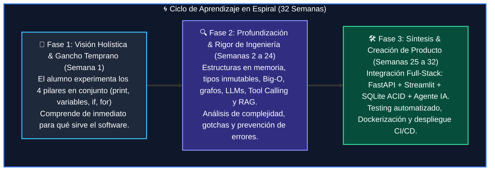
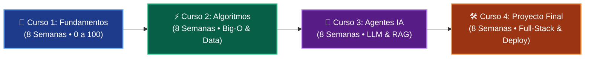

# 🐍 Programa Integral de Formación en Python: De Cero a Agentes de IA

<div align="center">

[](https://www.python.org/)
[](https://codespaces.new/wisrovi/wisrovi-python)
[](https://github.com/wisrovi/wisrovi-python/actions/workflows/ci.yml)
[](https://academy_python.wisrovi.dev/)
[](tests/)
[](LICENSE)

**Un ecosistema académico y profesional diseñado para transformar a estudiantes sin experiencia previa en ingenieros capaces de concebir, programar y desplegar aplicaciones reales y Agentes de Inteligencia Artificial.**

[🌐 Explorar Portal Web Interactivo](https://academy_python.wisrovi.dev/) &bull; [🚀 Abrir en Codespaces con 1 Clic](https://codespaces.new/wisrovi/wisrovi-python) &bull; [📚 Ver Cursos](#-la-ruta-maestra-de-formación-4-cursos--32-semanas)

</div>

---

## 👤 Acerca del Autor y Mentor

### **William Rodríguez (Wisrovi)**
*AI Solutions Architect & Principal Software Engineer &bull; Badajoz, España*

Ingeniero y arquitecto de software especializado en **Inteligencia Artificial Generativa**, sistemas multi-agente, Visión por Computador e infraestructuras MLOps de alta disponibilidad. Diseñador del currículo integral y mantenedor del ecosistema de software libre **wisrovi SUITE** en PyPI con más de 26 bibliotecas enfocadas en orquestación de flujos de datos, bases de datos y algoritmos de alto rendimiento.

<div align="center">

[](https://github.com/wisrovi)
[](https://www.linkedin.com/in/wisrovi-rodriguez/)
[](https://pypi.org/user/wisrovi/)
[](https://hub.docker.com/u/wisrovi)
[](https://wisrovi.dev)

</div>

---

## 🌀 Modelo Pedagógico: Aprendizaje en Espiral *(Spiral Learning)*

El diseño curricular de este programa no enseña conceptos de forma aislada ni se apoya en la memorización de sintaxis abstracta. En su lugar, implementa el **Aprendizaje en Espiral**, un modelo pedagógico donde el conocimiento se adquiere a través de iteraciones progresivas de complejidad y profundidad técnica:



### 🚲 La Regla de la Bicicleta *(Pedaleo Activo en Código)*
> *"Por más conferencias que escuches o libros que leas sobre cómo guardar el equilibrio, si no te subes a la bicicleta y pedaleas por ti mismo, jamás aprenderás a montar."*

Cada clase está concebida para la acción inmediata:
1. **Modelos Mentales:** Metáforas físicas del mundo real (El Megáfono, Las Cajas, El Semáforo, La Licuadora).
2. **Ejemplos Vivos:** Al menos 4 carpetas con scripts ejecutables y comentados por clase.
3. **Autoevaluación:** Pruebas unitarias automatizadas (`pytest`) que validan la solución del alumno en milisegundos.

---

## 🚀 La Ruta Maestra de Formación (4 Cursos &bull; 32 Semanas)



---

## 📚 Mapa Detallado del Programa Académico

| Curso | Enfoque Principal | Manual PDF Oficial | Libro Digital | Cuadernos | Hito de Graduación |
| :---: | :--- | :---: | :---: | :---: | :--- |
| **1** | [**Fundamentos Básicos de Python**](01-fundamentos-python/)<br/>8 Clases &bull; 33 Ejemplos | [📄 PDF Completo](01-fundamentos-python/curso-01-fundamentos-python.pdf) | [📖 book.md](01-fundamentos-python/book.md) | 8 Notebooks (Colab) | Construcción de una aplicación interactiva CLI con validación robusta y control de excepciones. |
| **2** | [**Algoritmos y Estructuras de Datos**](02-algoritmos-estructuras/)<br/>8 Clases &bull; 32 Ejemplos | [📄 PDF Completo](02-algoritmos-estructuras/curso-02-algoritmos-estructuras.pdf) | [📖 book.md](02-algoritmos-estructuras/book.md) | 8 Notebooks (Colab) | Dominio de complejidad Big-O, pilas, colas, BST, grafos y recursión dinámica con `@lru_cache`. |
| **3** | [**Desarrollo de Agentes de IA**](03-agentes-ia/)<br/>8 Clases &bull; 32 Ejemplos | [📄 PDF Completo](03-agentes-ia/curso-03-agentes-ia.pdf) | [📖 book.md](03-agentes-ia/book.md) | 8 Notebooks (Colab) | Creación de pipelines RAG, Tool Calling con Pydantic, embeddings vectoriales y ciclo ReAct. |
| **4** | [**Proyecto Integrador & Taller Full-Stack**](04-proyecto-final/)<br/>8 Clases &bull; 32 Ejemplos | [📄 PDF Completo](04-proyecto-final/curso-04-proyecto-final.pdf) | [📖 book.md](04-proyecto-final/book.md) | 8 Notebooks (Colab) | Aplicación Web en producción (FastAPI + Streamlit + SQLite ACID + Docker Compose + CI/CD). |

---

## ⚡ Inicio Rápido (Quickstart)

### Opción A: Programar en la Nube con 1 Clic (Sin Instalaciones)
Haz clic en el siguiente botón para desplegar tu entorno completo de Visual Studio Code en la nube con Python, extensiones y dependencias preconfiguradas:

[](https://codespaces.new/wisrovi/wisrovi-python)

### Opción B: Configuración en tu Máquina Local
```bash
# 1. Clonar el repositorio
git clone https://github.com/wisrovi/wisrovi-python.git
cd wisrovi-python

# 2. Crear y activar el entorno virtual
python3 -m venv venv
source venv/bin/activate  # En Windows: venv\Scripts\activate

# 3. Instalar paquetes y herramientas en modo editable
pip install -e ".[all]"

# 4. Validar el entorno ejecutando la suite completa de pruebas
pytest
```

---

## 🧪 Verificación Automatizada de Calidad (Pytest)

Toda la infraestructura de pruebas está centralizada en la carpeta [`/tests`](tests/) para mantener el código de los alumnos limpio y libre de archivos secundarios:

```bash
# Ejecutar todas las pruebas del repositorio (34 tests en < 0.3s)
pytest

# Ejecutar pruebas por módulo específico
pytest tests/curso_01/
pytest tests/curso_02/
pytest tests/curso_03/
pytest tests/curso_04/

# O utilizar la herramienta CLI oficial
wisrovi test 1
```

---

## 🗺️ Estructura del Repositorio

```text
wisrovi-python/
├── 📁 .devcontainer/                   # 💻 Entorno reproducible para Codespaces y contenedores
├── 📁 .github/                         # ⚙️ Workflows CI/CD, issue templates y automatizaciones
├── 📁 01-fundamentos-python/           # 🎯 Curso 1: Fundamentos (8 Clases con PDF, libro, notebook y ejemplos)
├── 📁 02-algoritmos-estructuras/       # ⚡ Curso 2: Algoritmos & Estructuras (8 Clases)
├── 📁 03-agentes-ia/                   # 🤖 Curso 3: Agentes de Inteligencia Artificial (8 Clases)
├── 📁 04-proyecto-final/               # 🛠️ Curso 4: Proyecto Integrador Full-Stack (8 Clases)
├── 📁 docs/                            # 🌐 Portal web oficial (academy_python.wisrovi.dev)
├── 📁 scripts/                         # 🔧 Herramientas internas de compilación y mantenimiento
├── 📁 src/                             # 📦 Código fuente de la CLI oficial wisrovi
├── 📁 tests/                           # 🧪 Suites de pruebas unitarias centralizadas
├── 📄 mkdocs.yml                       # 📑 Configuración del portal web documental
├── 📄 pyproject.toml                   # 📦 Especificación estándar de dependencias Python
└── 📄 README.md                        # 📌 Portal principal de navegación
```

---

## 📜 Licencia y Comunidad

Este proyecto se publica bajo los términos de la **Licencia MIT**. Puedes usarlo, estudiarlo, compartirlo y adaptarlo con total libertad tanto para fines académicos como comerciales.

Si este programa de formación aporta valor a tu carrera profesional, **te invitamos a dejar una ⭐️ en GitHub** para apoyar el desarrollo de software libre en español.
