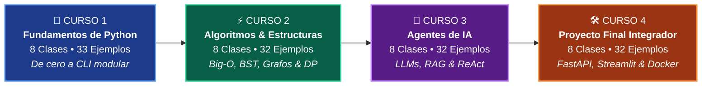
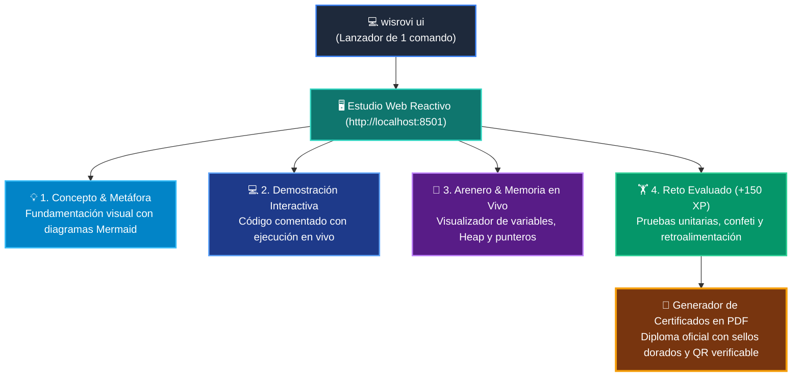
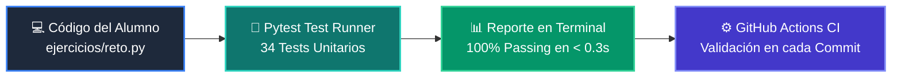

<div align="center">

# 🐍 Programa Integral de Formación en Python
### *De Cero Absoluto a la Arquitectura de Agentes de Inteligencia Artificial*

<br/>

[](https://www.python.org/)
[](https://wisrovi.github.io/wisrovi-python/)
[](https://codespaces.new/wisrovi/wisrovi-python)
[](tests/)
[](LICENSE)

<br/>

**Un ecosistema académico y profesional de nivel universitario y de ingeniería, concebido para guiarte de forma rigurosa, práctica e inmersiva a lo largo de 4 cursos, 32 clases semanales, 129 ejemplos estructurados, 32 manuales técnicos en PDF, cuadernos interactivos en Google Colab y proyectos reales de portafolio.**

<br/>

[🌐 Portal Web Oficial](https://wisrovi.github.io/wisrovi-python/) &bull; [🚀 Iniciar en Codespaces](https://codespaces.new/wisrovi/wisrovi-python) &bull; [📚 Plan de Estudios](#-el-currículo-maestro-4-cursos--32-semanas) &bull; [🌀 Aprendizaje en Espiral](#-metodología-pedagógica-el-modelo-de-aprendizaje-en-espiral) &bull; [👤 Sobre el Mentor](#-dirección-académica-y-mentoría)

</div>

---

## 🌟 Visión y Manifiesto del Programa

Aprender a programar en la era de la Inteligencia Artificial exige un cambio radical de paradigma: ya no basta con memorizar sintaxis básica o resolver ejercicios abstractos de consola. La industria demanda profesionales capaces de **pensar algorítmicamente**, entender cómo se gestiona la memoria en el procesador, estructurar código desacoplado y de calidad empresarial, y orquestar **modelos LLM, bases de datos vectoriales y sistemas multi-agente autónomos**.

Este repositorio es el fruto de años de experiencia en arquitectura de software y diseño instruccional. Ha sido estructurado minuciosamente para eliminar la fricción técnica, proporcionando a cada estudiante una ruta clara, progresiva y sin lagunas conceptuales.

---

## 👤 Dirección Académica y Mentoría

<div align="center">

### **William Rodríguez (Wisrovi)**
*Principal Software Engineer & AI Solutions Architect &bull; Badajoz, España*

</div>

Ingeniero de software, investigador y arquitecto de soluciones de Inteligencia Artificial Generativa, sistemas distribuidos, Visión por Computador e infraestructuras de Machine Learning Operations (MLOps). Diseñador de arquitecturas empresariales y autor de la suite de código abierto **wisrovi SUITE** en PyPI, con más de 26 paquetes publicados enfocados en optimización de rendimiento, pipelines asíncronos y bases de datos.

<div align="center">

[](https://github.com/wisrovi)
[](https://www.linkedin.com/in/wisrovi-rodriguez/)
[](https://pypi.org/user/wisrovi/)
[](https://hub.docker.com/u/wisrovi)
[](https://wisrovi.dev)

</div>

---

## 🌀 Metodología Pedagógica: El Modelo de Aprendizaje en Espiral

La mayoría de los cursos tradicionales cometen uno de dos errores: o abruman al principiante con teoría matemática abstracta antes de escribir una sola línea de código, o enseñan fragmentos aislados que el alumno olvida de inmediato.

Este programa implementa el **Aprendizaje en Espiral *(Spiral Learning)***, un modelo cognitivo donde el conocimiento se construye en ciclos iterativos de complejidad creciente, conectando la intuición inicial con la ingeniería avanzada:

```mermaid
flowchart TD
    subgraph Espiral["🌀 El Ciclo de Aprendizaje en Espiral (32 Semanas de Evolución Técnica)"]
        
        subgraph F1["🌱 FASE 1: Visión Holística & Gratificación Temprana (Curso 1)"]
            F1_A["Semana 1: Primer Vistazo Práctico<br/>print(), variables, if/else, for y def en acción conjunta"]
            F1_B["Semanas 2 a 7: Profundización de Tipos, Flujos & Modularidad<br/>Heap, mutabilidad, slicing, tablas hash y scope LEGB"]
            F1_C["Semana 8: Síntesis en Proyecto CLI<br/>Gestor de Tareas interactivo con validación try/except"]
            F1_A --> F1_B --> F1_C
        end

        subgraph F2["⚡ FASE 2: Rigor Algorítmico & Estructuras de Datos (Curso 2)"]
            F2_A["Análisis de Complejidad Temporal y Espacial Big-O"]
            F2_B["Estructuras Lineales & Jerárquicas (Pilas, Colas, BST, Grafos)"]
            F2_C["Algoritmos Clásicos: Búsqueda Binaria, QuickSort y DP Memoizada"]
            F2_A --> F2_B --> F2_C
        end

        subgraph F3["🤖 FASE 3: Inteligencia Artificial Generativa & Agentes (Curso 3)"]
            F3_A["Tokenización BPE, Inferencia LLM & Prompt Engineering Avanzado"]
            F3_B["Salidas Estructuradas (Pydantic), Tool Calling & Embeddings Vectoriales"]
            F3_C["Arquitecturas RAG Semánticas, Agentes ReAct y Sistemas Multi-Agente"]
            F3_A --> F3_B --> F3_C
        end

        subgraph F4["🛠️ FASE 4: Taller Integrador & Aplicación Full-Stack (Curso 4)"]
            F4_A["Arquitectura Modular Limpia & Backend FastAPI REST con Swagger"]
            F4_B["Persistencia Relacional SQLite ACID & Frontend Reactivo Streamlit"]
            F4_C["Streaming de Tokens, Docker Compose, Testing Mockeado y Despliegue CI/CD"]
            F4_A --> F4_B --> F4_C
        end

        F1_C ==> F2_A
        F2_C ==> F3_A
        F3_C ==> F4_A
    end

    style Espiral fill:#0b1120,stroke:#3b82f6,stroke-width:2px,color:#ffffff
    style F1 fill:#1e293b,stroke:#38bdf8,stroke-width:2px,color:#ffffff
    style F2 fill:#064e3b,stroke:#34d399,stroke-width:2px,color:#ffffff
    style F3 fill:#3b0764,stroke:#c084fc,stroke-width:2px,color:#ffffff
    style F4 fill:#7c2d12,stroke:#fb923c,stroke-width:2px,color:#ffffff
```



### 🚲 La Regla de la Bicicleta *(Pedaleo Activo)*
> *"Nadie aprende a montar en bicicleta leyendo un manual de física sobre el centro de gravedad. Tu verdadero aprendizaje como desarrollador ocurre cuando abres el editor, escribes el código con tus propios dedos, provocas errores deliberados para entender las trazas de Python y ejecutas las suites de pruebas automatizadas."*

Cada clase está diseñada para que **más del 70% del tiempo sea práctica aplicada**:
1. **Modelos Mentales Explícitos:** Metáforas cotidianas que anclan el concepto abstracto.
2. **Ejemplos Vivos:** Al menos 4 carpetas con scripts ejecutables, comentados e independientes por clase.
3. **Retos Autoevaluables:** Ejercicios con pruebas unitarias (`pytest`) que ofrecen retroalimentación instantánea.

---

## 🗺️ El Currículo Maestro (4 Cursos &bull; 32 Semanas)



---

### 📑 Matriz Detallada de Contenidos y Recursos Oficiales

| Curso | Nivel | Manual PDF Oficial | Libro Digital | Cuadernos Colab | Proyecto / Hito de Graduación |
| :---: | :--- | :---: | :---: | :---: | :--- |
| **1** | [**Fundamentos Básicos de Python**](01-fundamentos-python/)<br/>*(Semanas 1 a 8)* | [📄 PDF Completo (98 págs)](01-fundamentos-python/curso-01-fundamentos-python.pdf) | [📖 book.md](01-fundamentos-python/book.md) | [📓 8 Notebooks](01-fundamentos-python/) | **Gestor de Tareas CLI:** Menú interactivo de consola con gestión de estado en memoria y validación `try/except`. |
| **2** | [**Algoritmos y Estructuras de Datos**](02-algoritmos-estructuras/)<br/>*(Semanas 9 a 16)* | [📄 PDF Completo (92 págs)](02-algoritmos-estructuras/curso-02-algoritmos-estructuras.pdf) | [📖 book.md](02-algoritmos-estructuras/book.md) | [📓 8 Notebooks](02-algoritmos-estructuras/) | **Optimizador Algorítmico:** Búsqueda binaria O(log n), ordenamiento QuickSort y memoización con `@lru_cache`. |
| **3** | [**Desarrollo de Agentes de IA**](03-agentes-ia/)<br/>*(Semanas 17 a 24)* | [📄 PDF Completo (95 págs)](03-agentes-ia/curso-03-agentes-ia.pdf) | [📖 book.md](03-agentes-ia/book.md) | [📓 8 Notebooks](03-agentes-ia/) | **Pipeline RAG & Agente ReAct:** Sistema de búsqueda semántica vectorial y agente con Tool Calling y validación Pydantic. |
| **4** | [**Taller Práctico & Proyecto Integrador**](04-proyecto-final/)<br/>*(Semanas 25 a 32)* | [📄 PDF Completo (96 págs)](04-proyecto-final/curso-04-proyecto-final.pdf) | [📖 book.md](04-proyecto-final/book.md) | [📓 8 Notebooks](04-proyecto-final/) | **Aplicación Web Full-Stack:** FastAPI REST + UI Streamlit con streaming de tokens, persistencia SQL, Docker Compose y CI/CD. |

---

## 🏛️ Desglose Curricular Clase por Clase (Las 32 Semanas)

<details open>
<summary><b>🎯 Curso 1: Fundamentos Básicos de Python (Semanas 1 a 8)</b></summary>

| Semana | Clase | Metáfora Central | Hito de Aprendizaje |
| :---: | :--- | :--- | :--- |
| **S01** | [**Panorama General**](01-fundamentos-python/clase-01-panorama-general/) | *El Megáfono, las Cajas, el Semáforo y la Cinta* | Primer contacto interactivo con `print`, variables, condicionales `if`, bucles `for` y funciones `def`. |
| **S02** | [**Variables y Tipos**](01-fundamentos-python/clase-02-variables-y-tipos/) | *Cajas Etiquetadas en Memoria* | Dominio de tipos primitivos (`int`, `float`, `str`, `bool`), type casting, inmutabilidad y `f-strings`. |
| **S03** | [**Condicionales**](01-fundamentos-python/clase-03-control-flujo-condicionales/) | *El Semáforo y las Puertas Lógicas* | Control de flujo con `if`, `elif`, `else`, operadores booleanos (`and`, `or`, `not`) y cortocircuitos. |
| **S04** | [**Bucles e Iteración**](01-fundamentos-python/clase-04-control-flujo-bucles/) | *La Cinta Transportadora* | Automatización de repeticiones con `for`, `range()`, bucles `while`, `break` y `continue`. |
| **S05** | [**Listas y Colecciones**](01-fundamentos-python/clase-05-listas-y-colecciones/) | *El Archivador y las Cajas Selladas* | Métodos de mutación (`append`, `insert`, `pop`), rebanado avanzado (*slicing*) y list comprehensions. |
| **S06** | [**Diccionarios y Sets**](01-fundamentos-python/clase-06-diccionarios/) | *La Agenda Telefónica y el Filtro de Únicos* | Mapeos clave-valor O(1) con `.get()`, `.items()` y eliminación de duplicados con conjuntos `set`. |
| **S07** | [**Funciones y Scope**](01-fundamentos-python/clase-07-funciones/) | *La Licuadora (Entradas ➔ Jugo)* | Modularización limpia con parámetros por defecto, `*args`, `**kwargs`, `return` y ámbito LEGB. |
| **S08** | [**Proyecto Integrador CLI**](01-fundamentos-python/clase-08-proyecto-integrador-basico/) | *El Tablero de Control y el Casco (`try/except`)* | Construcción de una aplicación de terminal robusta con interfaz de menú y manejo de excepciones. |

</details>

<details>
<summary><b>⚡ Curso 2: Algoritmos Avanzados y Estructuras de Datos (Semanas 9 a 16)</b></summary>

| Semana | Clase | Conceptos Principales | Implementación Clave |
| :---: | :--- | :--- | :--- |
| **S09** | [**Análisis Big-O**](02-algoritmos-estructuras/clase-01-analisis-complejidad-big-o/) | Complejidad temporal y espacial | Curvas $\mathcal{O}(1)$, $\mathcal{O}(n)$, $\mathcal{O}(n \log n)$, $\mathcal{O}(n^2)$ y análisis asintótico. |
| **S10** | [**Pilas y Colas**](02-algoritmos-estructuras/clase-02-pilas-y-colas/) | LIFO vs FIFO | Implementación con `collections.deque` y buffers circulares `maxlen`. |
| **S11** | [**Tablas Hash y Sets**](02-algoritmos-estructuras/clase-03-tablas-hash-y-sets/) | Colisiones y dispersión | Algoritmo Two-Sum en $\mathcal{O}(n)$ y conteo de frecuencias con `dict`. |
| **S12** | [**Algoritmos de Búsqueda**](02-algoritmos-estructuras/clase-04-algoritmos-busqueda/) | Búsqueda Lineal vs Binaria | Búsqueda binaria iterativa y cálculo de índices medios sin overflow. |
| **S13** | [**Algoritmos de Ordenamiento**](02-algoritmos-estructuras/clase-05-algoritmos-ordenamiento/) | Divide y vencerás | Implementación canónica de QuickSort con selección de pivote y MergeSort. |
| **S14** | [**Árboles BST**](02-algoritmos-estructuras/clase-06-arboles-binarios-busqueda/) | Árboles Binarios de Búsqueda | Inserción recursiva, búsqueda O(h) y recorridos in-order, pre-order y post-order. |
| **S15** | [**Grafos y Recorridos**](02-algoritmos-estructuras/clase-07-grafos-y-recorridos/) | Listas de adyacencia | Algoritmos BFS (amplitud con cola) y DFS (profundidad con pila/recursión). |
| **S16** | [**Recursión y DP**](02-algoritmos-estructuras/clase-08-recursividad-y-programacion-dinamica/) | Casos base y subproblemas | Optimización de secuencias Fibonacci mediante memoización y `@functools.lru_cache`. |

</details>

<details>
<summary><b>🤖 Curso 3: Desarrollo de Agentes de Inteligencia Artificial (Semanas 17 a 24)</b></summary>

| Semana | Clase | Enfoque Tecnológico | Capacidades Adquiridas |
| :---: | :--- | :--- | :--- |
| **S17** | [**LLMs y Tokenización**](03-agentes-ia/clase-01-fundamentos-llm-tokenizacion/) | Arquitectura Transformer & BPE | Comprensión de ventanas de contexto, codificación de tokens y cálculo de costos. |
| **S18** | [**Prompt Engineering**](03-agentes-ia/clase-02-prompt-engineering-avanzado/) | Técnicas de alineación | Few-Shot prompting, Chain of Thought (CoT) y mitigación de alucinaciones. |
| **S19** | [**Salidas Pydantic**](03-agentes-ia/clase-03-salidas-estructuradas-pydantic/) | Validación de esquemas | Extracción de JSON tipado garantizado y contratos DTO con `BaseModel`. |
| **S20** | [**Tool Calling**](03-agentes-ia/clase-04-tool-calling-funciones/) | Invocación de herramientas | Despachadores de funciones de Python llamadas dinámicamente por el LLM. |
| **S21** | [**Embeddings Vectoriales**](03-agentes-ia/clase-05-embeddings-y-bases-vectoriales/) | Espacios semánticos multidimensionales | Generación de vectores densos y cálculo de similitud coseno para ranking. |
| **S22** | [**Arquitecturas RAG**](03-agentes-ia/clase-06-arquitecturas-rag/) | Retrieval-Augmented Generation | Chunking con solapamiento, búsqueda semántica y síntesis fundamentada en fuentes. |
| **S23** | [**Agentes ReAct**](03-agentes-ia/clase-07-agentes-autonomos-react/) | Razonamiento y Acción | Ciclos autónomos *Thought ➔ Action ➔ Observation ➔ Answer* con límites de seguridad. |
| **S24** | [**Sistemas Multi-Agente**](03-agentes-ia/clase-08-sistemas-multi-agente/) | Orquestación distribuida | Patrón supervisor, agentes especialistas (investigador, redactor, auditor) y guardrails. |

</details>

<details>
<summary><b>🛠️ Curso 4: Taller Práctico & Proyecto Integrador Full-Stack (Semanas 25 a 32)</b></summary>

| Semana | Clase | Capa del Sistema | Entregable de Ingeniería |
| :---: | :--- | :--- | :--- |
| **S25** | [**Arquitectura Limpia**](04-proyecto-final/clase-01-arquitectura-y-planificacion/) | Configuración y DTOs | Modelado de dominio desacoplado, `BaseSettings` y patrón repositorio. |
| **S26** | [**Backend FastAPI**](04-proyecto-final/clase-02-backend-fastapi/) | API REST asíncrona | Endpoints CRUD, inyección de dependencias `Depends()` y Swagger OpenAPI interactivo. |
| **S27** | [**Persistencia SQL**](04-proyecto-final/clase-03-persistencia-sql-transacciones/) | Base de Datos Relacional | Consultas parametrizadas seguras, transacciones ACID con `with conn:` y migraciones. |
| **S28** | [**Frontend Streamlit**](04-proyecto-final/clase-04-frontend-streamlit/) | Interfaz Web Reactiva | Componentes interactivos, gestión de estado con `st.session_state` y cliente HTTP. |
| **S29** | [**Integración Agente IA**](04-proyecto-final/clase-05-integracion-agente-ia/) | Chatbot en Tiempo Real | Streaming de tokens en vivo con generadores `yield` en componentes de chat UI. |
| **S30** | [**Testing y Calidad**](04-proyecto-final/clase-06-testing-y-calidad/) | Pruebas Automatizadas | Fixtures en memoria, mocks de servicios externos y `TestClient` de FastAPI. |
| **S31** | [**Docker y Compose**](04-proyecto-final/clase-07-docker-y-compose/) | Contenerización | `Dockerfile` multi-stage optimizado y `docker-compose.yml` orquestando backend y frontend. |
| **S32** | [**Despliegue y Portafolio**](04-proyecto-final/clase-08-despliegue-cicd-portafolio/) | Producción y CI/CD | Pipeline de GitHub Actions automatizado y checklist de entrega para graduación. |

</details>

---

## ⚡ Guía de Inicio Rápido (Quickstart)

### ☁️ Opción 1: En la Nube con 1 Clic (Recomendado para Estudiantes)
No necesitas instalar Python ni configurar entornos en tu ordenador. Haz clic en el botón inferior para abrir un entorno completo de Visual Studio Code en tu navegador:

[](https://codespaces.new/wisrovi/wisrovi-python)

---

### 💻 Opción 2: Instalación en tu Máquina Local (Linux / macOS / Windows)

```bash
# 1. Clonar el repositorio oficial
git clone https://github.com/wisrovi/wisrovi-python.git
cd wisrovi-python

# 2. Crear y activar el entorno virtual aislado de Python
python3 -m venv venv

# En Linux / macOS:
source venv/bin/activate

# En Windows (PowerShell):
# .\\venv\\Scripts\\Activate.ps1

# 3. Actualizar pip e instalar todas las dependencias en modo editable
pip install --upgrade pip
pip install -e ".[all]"

# 4. Validar la instalación ejecutando la suite completa de pruebas
pytest -v

# 5. Iniciar el Tutor Virtual Interactivo en tu navegador
wisrovi ui
```

---

## 🎮 Tutor Virtual Interactivo & RPG de Programación (`wisrovi ui`)

El repositorio incluye un **Tutor Virtual Interactivo** que convierte el aprendizaje en un videojuego de rol (RPG). El alumno puede estudiar de forma 100% autodidacta guiado por un **Mentor Socrático Digital**:



### 🌟 Capacidades del Tutor Virtual:
1. **Paso a Paso Asistido (*"Siguiente ➔ Siguiente"*)**: Guía estructurada a través de las 32 clases sin perder el hilo.
2. **🧠 Visualizador de Memoria y Punteros**: Muestra en tiempo real las direcciones hexadecimales (`id`), tamaños en RAM (`sys.getsizeof`) y cómo las variables apuntan a objetos en el Heap.
3. **🎮 Gamificación & Persistencia**: Niveles 1 al 4, puntos de experiencia (XP), rachas de estudio diarias e insignias coleccionables guardadas automáticamente en `~/.wisrovi/student_profile.json`.
4. **💡 Mentor Socrático**: Ante cualquier error en las pruebas, el mentor proporciona pistas pedagógicas basadas en la metáfora de la clase sin revelar la solución directamente.
5. **📜 Emisión de Diplomas Oficiales**: Al completar el curso, genera un Certificado PDF de alta resolución con sellos dorados, firma digital de *William Rodríguez (Wisrovi)* y badge para GitHub.

```bash
# Comandos directos de la herramienta:
wisrovi ui            # Lanza la plataforma web en el navegador
wisrovi list          # Consulta el mapa de clases y semanas en consola
wisrovi start 1 2     # Inicia la sesión de trabajo de la Clase 02
wisrovi solve 1 2     # Evalúa tu reto práctico con reporte interactivo
```

---

## 🧪 Arquitectura de Testing y Aseguramiento de Calidad

Para mantener las carpetas de clase de los estudiantes **completamente limpias y enfocadas únicamente en el aprendizaje**, toda la infraestructura de pruebas automatizadas está centralizada en [`tests/`](tests/):

```text
tests/
├── 📁 curso_01/       # 8 Tests unitarios (Fundamentos de Python)
├── 📁 curso_02/       # 8 Tests unitarios (Algoritmos y Estructuras)
├── 📁 curso_03/       # 8 Tests unitarios (Agentes de IA y Pydantic)
├── 📁 curso_04/       # 10 Tests unitarios e integración (FastAPI y SQLite)
└── 📝 README.md       # Guía técnica de la suite de pruebas
```



### Comandos Frecuentes de Testing:
```bash
# Ejecutar todas las pruebas del repositorio
pytest

# Ejecutar únicamente las pruebas del Curso 1
pytest tests/curso_01/

# Ejecutar las pruebas con reporte verboso y nombres de tests
pytest -v tests/
```

---

## 🗺️ Mapa de Estructura del Repositorio

```text
wisrovi-python/
├── 📁 .devcontainer/                   # 💻 Entorno reproducible para Codespaces y Docker Containers
├── 📁 .github/                         # ⚙️ Workflows CI/CD, issue templates y automatizaciones
├── 📁 01-fundamentos-python/           # 🎯 Curso 1: Fundamentos (8 Clases con PDF, libro, notebook y ejemplos)
├── 📁 02-algoritmos-estructuras/       # ⚡ Curso 2: Algoritmos & Estructuras de Datos (8 Clases)
├── 📁 03-agentes-ia/                   # 🤖 Curso 3: Desarrollo de Agentes de IA (8 Clases)
├── 📁 04-proyecto-final/               # 🛠️ Curso 4: Proyecto Integrador Full-Stack (8 Clases)
├── 📁 docs/                            # 🌐 Portal web documental oficial (academy_python.wisrovi.dev)
├── 📁 scripts/                         # 🔧 Herramientas de mantenimiento y compilación automatizada
├── 📁 src/                             # 📦 Código fuente del paquete CLI 'wisrovi'
├── 📁 tests/                           # 🧪 Suite de pruebas unitarias centralizada (34 tests)
├── 📄 mkdocs.yml                       # 📑 Configuración de MkDocs Material con Mermaid y Search
├── 📄 pyproject.toml                   # 📦 Especificación canónica de dependencias de Python (PEP 621)
└── 📄 README.md                        # 📌 Portal principal de navegación del programa
```

---

## 📜 Licencia y Filosofía Open Source

Este proyecto se distribuye bajo los términos de la **Licencia MIT**. Eres libre de estudiar, modificar, redistribuir y utilizar cualquier parte de este material tanto para propósitos educativos y académicos como para proyectos comerciales.

Si este programa formativo te resulta de utilidad en tu camino profesional, **te invitamos a otorgar una ⭐️ al repositorio en GitHub** para respaldar el software libre educativo en español.
