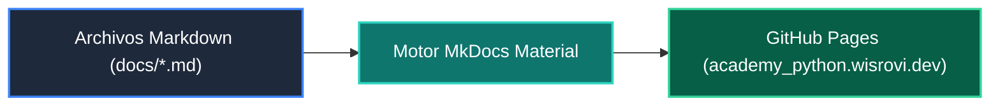

# 🌐 Documentación Web: Root

> **Sitio Web:** [`academy_python.wisrovi.dev`](https://academy_python.wisrovi.dev/)  
> **Ubicación:** `docs`  

---

## 🗺️ Flujo de Publicación Web



---

## 💻 Servidor Local
```bash
mkdocs serve
```
