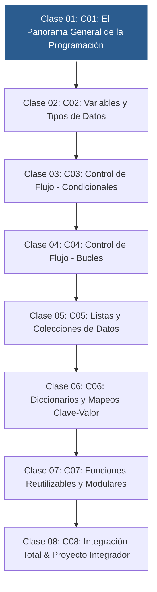

# 📚 Curso 1: Fundamentos Básicos de Python

> **De Cero a Programador: Los 4 Pilares Lógicos y Proyecto CLI**  
> **Nivel:** Principiantes Absolutos &bull; **Instructor:** **William Rodríguez (Wisrovi)** (AI Solutions Architect & Principal Software Engineer)

---

## 🗺️ Mapa de Contenidos del Curso

---

## 📑 Unidades Didácticas del Curso

| Unidad | Título | Metáfora Central | Enfoque Principal |
| :---: | :--- | :--- | :--- |
| **Clase 01** | **Clase 01: El Panorama General de la Programación** | *«El Asistente, las Cajas, el Semáforo y la Licuadora»* | Comprender que programar es dar instrucciones secuenciales precisas y dominar la... |
| **Clase 02** | **Clase 02: Variables y Tipos de Datos** | *«El Almacén, el Collar de Letras y el Micrófono»* | Comprender la diferencia fundamental entre tipos numéricos y texto, y cómo Pytho... |
| **Clase 03** | **Clase 03: Control de Flujo - Condicionales** | *«El Guardia de la Puerta y el Menú de Opciones»* | Comprender la evaluación de expresiones booleanas y la exclusión mutua en cadena... |
| **Clase 04** | **Clase 04: Control de Flujo - Bucles** | *«Las Vueltas a la Pista y el Termostato»* | Diferenciar con claridad cuándo emplear una iteración acotada (for) vs una itera... |
| **Clase 05** | **Clase 05: Listas y Colecciones de Datos** | *«La Mochila del Programador y los Casilleros»* | Comprender la indexación basada en cero (0-indexed), la mutabilidad de listas y ... |
| **Clase 06** | **Clase 06: Diccionarios y Mapeos Clave-Valor** | *«La Agenda Telefónica y el Expediente Médico»* | Comprender la indexación por clave semántica en lugar de posición numérica y la ... |
| **Clase 07** | **Clase 07: Funciones Reutilizables y Modulares** | *«El Electrodoméstico y la Entrega del Cajero»* | Comprender el principio DRY (Don't Repeat Yourself), la diferencia entre print y... |
| **Clase 08** | **Clase 08: Integración Total & Proyecto Integrador** | *«El Casco de Seguridad y Salir a Rodar en Bici»* | Comprender cómo se interconectan todos los pilares del lenguaje para crear una a... |

---

## 🚲 Metodología: La Regla de la Bicicleta

> *"Nadie aprende a montar en bicicleta viendo tutoriales. El verdadero dominio de la programación surge cuando abres tu editor, escribes código con tus propias manos, resuelves errores y construyes proyectos reales."*

!!! tip "Cómo estudiar este curso"
    1. Lee la lección temática de cada unidad.
    2. Analiza el diagrama de flujo y comprende el movimiento de los datos en memoria.
    3. Escribe y ejecuta el código en VS Code o en Google Colab.
    4. Resuelve los ejercicios y valida tu código ejecutando `pytest`.
