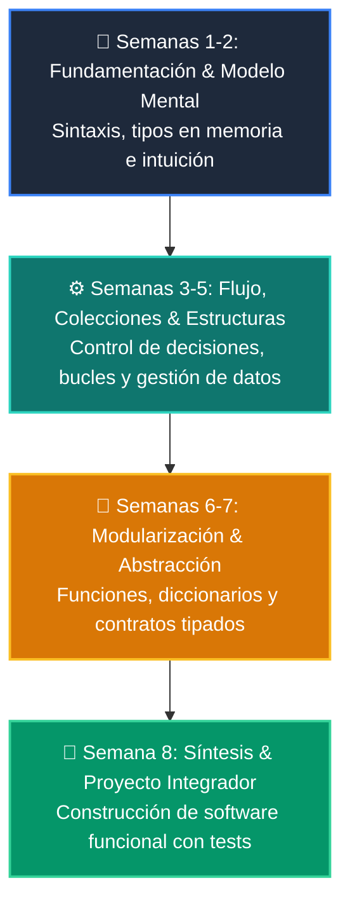

# 📚 Manual Oficial: Curso 1: Fundamentos Básicos de Python

-   :material-school: **Nivel:** `Nivel 1 (100% Principiantes Absolutos)`
-   :material-calendar-clock: **Duración:** 8 Semanas Formativas
-   :material-account-tie: **Instructor:** [William Rodríguez (Wisrovi)](https://wisrovi.dev)
-   :material-file-pdf-box: **PDF Completo:** [Descargar curso-01-fundamentos-python.pdf](https://github.com/wisrovi/wisrovi-python/raw/main/01-fundamentos-python/curso-01-fundamentos-python.pdf)

---

## 🗺️ Mapa de Clases Semanales

| Semana | Unidad Temática | Metáfora Didáctica |
| :---: | :--- | :--- |
| **CLASE 01** | [Primer Vistazo Práctico (print, variables, if, for)](clase-01-panorama-general.md) | *«El Megáfono (print), Las Cajas (variables), El Semáforo (if) y La Cinta Transportadora (for)»* |
| **CLASE 02** | [Variables, Tipos de Datos y Funciones con Type Hints](clase-02-variables-y-tipos.md) | *«Variables como Cajas Etiquetadas en Memoria y la Licuadora Tipada (PEP 484)»* |
| **CLASE 03** | [Condicionales (if / elif / else)](clase-03-control-flujo-condicionales.md) | *«Condicionales como Semáforos y Bifurcaciones en un Tren»* |
| **CLASE 04** | [Bucles (for / while)](clase-04-control-flujo-bucles.md) | *«Bucles como una Cinta Transportadora de Fábrica»* |
| **CLASE 05** | [Listas, Tuplas y Colecciones Básicas](clase-05-listas-y-colecciones.md) | *«Listas como Archivadores Modulares y Tuplas como Documentos Notariados»* |
| **CLASE 06** | [Diccionarios y Conjuntos (Sets)](clase-06-diccionarios.md) | *«Diccionarios como un Casillero con Llaves Únicas»* |
| **CLASE 07** | [Funciones, Parámetros y Scope](clase-07-funciones.md) | *«Funciones como Máquinas Reutilizables de una Fábrica»* |
| **CLASE 08** | [Sistema CLI Completo](clase-08-proyecto-integrador-basico.md) | *«Construyendo tu Primera Aplicación Real de Consola»* |

---

## 🌀 Progresión Formativa del Curso

---

## 📑 Clases del Curso
Haz clic en cualquiera de las clases del menú lateral o de la tabla superior para estudiar la teoría, ejecutar los ejemplos y resolver los retos prácticos.
