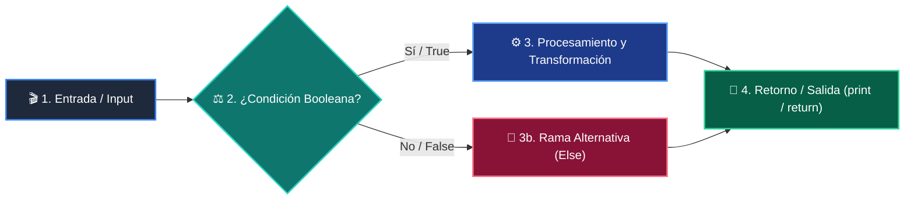

# Clase 01: El Panorama General de la Programación

<div class="grid cards" markdown>

-   :material-school: __Nivel:__ Principiante Absoluto
-   :material-book-open-page-variant: __Curso:__ Curso 1: Fundamentos Básicos de Python
-   :material-lightbulb-on: __Metáfora:__ *«El Asistente, las Cajas, el Semáforo y la Licuadora»*
-   :material-file-pdf-box: __Descargar PDF:__ [clase-01-panorama-general.pdf](https://github.com/wisrovi/wisrovi-python/blob/main/01-fundamentos-python/clase-01-panorama-general/clase-01-panorama-general.pdf)

</div>

---

## 🎯 Objetivos de Aprendizaje

!!! abstract "Competencias Clave de la Sesión"
    *   **Competencia Conceptual:** Comprender que programar es dar instrucciones secuenciales precisas y dominar la función mental de los 4 pilares.
    *   **Competencia Práctica:** Ejecutar tu primer script en VS Code usando print(), variables, condicionales if y funciones def.

---

## 1. 💡 Fundamentos Teóricos y Modelo Mental

Toda aplicación moderna, desde un script de automatización hasta una Inteligencia Artificial, está construida sobre cuatro bloques lógicos elementales.

!!! note "🌟 Metáfora Central: El Asistente, las Cajas, el Semáforo y la Licuadora"
    Imagina que la computadora es un asistente súper eficiente pero literal: las variables son cajas etiquetadas donde guarda cosas, el if es un semáforo que decide el camino según la luz, el for es una cinta transportadora que procesa elementos uno a uno, y la función def es una licuadora que recibe ingredientes y entrega un licuado.

### Principios Fundamentales

1. Variables (Memoria): Espacios con nombre para retener datos temporalmente. 2. Condicionales (Decisión): Bifurcaciones lógicas según condiciones booleanas. 3. Bucles (Repetición): Automatización de tareas repetitivas sin duplicar código. 4. Funciones (Modularidad): Bloques reutilizables con entradas y salidas bien definidas.

La magia del software no radica en la complejidad de cada pieza aislada, sino en la sinergia con la que se combinan para modelar la realidad.

!!! tip "⚡ Regla de Oro en Python"
    Python es un lenguaje interpretado, de tipado dinámico y fuertemente tipado: respeta la indentación y la semántica.

---

## 2. 🗺️ Diagrama de Arquitectura y Flujo de Control

Cómo el intérprete de Python procesa el código línea por línea desde el punto de entrada hasta la resolución.



### Desglose Paso a Paso del Flujo

| Fase del Flujo | Acción del Intérprete | Estado en Memoria |
| :--- | :--- | :--- |
| **1. Inicialización** | Lee la instrucción inicial e inicializa el entorno de variables en memoria. | `Tabla de símbolos vacía -> asigna valores` |
| **2. Evaluación** | Evalúa expresiones booleanas en condicionales para determinar la ruta. | `Evalúa True o False en CPU` |
| **3. Transformación** | Ejecuta el bloque indentado correspondiente a la condición satisfecha. | `Transformación de variables` |
| **4. Retorno / Salida** | Invoca funciones y devuelve el resultado a la consola con print(). | `Liberación de stack frame` |

!!! info "🔍 Visualización Mental"
    Piensa en el intérprete de Python como un lector con un marcador que avanza de arriba a abajo, saltando sólo cuando encuentra estructuras de control.

---

## 3. 💻 Implementación Práctica en Python

Código autónomo que demuestra la interacción armónica entre variables, condicionales, bucles y funciones:

```python title="main.py - Python 3.10+ (PEP 8)" linenums="1"
# 1. Definición de Función Reutilizable (La Licuadora)
def evaluar_estudiante(nombre: str, nota: float) -> str:
    if nota >= 7.0:
        return f"¡Felicidades {nombre}! Aprobaste con éxito 🚀"
    else:
        return f"Ánimo {nombre}, debes reforzar los conceptos 📚"

# 2. Variables y Colección (Cajas en memoria)
estudiantes = ["Ana", "Carlos", "Sofía"]
calificaciones = [9.5, 5.8, 8.2]

# 3. Bucle de Procesamiento (Cinta Transportadora)
for i in range(len(estudiantes)):
    resultado = evaluar_estudiante(estudiantes[i], calificaciones[i])
    print(resultado)
```

### Análisis Detallado del Código

El código define una función pura con type hints, itera una colección de datos mediante un bucle for y delega la toma de decisiones al condicional interno.

---

## 4. 🛡️ Buenas Prácticas, Gotchas y Depuración

Consejos clave para evitar los errores más comunes al dar tus primeros pasos en Python:

!!! warning "⚠️ Gotcha Frecuente (Trampa de Principiante)"
    Olvidar los dos puntos (:) al final de las estructuras if, for o def, o mezclar espacios y tabulaciones en la indentación.

### Comparativa: Patrón Recomendado vs Antipatrón

=== "✅ Patrón Pythonic Recomendado"
    ```python
if nota > 5:
    print("Aprobado") # Correcto e indentado
    ```

=== "❌ Antipatrón / Mal Código"
    ```python
if nota > 5
print("Aprobado") # Error de sintaxis
    ```

!!! success "🛡️ Consejo de Resiliencia en Producción"
    Configura VS Code para insertar 4 espacios automáticos al presionar la tecla Tab y activa el formateador black o ruff.

---

## 5. 🏋️ Ejercicios y Desafío de Autoestudio

!!! example "Desafío Práctico Recomendado"
    Modifica el script de la página 6 para que evalúe a 5 alumnos y clasifique notas con honores (mayores a 9.0).

???+ tip "🧪 Cómo validar tu solución con Pytest"
    Abre tu terminal en VS Code y ejecuta:
    ```bash
    pytest 01-fundamentos-python/clase-01-panorama-general/ejercicios/
    ```

---

## 6. 📚 Fuentes y Referencias Oficiales

| Fuente / Recurso | Descripción Temática | Enlace Oficial |
| :--- | :--- | :--- |
| **Documentación Oficial de Python** | Referencia canónica del lenguaje y librería estándar | [docs.python.org/3/](https://docs.python.org/3/) |
| **PEP 8 — Style Guide for Python** | Guía oficial de estilo, formato e indentación | [peps.python.org/pep-0008/](https://peps.python.org/pep-0008/) |
| **Real Python Tutorials** | Artículos técnicos y patrones de desarrollo moderno | [realpython.com](https://realpython.com/) |
| **Suite Open Source wisrovi** | Paquetes Python para orquestación y rendimiento | [github.com/wisrovi](https://github.com/wisrovi) |
