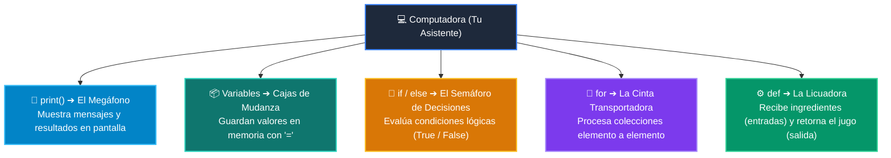

# 📘 Clase 01: Primer Vistazo Práctico (print, variables, if, for)

<div class="grid cards" markdown>

-   :material-bookmark: **Curso:** Curso 1: Fundamentos Básicos de Python (CLASE 01)
-   :material-signal-cellular-outline: **Nivel:** `Nivel 1 - Principiante`
-   :material-lightbulb-on: **Metáfora Central:** *«El Megáfono (print), Las Cajas (variables), El Semáforo (if) y La Cinta Transportadora (for)»*
-   :material-file-pdf-box: **Manual PDF Oficial:** [Descargar clase-01-panorama-general.pdf](https://github.com/wisrovi/wisrovi-python/raw/main/01-fundamentos-python/clase-01-panorama-general/clase-01-panorama-general.pdf)

</div>

<div align="center" style="margin: 1rem 0;" markdown>

[](https://colab.research.google.com/github/wisrovi/wisrovi-python/blob/main/01-fundamentos-python/clase-01-panorama-general/notebook/clase-01-panorama-general.ipynb)
[](https://github.com/wisrovi/wisrovi-python/tree/main/01-fundamentos-python/clase-01-panorama-general)

</div>

---

## 1. 💡 Fundamentación Teórica y Modelo Mental


!!! note "🌟 Modelo Mental de la Sesión: «El Megáfono (print), Las Cajas (variables), El Semáforo (if) y La Cinta Transportadora (for)»"
    Aprender a programar es como dominar 4 herramientas esenciales: el Megáfono (print) anuncia resultados, las Cajas (variables) guardan datos, el Semáforo (if) decide qué camino tomar y la Cinta Transportadora (for) procesa elementos uno tras otro.

### Principios Fundamentales de la Sesión


!!! info "⚡ Regla de Oro en Python"
    Todo programa real en Python combina datos (variables), decisiones (if), repetición (for) y salida por pantalla (print).

---

## 2. 🗺️ Arquitectura de Ejecución y Diagrama de Flujo



---

## 3. 💻 Código de Implementación Práctica

```python
# 1. El Megáfono (print)
print("¡Bienvenido al curso de Python!")

# 2. Las Cajas Etiquetadas (variables)
usuario = "Wisrovi"
edad = 25
print(f"Usuario: {usuario} | Edad: {edad} años")

# 3. El Semáforo de Decisiones (if / else)
if edad >= 18:
    print("🚦 Acceso permitido: Eres mayor de edad.")
else:
    print("🚦 Acceso restringido.")

# 4. La Cinta Transportadora (bucle for)
herramientas = ["VS Code", "Terminal", "Git", "Python"]
for item in herramientas:
    print("-> Herramienta configurada:", item)
```

---

## 4. 🛡️ Buenas Prácticas, Gotchas y Prevención de Errores

!!! warning "⚠️ Trampa Frecuente (Gotcha)"
    Olvidar los dos puntos (:) al final de if o for, o intentar concatenar texto y números con '+' en lugar de usar f-strings.

=== "❌ Antipatrón / Código Inadecuado"
    ```python
    edad = 25
print('Edad: ' + edad)  # ❌ TypeError: can only concatenate str to str
if edad >= 18          # ❌ Falta los dos puntos (:)
    ```

=== "✅ Patrón Recomendado / Pythonic"
    ```python
    edad = 25
print(f'Edad: {edad}')  # ✅ F-string formatea automáticamente
if edad >= 18:         # ✅ Sintaxis correcta con dos puntos
    print('Acceso OK')
    ```

!!! tip "🔧 Consejo de Ingeniería"
    

---

## 5. 🏋️ Desafío Práctico de la Clase

!!! example "🎯 Enunciado del Reto"
    **Crea un script que defina una lista de 3 alumnos con sus notas, use un for para recorrerlos y un if/else para imprimir si cada uno aprobó (nota >= 60) o reprobó.**

Para resolver este ejercicio en tu entorno:
1. Abre el archivo `ejercicios/reto.py` de esta clase en Visual Studio Code.
2. Implementa tu solución cumpliendo los requisitos y contratos de tipo.
3. Valida tus resultados ejecutando las pruebas unitarias:
   ```bash
   pytest tests/curso_01/test_clase_01_panorama_general.py
   ```

---

## 6. 📚 Fuentes y Bibliografía Recomendada

*   [📖 Documentación Oficial de Python 3](https://docs.python.org/3/)
*   [📑 Guía de Estilo Oficial PEP 8](https://peps.python.org/pep-0008/)
*   [📦 Ecosistema Open Source wisrovi en PyPI](https://pypi.org/user/wisrovi/)
