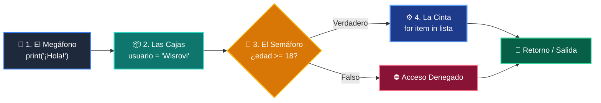

# 📘 Clase 01: Primer Vistazo Práctico (print, variables, if, for)

<div class="grid cards" markdown>

-   :material-bookmark: **Curso:** Curso 1: Fundamentos Básicos de Python (CLASE 01)
-   :material-signal-cellular-outline: **Nivel:** `Nivel 1 - Principiante`
-   :material-lightbulb-on: **Metáfora Central:** *«El Megáfono (print), Las Cajas (variables), El Semáforo (if) y La Cinta Transportadora (for)»*
-   :material-laptop: **Wisrovi Studio (Local):** [🚀 Abrir Reto](http://127.0.0.1:8501/?course=1&class=1) &bull; [👨‍🏫 Modo Tutor](http://127.0.0.1:8501/tutor?course=1&class=1)
-   :material-file-pdf-box: **Manual PDF Oficial:** [Descargar clase-01-panorama-general.pdf](https://github.com/wisrovi/wisrovi-python/raw/main/01-fundamentos-python/clase-01-panorama-general/clase-01-panorama-general.pdf)

</div>

<div align="center" style="margin: 1rem 0;" markdown>

[](https://colab.research.google.com/github/wisrovi/wisrovi-python/blob/main/01-fundamentos-python/clase-01-panorama-general/notebook/clase-01-panorama-general.ipynb)
[-0284c7?logo=python&logoColor=white)](http://127.0.0.1:8501/?course=1&class=1)
[](https://github.com/wisrovi/wisrovi-python/tree/main/01-fundamentos-python/clase-01-panorama-general)

</div>

---

## 1. 💡 Fundamentación Teórica y Modelo Mental

En esta sesión inaugural exploramos los 4 pilares esenciales del software:
1. **El Megáfono (`print`)**: Comunica datos y resultados al usuario en consola.
2. **Las Cajas Etiquetadas (Variables)**: Guardan información en memoria RAM mediante asignación `=`.
3. **El Semáforo (`if/else`)**: Evalúa condiciones booleanas (`True`/`False`) para bifurcar el camino lógico.
4. **La Cinta Transportadora (`for`)**: Procesa colecciones de elementos uno tras otro de forma secuencial.

!!! note "🌟 Modelo Mental de la Sesión: «El Megáfono (print), Las Cajas (variables), El Semáforo (if) y La Cinta Transportadora (for)»"
    En esta sesión anclamos el aprendizaje en la metáfora del mundo real para visualizar cómo fluyen las estructuras de datos y el flujo de ejecución en la memoria.

---

## 2. 🗺️ Arquitectura de Ejecución y Diagrama de Flujo



---

## 3. 💻 Código de Implementación Práctica

=== "🚀 Demostración en Vivo"
    ```python
    # 1. El Megáfono (print)
print("¡Bienvenido a Wisrovi Academy!")

# 2. Las Cajas (Variables)
usuario = "Wisrovi"
nivel = 1

# 3. El Semáforo (if/else)
if nivel == 1:
    print(f"Hola {usuario}, inicias como: Aprendiz")

# 4. La Cinta Transportadora (for)
habilidades = ["Variables", "Condicionales", "Bucles", "Funciones"]
for h in habilidades:
    print("-> Dominando:", h)
    ```

=== "🔬 Arenero de Exploración de Memoria (RAM)"
    ```python
    # 🔬 ARENERO DE PRUEBAS: Experimenta con variables y condiciones
nombre = "Alex"
edad = 20
es_programador = True

print(f"Estudiante: {nombre} | Edad: {edad}")

if edad >= 18 and es_programador:
    print("🚀 ¡Listo para construir Agentes de IA!")
else:
    print("🌱 Continúa aprendiendo paso a paso.")
    ```

---

## 4. 🛡️ Buenas Prácticas PEP 8: Antipatrones vs Código Pythonic

!!! warning "⚠️ Cuidado con los Antipatrones"
    

=== "❌ Antipatrón / Código Inadecuado"
    ```python
    edad = 25
print('Edad: ' + edad)  # ❌ TypeError: can only concatenate str to str
if edad >= 18          # ❌ Falta los dos puntos (:)
    ```

=== "✅ Patrón Recomendado / Pythonic"
    ```python
    edad = 25
print(f'Edad: {edad}')  # ✅ F-string formatea automáticamente
if edad >= 18:         # ✅ Sintaxis correcta con dos puntos
    print('Acceso OK')
    ```

---

## 5. 🏋️ Desafío Práctico de la Clase

!!! example "🎯 Enunciado del Reto"
    **Crea una función llamada `evaluar_estudiante(nombre: str, edad: int) -> str` que retorne el texto 'Mayor de edad' si tiene 18 o más, o 'Menor de edad' en caso contrario.**

!!! tip "⚡ Resolución Híbrida en 1 Clic (Local + Web)"
    Si tienes ejecutando `wisrovi ui` en tu terminal local, puedes [🚀 Abrir este Reto directamente en tu Studio Local (127.0.0.1:8501)](http://127.0.0.1:8501/?course=1&class=1) para escribir tu código con auto-formateo AST, inspeccionar variables en el Heap/Stack y evaluarlo con pruebas en tiempo real.

=== "💻 Plantilla de Inicio (Starter Code)"
    ```python
    def evaluar_estudiante(nombre: str, edad: int) -> str:
    # ✍️ Escribe aquí tu solución
    if edad >= 18:
        return "Mayor de edad"
    else:
        return "Menor de edad"

    ```

??? info "💡 Pista Socrática 1"
    💡 Pista 1: Usa la condición 'if edad >= 18:' para verificar la mayoría de edad.

??? info "💡 Pista Socrática 2"
    💡 Pista 2: La función debe retornar exactamente las cadenas 'Mayor de edad' o 'Menor de edad'.

??? info "💡 Pista Socrática 3"
    💡 Pista 3: Comprueba que el tipo de retorno sea 'str'.


Para resolver este ejercicio en tu entorno:
1. Abre el archivo `ejercicios/reto.py` de esta clase en Visual Studio Code o utiliza `wisrovi ui` / `wisrovi tutor`.
2. Implementa tu solución cumpliendo los requisitos y contratos de tipado.
3. Valida tus resultados ejecutando las pruebas unitarias:
   ```bash
   pytest tests/curso_01/test_clase_01_panorama_general.py
   ```

---


## 6. 📚 Fuentes y Bibliografía Recomendada

*   [📖 Documentación Oficial de Python 3](https://docs.python.org/3/)
*   [📑 Guía de Estilo Oficial PEP 8](https://peps.python.org/pep-0008/)
*   [📦 Ecosistema Open Source wisrovi en PyPI](https://pypi.org/user/wisrovi/)
