# 📘 Clase 02: Variables, Tipos de Datos y Operadores

<div class="grid cards" markdown>

-   :material-bookmark: **Curso:** Curso 1: Fundamentos Básicos de Python (CLASE 02)
-   :material-signal-cellular-outline: **Nivel:** `Nivel 1 - Principiante`
-   :material-lightbulb-on: **Metáfora Central:** *«Variables como Cajas Etiquetadas en Memoria»*
-   :material-file-pdf-box: **Manual PDF Oficial:** [Descargar clase-02-variables-y-tipos.pdf](https://github.com/wisrovi/wisrovi-python/raw/main/01-fundamentos-python/clase-02-variables-y-tipos/clase-02-variables-y-tipos.pdf)

</div>

<div align="center" style="margin: 1rem 0;" markdown>

[](https://colab.research.google.com/github/wisrovi/wisrovi-python/blob/main/01-fundamentos-python/clase-02-variables-y-tipos/notebook/clase-02-variables-y-tipos.ipynb)
[](https://github.com/wisrovi/wisrovi-python/tree/main/01-fundamentos-python/clase-02-variables-y-tipos)

</div>

---

## 1. 💡 Fundamentación Teórica y Modelo Mental


!!! note "🌟 Modelo Mental de la Sesión: «Variables como Cajas Etiquetadas en Memoria»"
    Una variable es una etiqueta adhesiva pegada a una caja; varias etiquetas pueden apuntar a la misma caja.

### Principios Fundamentales de la Sesión


!!! info "⚡ Regla de Oro en Python"
    Convierte tipos explícitamente usando int() o float() antes de operar con entradas de usuario.

---

## 2. 🗺️ Arquitectura de Ejecución y Diagrama de Flujo

```mermaid
flowchart LR
    INPUT["📥 Entrada del Usuario<br/>'45.90' (str)"] --> CAST1["⚙️ float('45.90')<br/>Conversión Decimal"]
    CAST1 --> FLOAT_VAL["💵 45.90 (float)<br/>Número Flotante"]
    FLOAT_VAL --> CAST2["⚙️ int(45.90)<br/>Truncado a Entero"]
    CAST2 --> INT_VAL["🔢 45 (int)<br/>Número Entero"]
    INT_VAL --> MEM["🧠 Memoria Heap<br/>id(objeto) & Inmutabilidad"]

    style INPUT fill:#1e293b,color:#ffffff,stroke:#3b82f6,stroke-width:2px
    style CAST1 fill:#d97706,color:#ffffff,stroke:#fbbf24,stroke-width:2px
    style FLOAT_VAL fill:#0f766e,color:#ffffff,stroke:#2dd4bf,stroke-width:2px
    style CAST2 fill:#d97706,color:#ffffff,stroke:#fbbf24,stroke-width:2px
    style INT_VAL fill:#059669,color:#ffffff,stroke:#34d399,stroke-width:2px
    style MEM fill:#4338ca,color:#ffffff,stroke:#818cf8,stroke-width:2px
```



---

## 3. 💻 Código de Implementación Práctica

```python
edad: int = 28
precio: float = 19.99
nombre: str = "Wisrovi"
es_activo: bool = True

total = precio * 2
print(f"Usuario: {nombre} | Total a pagar: ${total:.2f}")
```

---

## 4. 🛡️ Buenas Prácticas, Gotchas y Prevención de Errores

!!! warning "⚠️ Trampa Frecuente (Gotcha)"
    input() siempre retorna un string; sumarlo directamente concatena texto.

=== "❌ Antipatrón / Código Inadecuado"
    ```python
    edad = input('Edad: ')
total = edad + 5  # ❌ TypeError
    ```

=== "✅ Patrón Recomendado / Pythonic"
    ```python
    edad = int(input('Edad: '))
total = edad + 5  # ✅ Correcto
    ```

!!! tip "🔧 Consejo de Ingeniería"
    

---

## 5. 🏋️ Desafío Práctico de la Clase

!!! example "🎯 Enunciado del Reto"
    **Crea una calculadora de propinas que solicite el total de la cuenta y el porcentaje deseado.**

Para resolver este ejercicio en tu entorno:
1. Abre el archivo `ejercicios/reto.py` de esta clase en Visual Studio Code.
2. Implementa tu solución cumpliendo los requisitos y contratos de tipo.
3. Valida tus resultados ejecutando las pruebas unitarias:
   ```bash
   pytest tests/curso_01/test_clase_02_variables_y_tipos.py
   ```

---

## 6. 📚 Fuentes y Bibliografía Recomendada

*   [📖 Documentación Oficial de Python 3](https://docs.python.org/3/)
*   [📑 Guía de Estilo Oficial PEP 8](https://peps.python.org/pep-0008/)
*   [📦 Ecosistema Open Source wisrovi en PyPI](https://pypi.org/user/wisrovi/)
