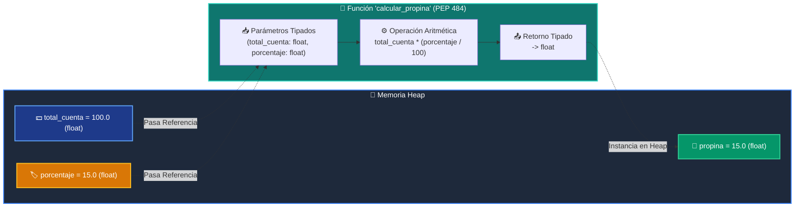

# 📘 Clase 02: Variables, Tipos de Datos y Funciones con Type Hints

<div class="grid cards" markdown>

-   :material-bookmark: **Curso:** Curso 1: Fundamentos Básicos de Python (CLASE 02)
-   :material-signal-cellular-outline: **Nivel:** `Nivel 1 - Principiante`
-   :material-lightbulb-on: **Metáfora Central:** *«Variables como Cajas Etiquetadas en Memoria y la Licuadora Tipada (PEP 484)»*
-   :material-file-pdf-box: **Manual PDF Oficial:** [Descargar clase-02-variables-y-tipos.pdf](https://github.com/wisrovi/wisrovi-python/raw/main/01-fundamentos-python/clase-02-variables-y-tipos/clase-02-variables-y-tipos.pdf)

</div>

<div align="center" style="margin: 1rem 0;" markdown>

[](https://colab.research.google.com/github/wisrovi/wisrovi-python/blob/main/01-fundamentos-python/clase-02-variables-y-tipos/notebook/clase-02-variables-y-tipos.ipynb)
[](https://github.com/wisrovi/wisrovi-python/tree/main/01-fundamentos-python/clase-02-variables-y-tipos)

</div>

---

## 1. 💡 Fundamentación Teórica y Modelo Mental

En Python, las variables almacenan referencias (punteros) a objetos en el Heap de memoria. Integradas con funciones modulares (`def`), nos permiten construir algoritmos limpios y reutilizables.

!!! note "🌟 Modelo Mental de la Sesión: «Variables en Memoria y la Licuadora Tipada»"
    Una variable es una etiqueta adhesiva pegada a una caja; varias etiquetas pueden apuntar a la misma caja. Una función es *«La Licuadora»*, que recibe parámetros tipados (`PEP 484`), opera con ellos y devuelve un nuevo objeto en el Heap.

### Principios Fundamentales de la Sesión

1. **Tipado Dinámico y Fuerte:** Python verifica tipos en runtime y no realiza conversiones forzadas incompatibles.
2. **Anotaciones de Tipo (PEP 484):** Documentan contratos de interfaz claros (`total: float, porcentaje: float -> float`).
3. **Inmutabilidad:** Operar con tipos primitivos (`int`, `float`, `str`, `bool`) genera siempre nuevos objetos en memoria.

!!! info "⚡ Regla de Oro en Python"
    Convierte tipos explícitamente usando `int()` o `float()` antes de operar con entradas de usuario.

---

## 2. 🗺️ Arquitectura de Ejecución y Diagrama de Flujo



---

## 3. 💻 Código de Implementación Práctica

```python
"""Demostración de Funciones con Type Hints, Casting y Formato f-strings."""

def calcular_resumen_pedido(
    producto: str, 
    precio_unitario_str: str, 
    cantidad: int, 
    tasa_iva: float = 0.21
) -> str:
    """Procesa una orden realizando casting explícito y retornando un resumen formateado."""
    precio_unitario: float = float(precio_unitario_str)
    subtotal: float = precio_unitario * cantidad
    monto_iva: float = subtotal * tasa_iva
    total_final: float = subtotal + monto_iva
    
    return (
        f"--- RESUMEN DE COMPRA ---\n"
        f"Producto:     {producto:<20}\n"
        f"Cantidad:     {cantidad:>5}\n"
        f"Subtotal:     ${subtotal:>8.2f}\n"
        f"IVA ({tasa_iva*100:.0f}%):    ${monto_iva:>8.2f}\n"
        f"Total Final:  ${total_final:>8.2f}"
    )

if __name__ == "__main__":
    factura = calcular_resumen_pedido("Teclado RGB", "79.99", 2)
    print(factura)
```

---

## 4. 🛡️ Buenas Prácticas, Gotchas y Prevención de Errores

!!! warning "⚠️ Trampa Frecuente (Gotcha)"
    `input()` siempre retorna un `str`; sumarlo o multiplicarlo directamente con números causará errores lógicos o de tipo.

=== "❌ Antipatrón / Código Inadecuado"
    ```python
    precio = input("Precio: ")
    total = precio * 2  # ❌ Repite el texto en vez de multiplicar
    ```

=== "✅ Patrón Recomendado / Pythonic"
    ```python
    def calcular_doble(precio_str: str) -> float:
        precio_num: float = float(precio_str)
        return precio_num * 2  # ✅ Multiplicación matemática real
    ```

!!! tip "🔧 Consejo de Ingeniería"
    Añade siempre anotaciones de tipo (PEP 484) a tus funciones para activar autocompletado y validación estática en tu editor.

---

## 5. 🏋️ Desafío Práctico de la Clase

!!! example "🎯 Enunciado del Reto"
    **Construye una calculadora de propinas y facturación modular implementando 3 funciones con Type Hints (PEP 484):**
    1. `calcular_propina(total_cuenta: float, porcentaje: float) -> float`
    2. `calcular_total_por_persona(total_cuenta: float, porcentaje: float, num_personas: int) -> float`
    3. `formatear_factura(total_cuenta: float, propina: float, total_por_persona: float) -> str`

Para resolver este ejercicio en tu entorno:
1. Abre el archivo `01-fundamentos-python/clase-02-variables-y-tipos/ejercicios/reto.py` en Visual Studio Code.
2. Implementa tu solución cumpliendo los requisitos y contratos de tipo.
3. Valida tus resultados ejecutando las pruebas unitarias:
   ```bash
   pytest tests/curso_01/test_clase_02.py
   ```

---

## 6. 📚 Fuentes y Bibliografía Recomendada

*   [📖 Documentación Oficial de Python 3](https://docs.python.org/3/library/stdtypes.html)
*   [📑 Guía de Anotaciones de Tipo PEP 484](https://peps.python.org/pep-0484/)
*   [📑 Guía de Estilo Oficial PEP 8](https://peps.python.org/pep-0008/)
*   [📦 Ecosistema Open Source wisrovi en PyPI](https://pypi.org/user/wisrovi/)
