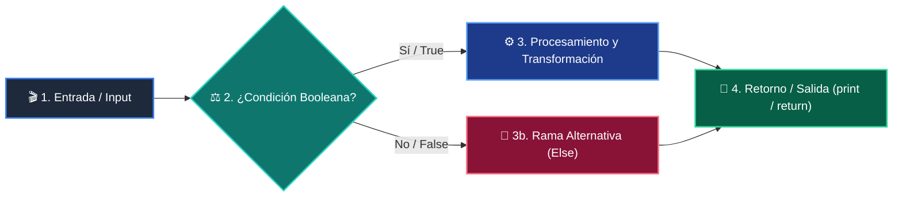

# Clase 02: Variables y Tipos de Datos

<div class="grid cards" markdown>

-   :material-school: __Nivel:__ Principiante Absoluto
-   :material-book-open-page-variant: __Curso:__ Curso 1: Fundamentos Básicos de Python
-   :material-lightbulb-on: __Metáfora:__ *«El Almacén, el Collar de Letras y el Micrófono»*
-   :material-file-pdf-box: __Descargar PDF:__ [clase-02-variables-y-tipos.pdf](https://github.com/wisrovi/wisrovi-python/blob/main/01-fundamentos-python/clase-02-variables-y-tipos/clase-02-variables-y-tipos.pdf)

</div>

---

## 🎯 Objetivos de Aprendizaje

!!! abstract "Competencias Clave de la Sesión"
    *   **Competencia Conceptual:** Comprender la diferencia fundamental entre tipos numéricos y texto, y cómo Python asigna memoria dinámicamente.
    *   **Competencia Práctica:** Construir programas interactivos que soliciten datos al usuario, realicen conversiones numéricas y devuelvan mensajes formateados.

---

## 1. 💡 Fundamentos Teóricos y Modelo Mental

Una variable es un identificador que apunta a una ubicación de memoria donde reside un valor con un tipo de dato específico.

!!! note "🌟 Metáfora Central: El Almacén, el Collar de Letras y el Micrófono"
    Imagina un almacén con cajas etiquetadas. Una caja pequeña guarda números enteros (int), una caja de precisión con decimales guarda números reales (float), una caja larga guarda un collar de letras enhebradas (str) y un interruptor de encendido/apagado representa un valor booleano (bool).

### Principios Fundamentales

Python utiliza tipado dinámico: no necesitas declarar el tipo de antemano, el intérprete lo infiere en tiempo de asignación.

La función input() SIEMPRE devuelve una cadena de texto (str). Para operar matemáticamente con ella es imperativo hacer casting mediante int() o float().

!!! tip "⚡ Regla de Oro en Python"
    Nunca sumes texto con números sin convertir; '10' + 5 genera TypeError, pero int('10') + 5 produce 15.

---

## 2. 🗺️ Diagrama de Arquitectura y Flujo de Control

Flujo de recepción de datos por teclado, validación de tipo y operación aritmética en memoria.



### Desglose Paso a Paso del Flujo

| Fase del Flujo | Acción del Intérprete | Estado en Memoria |
| :--- | :--- | :--- |
| **1. Inicialización** | La función input() captura la entrada del teclado como string. | `Buffer de entrada -> '25' (str)` |
| **2. Evaluación** | La función int() o float() transforma los caracteres en número binario. | `Casting -> 25 (int)` |
| **3. Transformación** | La ALU del procesador realiza la operación matemática solicitada. | `25 * 2 = 50 en CPU` |
| **4. Retorno / Salida** | f-string formatea el resultado y lo proyecta en la salida estándar. | `Render en pantalla` |

!!! info "🔍 Visualización Mental"
    Siempre valida y castea los datos en la frontera de entrada del programa antes de procesarlos en la lógica de negocio.

---

## 3. 💻 Implementación Práctica en Python

Programa completo que solicita entradas, convierte tipos de datos y utiliza f-strings modernas:

```python title="main.py - Python 3.10+ (PEP 8)" linenums="1"
# Entrada de datos con conversión directa
nombre_usuario: str = input("Ingresa tu nombre: ")
ingreso_mensual: float = float(input("Ingreso mensual ($): "))
porcentaje_ahorro: float = float(input("Porcentaje a ahorrar (%): "))

# Cálculo matemático
monto_ahorro: float = ingreso_mensual * (porcentaje_ahorro / 100.0)
es_meta_alta: bool = monto_ahorro >= 500.0

# Salida formateada con f-strings
print(f"
--- Reporte Financiero de {nombre_usuario} ---")
print(f"Ahorro estimado: ${monto_ahorro:,.2f}")
print(f"¿Es un ahorro significativo?: {es_meta_alta}")
```

### Análisis Detallado del Código

Se declaran variables con anotaciones de tipo, se realiza casting explícito con float() y se formatea el número a dos decimales con ${monto_ahorro:,.2f}.

---

## 4. 🛡️ Buenas Prácticas, Gotchas y Depuración

Errores comunes de principiantes al trabajar con tipos de datos:

!!! warning "⚠️ Gotcha Frecuente (Trampa de Principiante)"
    Intentar convertir una cadena con caracteres alfabéticos a int (ej: int('hola')), lo cual dispara un ValueError.

### Comparativa: Patrón Recomendado vs Antipatrón

=== "✅ Patrón Pythonic Recomendado"
    ```python
edad = int(input('Edad: '))
total = edad + 5 # Correcto: suma entera
    ```

=== "❌ Antipatrón / Mal Código"
    ```python
edad = input('Edad: ')
total = edad + 5 # TypeError: str + int
    ```

!!! success "🛡️ Consejo de Resiliencia en Producción"
    Usa siempre f-strings (f'Texto {variable}') en lugar del operador + para concatenar texto con variables.

---

## 5. 🏋️ Ejercicios y Desafío de Autoestudio

!!! example "Desafío Práctico Recomendado"
    Crea un conversor de temperatura que solicite grados Celsius y devuelva Fahrenheit y Kelvin formateados a un decimal.

???+ tip "🧪 Cómo validar tu solución con Pytest"
    Abre tu terminal en VS Code y ejecuta:
    ```bash
    pytest 01-fundamentos-python/clase-02-variables-y-tipos/ejercicios/
    ```

---

## 6. 📚 Fuentes y Referencias Oficiales

| Fuente / Recurso | Descripción Temática | Enlace Oficial |
| :--- | :--- | :--- |
| **Documentación Oficial de Python** | Referencia canónica del lenguaje y librería estándar | [docs.python.org/3/](https://docs.python.org/3/) |
| **PEP 8 — Style Guide for Python** | Guía oficial de estilo, formato e indentación | [peps.python.org/pep-0008/](https://peps.python.org/pep-0008/) |
| **Real Python Tutorials** | Artículos técnicos y patrones de desarrollo moderno | [realpython.com](https://realpython.com/) |
| **Suite Open Source wisrovi** | Paquetes Python para orquestación y rendimiento | [github.com/wisrovi](https://github.com/wisrovi) |
