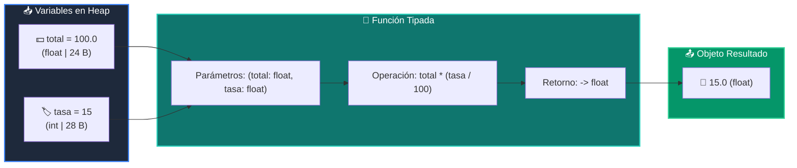

# 📘 Clase 02: Variables, Tipos de Datos y Funciones con Type Hints

<div class="grid cards" markdown>

-   :material-bookmark: **Curso:** Curso 1: Fundamentos Básicos de Python (CLASE 02)
-   :material-signal-cellular-outline: **Nivel:** `Nivel 1 - Principiante`
-   :material-lightbulb-on: **Metáfora Central:** *«Las Cajas Etiquetadas en Memoria y la Licuadora Tipada (PEP 484)»*
-   :material-laptop: **Wisrovi Studio (Local):** [🚀 Abrir Reto](http://127.0.0.1:8501/?course=1&class=2) &bull; [👨‍🏫 Modo Tutor](http://127.0.0.1:8501/tutor?course=1&class=2)
-   :material-file-pdf-box: **Manual PDF Oficial:** [Descargar clase-02-variables-y-tipos.pdf](https://github.com/wisrovi/wisrovi-python/raw/main/01-fundamentos-python/clase-02-variables-y-tipos/clase-02-variables-y-tipos.pdf)

</div>

<div align="center" style="margin: 1rem 0;" markdown>

[](https://colab.research.google.com/github/wisrovi/wisrovi-python/blob/main/01-fundamentos-python/clase-02-variables-y-tipos/notebook/clase-02-variables-y-tipos.ipynb)
[-0284c7?logo=python&logoColor=white)](http://127.0.0.1:8501/?course=1&class=2)
[](https://github.com/wisrovi/wisrovi-python/tree/main/01-fundamentos-python/clase-02-variables-y-tipos)

</div>

---

## 1. 💡 Fundamentación Teórica y Modelo Mental

En Python, las variables son **etiquetas que apuntan a objetos en la memoria RAM**.
1. **Tipos Primitivos & Type Hints (PEP 484)**: `int`, `float`, `str`, `bool`. Anotar parámetros (`x: float`) y retorno (`-> float`) previene errores de diseño.
2. **Inmutabilidad**: Modificar un tipo primitivo crea un *nuevo* objeto en una dirección hex diferente.
3. **Inspección de Memoria**: `type()`, `id()` y `sys.getsizeof()` revelan la huella física del dato.

!!! note "🌟 Modelo Mental de la Sesión: «Las Cajas Etiquetadas en Memoria y la Licuadora Tipada (PEP 484)»"
    En esta sesión anclamos el aprendizaje en la metáfora del mundo real para visualizar cómo fluyen las estructuras de datos y el flujo de ejecución en la memoria.

---

## 2. 🗺️ Arquitectura de Ejecución y Diagrama de Flujo



---

## 3. 💻 Código de Implementación Práctica

=== "🚀 Demostración en Vivo"
    ```python
    import sys

def calcular_propina(total_cuenta: float, porcentaje: float) -> float:
    return total_cuenta * (porcentaje / 100.0)

propina = calcular_propina(100.0, 15.0)
print(f"Propina: ${propina:.2f} | Memoria: {sys.getsizeof(propina)} bytes")
    ```

=== "🔬 Arenero de Exploración de Memoria (RAM)"
    ```python
    import sys
entero = 42
flotante = 3.1416
texto = "Wisrovi"

print(f"Tipo entero: {type(entero).__name__} | Bytes: {sys.getsizeof(entero)}")
print(f"Tipo texto:  {type(texto).__name__}  | Bytes: {sys.getsizeof(texto)}")
    ```

---

## 4. 🛡️ Buenas Prácticas PEP 8: Antipatrones vs Código Pythonic

!!! warning "⚠️ Cuidado con los Antipatrones"
    

=== "❌ Antipatrón / Código Inadecuado"
    ```python
    precio = input('Precio: ')
total = precio * 2  # ❌ Repite la cadena
    ```

=== "✅ Patrón Recomendado / Pythonic"
    ```python
    def calcular_doble(precio_str: str) -> float:
    return float(precio_str) * 2  # ✅ Multiplicación real
    ```

---

## 5. 🏋️ Desafío Práctico de la Clase

!!! example "🎯 Enunciado del Reto"
    **Crea una función llamada `identificar_tipo_y_tamano(valor: Any) -> tuple[str, int]` que retorne una tupla con el nombre del tipo (ej: 'int', 'str') y su tamaño en bytes mediante `sys.getsizeof(valor)`.**

!!! tip "⚡ Resolución Híbrida en 1 Clic (Local + Web)"
    Si tienes ejecutando `wisrovi ui` en tu terminal local, puedes [🚀 Abrir este Reto directamente en tu Studio Local (127.0.0.1:8501)](http://127.0.0.1:8501/?course=1&class=2) para escribir tu código con auto-formateo AST, inspeccionar variables en el Heap/Stack y evaluarlo con pruebas en tiempo real.

=== "💻 Plantilla de Inicio (Starter Code)"
    ```python
    import sys
from typing import Any, Tuple

def identificar_tipo_y_tamano(valor: Any) -> Tuple[str, int]:
    # ✍️ Retorna (nombre_tipo, tamano_bytes)
    return (type(valor).__name__, sys.getsizeof(valor))

    ```

??? info "💡 Pista Socrática 1"
    💡 Pista 1: Usa `type(valor).__name__` para obtener la cadena con el nombre del tipo.

??? info "💡 Pista Socrática 2"
    💡 Pista 2: Usa `sys.getsizeof(valor)` para obtener los bytes ocupados en RAM.

??? info "💡 Pista Socrática 3"
    💡 Pista 3: Retorna ambos valores dentro de una tupla `(tipo_str, bytes_int)`.


Para resolver este ejercicio en tu entorno:
1. Abre el archivo `ejercicios/reto.py` de esta clase en Visual Studio Code o utiliza `wisrovi ui` / `wisrovi tutor`.
2. Implementa tu solución cumpliendo los requisitos y contratos de tipado.
3. Valida tus resultados ejecutando las pruebas unitarias:
   ```bash
   pytest tests/curso_01/test_clase_02_variables_y_tipos.py
   ```

---


## 6. 📚 Fuentes y Bibliografía Recomendada

*   [📖 Documentación Oficial de Python 3](https://docs.python.org/3/)
*   [📑 Guía de Estilo Oficial PEP 8](https://peps.python.org/pep-0008/)
*   [📦 Ecosistema Open Source wisrovi en PyPI](https://pypi.org/user/wisrovi/)
