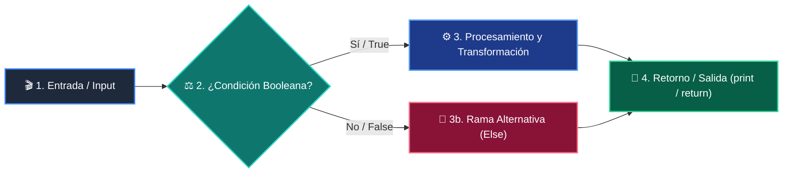

# Clase 03: Control de Flujo - Condicionales

<div class="grid cards" markdown>

-   :material-school: __Nivel:__ Principiante Absoluto
-   :material-book-open-page-variant: __Curso:__ Curso 1: Fundamentos Básicos de Python
-   :material-lightbulb-on: __Metáfora:__ *«El Guardia de la Puerta y el Menú de Opciones»*
-   :material-file-pdf-box: __Descargar PDF:__ [clase-03-control-flujo-condicionales.pdf](https://github.com/wisrovi/wisrovi-python/blob/main/01-fundamentos-python/clase-03-control-flujo-condicionales/clase-03-control-flujo-condicionales.pdf)

</div>

---

## 🎯 Objetivos de Aprendizaje

!!! abstract "Competencias Clave de la Sesión"
    *   **Competencia Conceptual:** Comprender la evaluación de expresiones booleanas y la exclusión mutua en cadenas if-elif-else.
    *   **Competencia Práctica:** Implementar sistemas de validación de reglas de negocio, control de acceso y árboles de decisión.

---

## 1. 💡 Fundamentos Teóricos y Modelo Mental

Un programa no es una línea recta; es un camino con encrucijadas donde el flujo toma una dirección según las condiciones.

!!! note "🌟 Metáfora Central: El Guardia de la Puerta y el Menú de Opciones"
    Imagina un guardia en la entrada de un club: revisa tu entrada (if). Si tienes pase VIP entra gratis (if), si tienes entrada general paga boleto (elif), y si no tienes entrada se le deniega el acceso (else).

### Principios Fundamentales

Operadores relacionales: == (igualdad), != (diferente), > (mayor), < (menor), >= (mayor o igual), <= (menor o igual).

Operadores lógicos: and (ambas condiciones deben ser True), or (al menos una True), not (invierte el valor de verdad).

!!! tip "⚡ Regla de Oro en Python"
    En una cadena if-elif-else, tan pronto como una condición resulta True, se ejecuta su bloque y se omiten todas las demás.

---

## 2. 🗺️ Diagrama de Arquitectura y Flujo de Control

Representación del flujo booleano con múltiples alternativas excluyentes.



### Desglose Paso a Paso del Flujo

| Fase del Flujo | Acción del Intérprete | Estado en Memoria |
| :--- | :--- | :--- |
| **1. Inicialización** | Evalúa la primera condición del if principal. | `Condición 1: ¿edad >= 18?` |
| **2. Evaluación** | Si es True, entra al bloque if y salta al final de la estructura. | `Ejecuta bloque prioritario` |
| **3. Transformación** | Si es False, evalúa secuencialmente los bloques elif. | `Condición 2: ¿tiene_permiso?` |
| **4. Retorno / Salida** | Si ninguna condición previa fue True, se ejecuta el bloque else por defecto. | `Rama fallback de seguridad` |

!!! info "🔍 Visualización Mental"
    Ordena tus condiciones de la más específica a la más general para evitar que un caso amplio oculte casos particulares.

---

## 3. 💻 Implementación Práctica en Python

Ejemplo práctico con operadores lógicos combinados y evaluación de reglas financieras:

```python title="main.py - Python 3.10+ (PEP 8)" linenums="1"
salario = float(input("Salario mensual ($): "))
puntaje_credito = int(input("Puntaje crediticio (300-850): "))
tiene_deudas = input("¿Tiene deudas activas? (s/n): ").lower() == "s"

if salario >= 3000.0 and puntaje_credito >= 720 and not tiene_deudas:
    estado = "Aprobado Premium (Tasa de interés preferencial)"
elif salario >= 1800.0 and puntaje_credito >= 650:
    estado = "Aprobado Estándar (Sujeto a verificación)"
elif salario >= 1200.0 or puntaje_credito >= 600:
    estado = "Requiere Codeudor o Aval"
else:
    estado = "Rechazado (No cumple los requisitos mínimos)"

print(f"
Resultado de la solicitud: {estado}")
```

### Análisis Detallado del Código

El código implementa lógica booleana compuesta con and, not y or, garantizando una jerarquía de evaluación limpia.

---

## 4. 🛡️ Buenas Prácticas, Gotchas y Depuración

Trampas clásicas de sintaxis y lógica booleana en Python:

!!! warning "⚠️ Gotcha Frecuente (Trampa de Principiante)"
    Confundir el operador de asignación (=) con el operador de comparación (==).

### Comparativa: Patrón Recomendado vs Antipatrón

=== "✅ Patrón Pythonic Recomendado"
    ```python
if rol == "admin": # Comparación correcta
    print("Acceso total")
    ```

=== "❌ Antipatrón / Mal Código"
    ```python
if rol = "admin": # SyntaxError
    print("Acceso total")
    ```

!!! success "🛡️ Consejo de Resiliencia en Producción"
    Aprovecha la evaluación de cortocircuito (short-circuit evaluation) en Python para proteger llamadas riesgosas.

---

## 5. 🏋️ Ejercicios y Desafío de Autoestudio

!!! example "Desafío Práctico Recomendado"
    Diseña un sistema de tarificación de boletos de cine con descuentos por edad, día de la semana y membresía VIP.

???+ tip "🧪 Cómo validar tu solución con Pytest"
    Abre tu terminal en VS Code y ejecuta:
    ```bash
    pytest 01-fundamentos-python/clase-03-control-flujo-condicionales/ejercicios/
    ```

---

## 6. 📚 Fuentes y Referencias Oficiales

| Fuente / Recurso | Descripción Temática | Enlace Oficial |
| :--- | :--- | :--- |
| **Documentación Oficial de Python** | Referencia canónica del lenguaje y librería estándar | [docs.python.org/3/](https://docs.python.org/3/) |
| **PEP 8 — Style Guide for Python** | Guía oficial de estilo, formato e indentación | [peps.python.org/pep-0008/](https://peps.python.org/pep-0008/) |
| **Real Python Tutorials** | Artículos técnicos y patrones de desarrollo moderno | [realpython.com](https://realpython.com/) |
| **Suite Open Source wisrovi** | Paquetes Python para orquestación y rendimiento | [github.com/wisrovi](https://github.com/wisrovi) |
