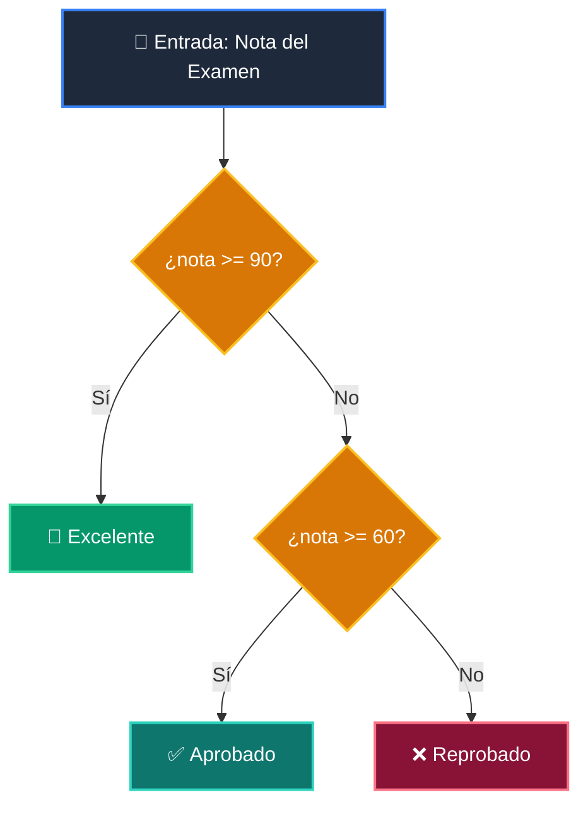

# 📘 Clase 03: Control de Flujo: Condicionales (if / elif / else)

<div class="grid cards" markdown>

-   :material-bookmark: **Curso:** Curso 1: Fundamentos Básicos de Python (CLASE 03)
-   :material-signal-cellular-outline: **Nivel:** `Nivel 1 - Principiante`
-   :material-lightbulb-on: **Metáfora Central:** *«El Semáforo y las Puertas Lógicas»*
-   :material-laptop: **Wisrovi Studio (Local):** [🚀 Abrir Reto](http://127.0.0.1:8501/?course=1&class=3) &bull; [👨‍🏫 Modo Tutor](http://127.0.0.1:8501/tutor?course=1&class=3)
-   :material-file-pdf-box: **Manual PDF Oficial:** [Descargar clase-03-control-flujo-condicionales.pdf](https://github.com/wisrovi/wisrovi-python/raw/main/01-fundamentos-python/clase-03-control-flujo-condicionales/clase-03-control-flujo-condicionales.pdf)

</div>

<div align="center" style="margin: 1rem 0;" markdown>

[](https://colab.research.google.com/github/wisrovi/wisrovi-python/blob/main/01-fundamentos-python/clase-03-control-flujo-condicionales/notebook/clase-03-control-flujo-condicionales.ipynb)
[-0284c7?logo=python&logoColor=white)](http://127.0.0.1:8501/?course=1&class=3)
[](https://github.com/wisrovi/wisrovi-python/tree/main/01-fundamentos-python/clase-03-control-flujo-condicionales)

</div>

---

## 1. 💡 Fundamentación Teórica y Modelo Mental

El control de flujo permite a un programa tomar decisiones inteligentes:
1. **Bifurcaciones `if / elif / else`**: Evalúan expresiones booleanas de arriba hacia abajo.
2. **Operadores de Comparación**: `==`, `!=`, `<`, `>`, `<=`, `>=`.
3. **Operadores Lógicos**: `and`, `or`, `not` para componer reglas complejas.

!!! note "🌟 Modelo Mental de la Sesión: «El Semáforo y las Puertas Lógicas»"
    En esta sesión anclamos el aprendizaje en la metáfora del mundo real para visualizar cómo fluyen las estructuras de datos y el flujo de ejecución en la memoria.

---

## 2. 🗺️ Arquitectura de Ejecución y Diagrama de Flujo



---

## 3. 💻 Código de Implementación Práctica

=== "🚀 Demostración en Vivo"
    ```python
    def clasificar_nota(nota: float) -> str:
    if nota >= 90:
        return "Excelente"
    elif nota >= 60:
        return "Aprobado"
    else:
        return "Reprobado"

print("85 ->", clasificar_nota(85))
print("95 ->", clasificar_nota(95))
print("45 ->", clasificar_nota(45))
    ```

=== "🔬 Arenero de Exploración de Memoria (RAM)"
    ```python
    edad = 21
tiene_pase_vip = True

if edad >= 18 and tiene_pase_vip:
    print("💎 Acceso al salón VIP concedido")
elif edad >= 18:
    print("🎫 Acceso general concedido")
else:
    print("⛔ Acceso denegado a menores")
    ```

---

## 4. 🛡️ Buenas Prácticas PEP 8: Antipatrones vs Código Pythonic

!!! warning "⚠️ Cuidado con los Antipatrones"
    

=== "❌ Antipatrón / Código Inadecuado"
    ```python
    if nombre is 'Juan':  # ❌ SyntaxWarning
    ```

=== "✅ Patrón Recomendado / Pythonic"
    ```python
    if nombre == 'Juan':  # ✅ Comparación correcta
    ```

---

## 5. 🏋️ Desafío Práctico de la Clase

!!! example "🎯 Enunciado del Reto"
    **Crea una función llamada `clasificar_calificacion(nota: float) -> str` que retorne 'Excelente' si nota >= 90, 'Aprobado' si 60 <= nota < 90, y 'Reprobado' si nota < 60.**

!!! tip "⚡ Resolución Híbrida en 1 Clic (Local + Web)"
    Si tienes ejecutando `wisrovi ui` en tu terminal local, puedes [🚀 Abrir este Reto directamente en tu Studio Local (127.0.0.1:8501)](http://127.0.0.1:8501/?course=1&class=3) para escribir tu código con auto-formateo AST, inspeccionar variables en el Heap/Stack y evaluarlo con pruebas en tiempo real.

=== "💻 Plantilla de Inicio (Starter Code)"
    ```python
    def clasificar_calificacion(nota: float) -> str:
    # ✍️ Escribe tu lógica condicional
    if nota >= 90:
        return "Excelente"
    elif nota >= 60:
        return "Aprobado"
    return "Reprobado"

    ```

??? info "💡 Pista Socrática 1"
    💡 Pista 1: Empieza evaluando el caso más restrictivo: `if nota >= 90:`

??? info "💡 Pista Socrática 2"
    💡 Pista 2: Usa `elif nota >= 60:` para el caso de Aprobado.

??? info "💡 Pista Socrática 3"
    💡 Pista 3: Retorna 'Reprobado' en el `else:` final.


Para resolver este ejercicio en tu entorno:
1. Abre el archivo `ejercicios/reto.py` de esta clase en Visual Studio Code o utiliza `wisrovi ui` / `wisrovi tutor`.
2. Implementa tu solución cumpliendo los requisitos y contratos de tipado.
3. Valida tus resultados ejecutando las pruebas unitarias:
   ```bash
   pytest tests/curso_01/test_clase_03_control_flujo_condicionales.py
   ```

---


## 6. 📚 Fuentes y Bibliografía Recomendada

*   [📖 Documentación Oficial de Python 3](https://docs.python.org/3/)
*   [📑 Guía de Estilo Oficial PEP 8](https://peps.python.org/pep-0008/)
*   [📦 Ecosistema Open Source wisrovi en PyPI](https://pypi.org/user/wisrovi/)
